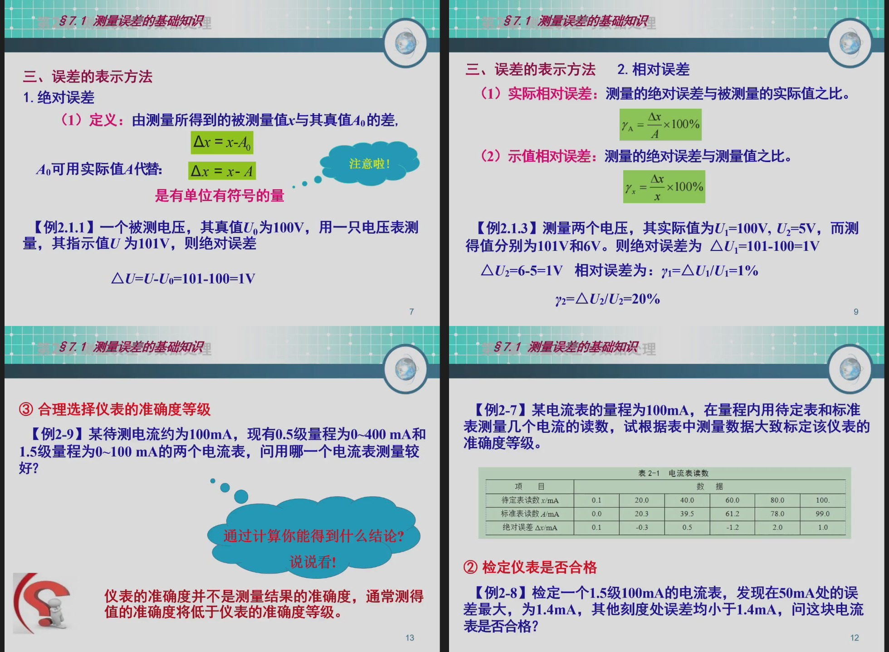
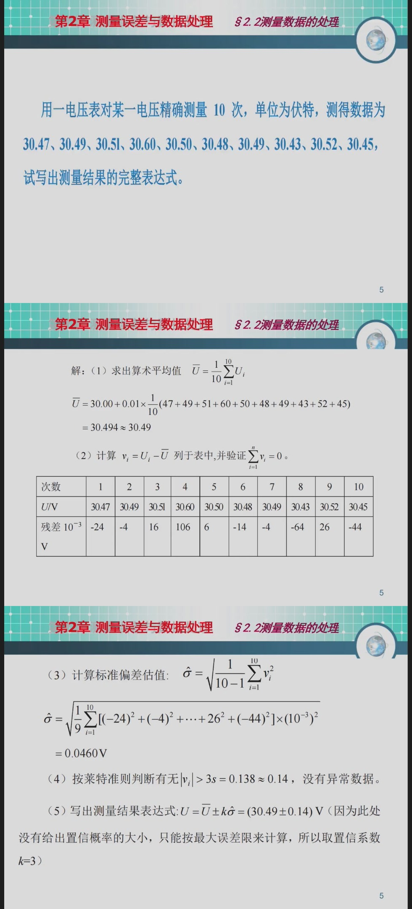
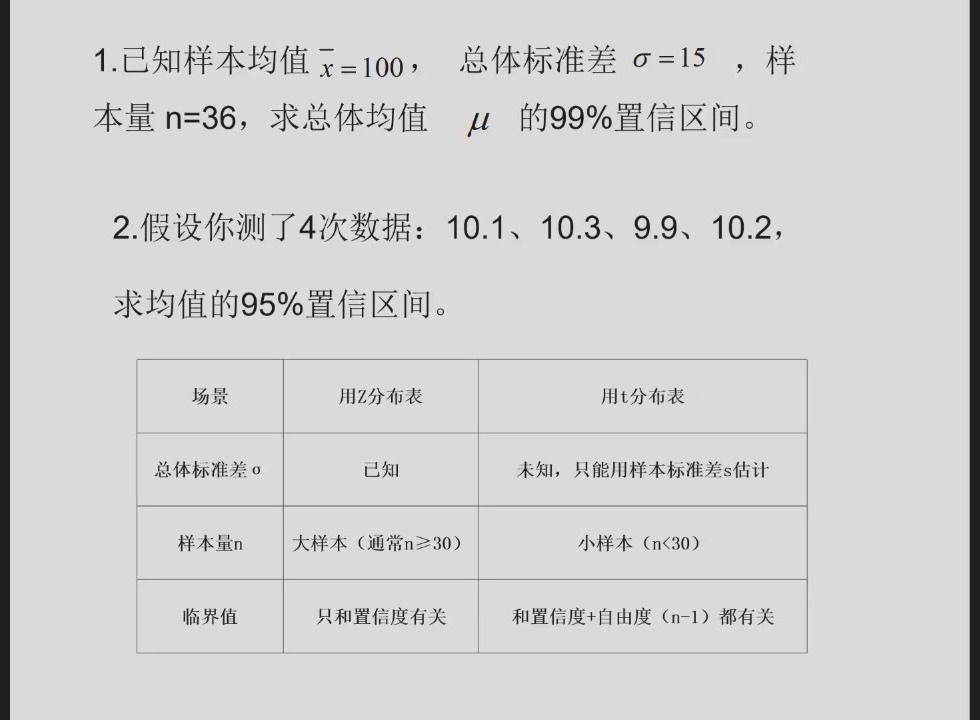
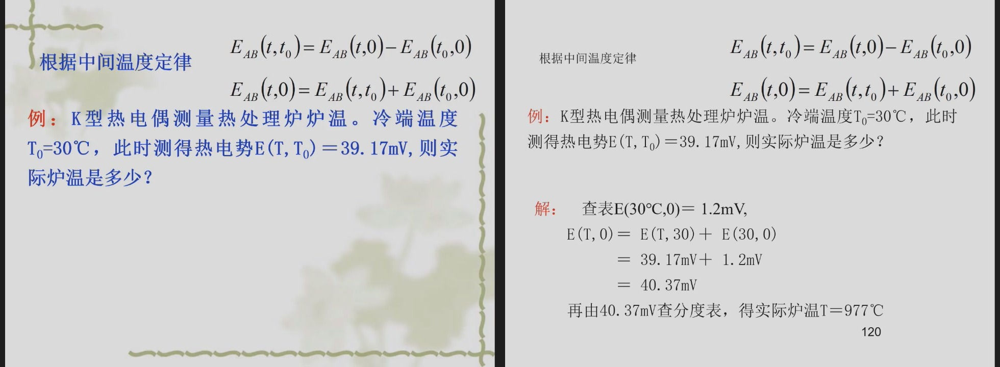
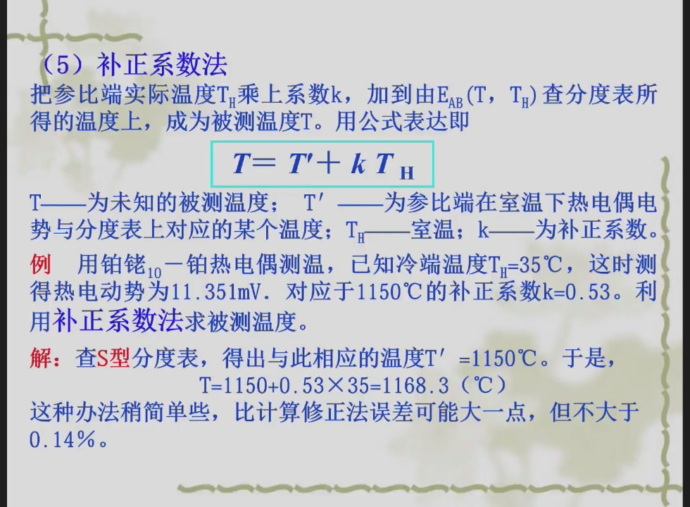
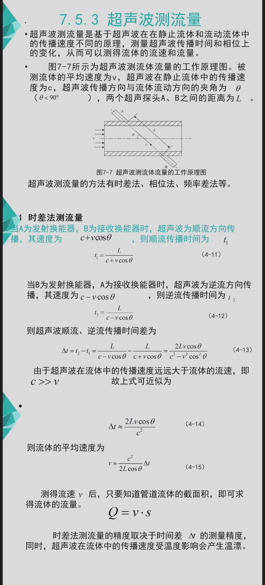

本文重点整理：

- 2026 年 6 月 17 日课件中的热电偶、补偿方法和超声波例题；
- 2026 年 6 月 22 日综合复习课中的测量误差、数据处理、电桥和应变片例题。

所有题图均从相应 PPTX 的原始幻灯片图片中提取。

---

# 一、绝对误差、相对误差和仪表准确度

## 1. 绝对误差

测量值为 $x$，真值或约定真值为 $A$：

$$
\Delta x=x-A
$$

绝对误差有单位和正负号。

例如真值为 $100V$，仪表指示 $101V$：

$$
\Delta U=101-100=1V
$$

## 2. 相对误差

$$
\gamma=
\frac{\Delta x}{A}\times100\%
$$

相同的绝对误差，对小量值造成的相对影响更大。

例如：

$$
U_1=100V,\quad U'_1=101V
$$

$$
\gamma_1=\frac{1}{100}\times100\%=1\%
$$

而：

$$
U_2=5V,\quad U'_2=6V
$$

$$
\gamma_2=\frac{1}{5}\times100\%=20\%
$$

两次绝对误差都是 $1V$，但第二次测量质量明显更差。

## 3. 仪表准确度等级

允许最大绝对误差：

$$
|\Delta x|_{\max}
=
\frac{s}{100}x_m
$$

其中：

- $s$：准确度等级数字；
- $x_m$：满量程值。

原题图：



---

## 例题 1：根据检定数据确定准确度等级

电流表量程为 $100mA$，各检定点绝对误差为：

$$
0.1,-0.3,0.5,-1.2,2.0,1.0\;mA
$$

最大绝对误差：

$$
|\Delta I|_{\max}=2.0mA
$$

最大引用误差：

$$
\gamma_m=
\frac{2.0}{100}\times100\%
=2.0\%
$$

计算值为 $2.0\%$。按常见标准准确度等级序列，应选择不小于该计算值的等级，因此该仪表应标为：

$$
\boxed{2.5\text{ 级}}
$$

如果考试题给出了本课程采用的等级序列，应以题目给出的序列为准。

### 易错点

不能用某个中间刻度的读数作分母，准确度等级以满量程为分母。

---

## 例题 2：判断仪表是否合格

检定一只 1.5 级、量程 $100mA$ 的电流表，测得最大绝对误差为 $1.4mA$。

允许最大绝对误差：

$$
|\Delta I|_{\text{允许}}
=
\frac{1.5}{100}\times100mA
=1.5mA
$$

因为：

$$
1.4mA<1.5mA
$$

所以该电流表合格。

---

## 例题 3：仪表应该怎样选

待测电流约为 $100mA$，有两只表：

1. 0.5 级，量程 $0\sim400mA$；
2. 1.5 级，量程 $0\sim100mA$。

第一只表：

$$
|\Delta I_1|_{\max}
=0.5\%\times400mA
=2mA
$$

在 $100mA$ 附近的相对误差约为：

$$
\gamma_1=\frac{2}{100}\times100\%=2\%
$$

第二只表：

$$
|\Delta I_2|_{\max}
=1.5\%\times100mA
=1.5mA
$$

相对误差约为：

$$
\gamma_2=\frac{1.5}{100}\times100\%=1.5\%
$$

所以应选择第二只 **1.5 级、100mA 量程**的电流表。

### 结论

```text
仪表等级不能脱离量程比较。
测量值应尽量接近满量程，但不能超过量程。
```

---

# 二、等精度重复测量

原题给出 10 次电压测量：

$$
30.47,\ 30.49,\ 30.51,\ 30.60,\ 30.50,
$$

$$
30.48,\ 30.49,\ 30.43,\ 30.52,\ 30.45\quad (V)
$$

要求写出完整测量结果。

原题和课件解答：



## 第一步：平均值

$$
\bar U=
\frac{1}{10}\sum_{i=1}^{10}U_i
=30.494V
$$

按课件保留为：

$$
\bar U\approx30.49V
$$

## 第二步：残差

$$
v_i=U_i-\bar U
$$

以 $10^{-3}V$ 为单位，残差为：

$$
-24,-4,16,106,6,-14,-4,-64,26,-44
$$

检查：

$$
\sum_{i=1}^{10}v_i=0
$$

说明平均值和残差计算相互吻合。

## 第三步：标准差

$$
s=
\sqrt{
\frac{1}{10-1}
\sum_{i=1}^{10}v_i^2
}
$$

计算得到：

$$
s=0.0460V
$$

## 第四步：判断异常值

课件使用莱特准则：

$$
3s=3\times0.0460=0.138V
$$

最大残差绝对值：

$$
|v_{\max}|=0.106V
$$

因为：

$$
0.106<0.138
$$

所以没有数据满足 $|v_i|>3s$，不能删除 $30.60V$。

这道题很容易凭感觉把 $30.60V$ 当异常值删除，这是错误的。

## 第五步：测量结果

题目没有给定置信概率，课件按最大误差限取 $k=3$：

$$
U=\bar U\pm3s
$$

因此：

$$
\boxed{U=(30.49\pm0.14)V}
$$

## 固定答题模板

```text
平均值 -> 残差 -> 检查残差和 -> 标准差
-> 粗大误差判断 -> 最终结果表达
```

---

# 三、置信区间

原题图：



## 例题 1：总体标准差已知

已知：

$$
\bar x=100,\quad \sigma=15,\quad n=36
$$

求总体均值 $\mu$ 的 99% 置信区间。

总体标准差已知，使用正态分布：

$$
\mu\in
\left[
\bar x-z_{\alpha/2}\frac{\sigma}{\sqrt n},
\bar x+z_{\alpha/2}\frac{\sigma}{\sqrt n}
\right]
$$

99% 置信度：

$$
z_{\alpha/2}=2.576
$$

误差限：

$$
\Delta=
2.576\times\frac{15}{\sqrt{36}}
=2.576\times2.5
=6.44
$$

所以：

$$
\boxed{
\mu\in[93.56,\ 106.44]
}
$$

---

## 例题 2：总体标准差未知的小样本

测量数据：

$$
10.1,\ 10.3,\ 9.9,\ 10.2
$$

求均值的 95% 置信区间。

样本量：

$$
n=4
$$

总体标准差未知，且为小样本，使用 $t$ 分布。

### 第一步：平均值

$$
\bar x=
\frac{10.1+10.3+9.9+10.2}{4}
=10.125
$$

### 第二步：样本标准差

$$
s=
\sqrt{
\frac{\sum(x_i-\bar x)^2}{n-1}
}
\approx0.1708
$$

### 第三步：查表

自由度：

$$
\nu=n-1=3
$$

95% 双侧置信区间：

$$
t_{0.025,3}\approx3.182
$$

### 第四步：误差限

$$
\Delta=
t_{\alpha/2,n-1}
\frac{s}{\sqrt n}
$$

$$
\Delta=
3.182\times\frac{0.1708}{2}
\approx0.272
$$

所以：

$$
\boxed{
\mu\in[9.853,\ 10.397]
}
$$

### 易错点

1. 总体标准差未知，不能把样本标准差直接代入正态分布公式。
2. 自由度是 $n-1=3$，不是 $n=4$。
3. 双侧 95% 区间查的是 $t_{\alpha/2}$。

---

# 四、直流电桥综合题

原题条件：

$$
U_i=10V
$$

$$
R_1=R_2=R_3=R_4=150\Omega
$$

原题图：


按题图，输入电压加在 $A$、$C$ 两端，输出为 $B$、$D$ 两点的电位差。

输出公式：

$$
U_o=
\left(
\frac{R_1}{R_1+R_2}
-
\frac{R_4}{R_3+R_4}
\right)U_i
$$

## 第 1 问：只有 $R_1$ 增大

$$
R_1'=151.5\Omega
$$

代入：

$$
U_o=
\left(
\frac{151.5}{151.5+150}
-
\frac{150}{150+150}
\right)\times10
$$

$$
U_o\approx0.02488V
$$

所以：

$$
\boxed{U_o\approx24.9mV}
$$

使用单臂电桥近似式也可快速计算：

$$
U_o\approx
\frac{U_i}{4}\frac{\Delta R}{R}
$$

$$
U_o\approx
\frac{10}{4}\times\frac{1.5}{150}
=0.025V
$$

近似结果为 $25mV$。

---

## 第 2 问：$R_1$、$R_2$ 同向同量变化

$$
R_1'=R_2'=151.5\Omega
$$

上支路分压比例仍为：

$$
\frac{R_1'}{R_1'+R_2'}=\frac12
$$

下支路也是 $\frac12$，因此：

$$
\boxed{U_o=0}
$$

这说明相邻桥臂同方向、同大小变化时会互相抵消。

---

## 第 3 问：$R_1$、$R_2$ 反向变化

取：

$$
R_1'=151.5\Omega,\quad R_2'=148.5\Omega
$$

则：

$$
U_o=
\left(
\frac{151.5}{151.5+148.5}
-
\frac{150}{300}
\right)\times10
$$

$$
U_o=(0.505-0.5)\times10=0.05V
$$

所以：

$$
\boxed{U_o=50mV}
$$

双臂反向变化时，输出约为单臂的 2 倍。

### 电桥题总口诀

```text
同臂同向可能抵消；
合理安排一增一减，灵敏度相加；
先按题图确定输出正负，再代公式。
```

---

# 五、热电偶冷端补偿

## 1. 中间温度定律

$$
E(t,t_0)
=
E(t,0)-E(t_0,0)
$$

因此：

$$
E(t,0)
=
E(t,t_0)+E(t_0,0)
$$

原题和答案图：



## 例题

K 型热电偶测量热处理炉温度，冷端：

$$
t_0=30^\circ C
$$

实测热电势：

$$
E(t,30)=39.17mV
$$

查 K 型热电偶分度表：

$$
E(30,0)=1.20mV
$$

修正到冷端 $0^\circ C$：

$$
E(t,0)
=39.17+1.20
=40.37mV
$$

再查 K 型分度表：

$$
\boxed{t\approx977^\circ C}
$$

## 为什么不能直接用 $39.17mV$ 查表

热电偶分度表默认：

$$
t_0=0^\circ C
$$

如果直接查 $39.17mV$，得到的约为 $938^\circ C$ 左右，而不是实际炉温。误差来自忽略了冷端的热电势。

## 固定步骤

```text
冷端不为 0℃
-> 查 E(t0,0)
-> 与实测 E(t,t0) 相加
-> 得到 E(t,0)
-> 再查分度表
```

---

# 六、热电偶补正系数法

补正系数法近似写为：

$$
T=T'+kT_H
$$

其中：

- $T$：实际被测温度；
- $T'$：实测热电势直接查表所得温度；
- $T_H$：冷端温度；
- $k$：补正系数。

原题图：



## 例题

铂铑 10-铂热电偶测温，已知：

$$
T_H=35^\circ C
$$

实测热电势：

$$
E=11.351mV
$$

查 S 型分度表，得到：

$$
T'=1150^\circ C
$$

已知该温度附近补正系数：

$$
k=0.53
$$

则：

$$
T=1150+0.53\times35
$$

$$
T=1168.55^\circ C
$$

按课件写为：

$$
\boxed{T\approx1168.3^\circ C}
$$

由于补正系数法属于近似方法，结果可能因 $k$ 的取值和中间舍入略有差异。

---

# 七、电阻应变片计算

基本公式：

$$
K=
\frac{\Delta R/R}{\varepsilon}
$$

所以：

$$
\frac{\Delta R}{R}=K\varepsilon
$$

$$
\Delta R=KR\varepsilon
$$

原题图：


## 例题 1：已知应变求电阻变化

已知：

$$
R=350\Omega,\quad K=2.05
$$

$$
\varepsilon=800\mu\varepsilon
=800\times10^{-6}
$$

相对电阻变化：

$$
\frac{\Delta R}{R}
=K\varepsilon
$$

$$
\frac{\Delta R}{R}
=2.05\times800\times10^{-6}
=0.00164
$$

电阻变化量：

$$
\Delta R=0.00164\times350
$$

$$
\boxed{\Delta R=0.574\Omega}
$$

---

## 例题 2：受力支柱上的应变片

已知：

$$
R=350\Omega,\quad K=2.1
$$

铝支柱：

$$
D=50mm,\quad d=47.5mm
$$

$$
E=73GPa
$$

承受质量 $1000kg$，取：

$$
F=mg\approx9800N
$$

### 第一步：环形截面积

$$
S=\frac{\pi(D^2-d^2)}{4}
$$

$$
S\approx191mm^2
=191\times10^{-6}m^2
$$

### 第二步：应变

$$
\varepsilon=
\frac{F}{SE}
$$

### 第三步：电阻变化

$$
\Delta R=
KR\frac{F}{SE}
$$

代入：

$$
\Delta R=
2.1\times350
\times
\frac{9800}
{191\times10^{-6}\times73\times10^9}
$$

得到：

$$
\boxed{\Delta R\approx0.52\Omega}
$$

### 易错点

课件中面积的中间展开写法不够直观，考试建议直接使用：

$$
S=\frac{\pi}{4}(D^2-d^2)
$$

这样不容易把直径差和平方差混淆。

---

## 例题 3：反求灵敏系数

已知：

$$
R=100\Omega,\quad \Delta R=1\Omega
$$

$$
S=0.5\times10^{-4}m^2
$$

$$
E=2\times10^{11}Pa
$$

$$
F=5\times10^4N
$$

相对电阻变化：

$$
\frac{\Delta R}{R}
=\frac{1}{100}
=0.01
$$

应变：

$$
\varepsilon=
\frac{F}{SE}
$$

$$
\varepsilon=
\frac{5\times10^4}
{0.5\times10^{-4}\times2\times10^{11}}
=0.005
$$

灵敏系数：

$$
K=
\frac{\Delta R/R}{\varepsilon}
$$

$$
K=
\frac{0.01}{0.005}
$$

$$
\boxed{K=2}
$$

---

# 八、超声波流量测量

原理图和公式：



设：

- 超声波在静止介质中的速度为 $c$；
- 流体平均速度为 $v$；
- 声程为 $L$；
- 声束与流向夹角为 $\theta$。

顺流传播时间：

$$
t_1=
\frac{L}{c+v\cos\theta}
$$

逆流传播时间：

$$
t_2=
\frac{L}{c-v\cos\theta}
$$

两者时间差：

$$
\Delta t=t_2-t_1
$$

精确展开：

$$
\Delta t=
\frac{2Lv\cos\theta}
{c^2-v^2\cos^2\theta}
$$

由于一般有：

$$
v\ll c
$$

可忽略 $v^2\cos^2\theta$：

$$
\Delta t\approx
\frac{2Lv\cos\theta}{c^2}
$$

所以：

$$
\boxed{
v\approx
\frac{c^2\Delta t}{2L\cos\theta}
}
$$

体积流量：

$$
\boxed{Q=vS}
$$

## 常见变形

若题目直接给顺流和逆流时间，也可以由：

$$
\frac{1}{t_1}-\frac{1}{t_2}
=
\frac{2v\cos\theta}{L}
$$

求流速：

$$
v=
\frac{L}{2\cos\theta}
\left(
\frac{1}{t_1}-\frac{1}{t_2}
\right)
$$

## 易错点

1. $\theta$ 是声束与流向的夹角，不一定是与管壁或法线的夹角。
2. 顺流时间小，逆流时间大。
3. 流量还需要乘管道有效截面积。
4. 只有满足 $v\ll c$ 时才能使用近似式。

---

# 九、考前必须能独立完成的步骤

## 误差与仪表

```text
绝对误差 -> 相对误差 -> 引用误差
-> 最大允许误差 -> 等级或仪表选型
```

## 重复测量

```text
平均值 -> 残差 -> 标准差
-> 粗大误差 -> 测量结果
```

## 置信区间

```text
判断 σ 是否已知
-> 判断样本大小
-> 选 z 或 t
-> 计算误差限
```

## 应变片

```text
受力 -> 应力 -> 应变
-> 相对电阻变化 -> 电阻变化
-> 电桥输出
```

## 热电偶

```text
确认冷端温度
-> 补偿为冷端 0℃
-> 查分度表
```

## 超声波

```text
判断单程或往返
-> 写传播时间
-> 求距离或速度
-> 必要时再求流量
```
