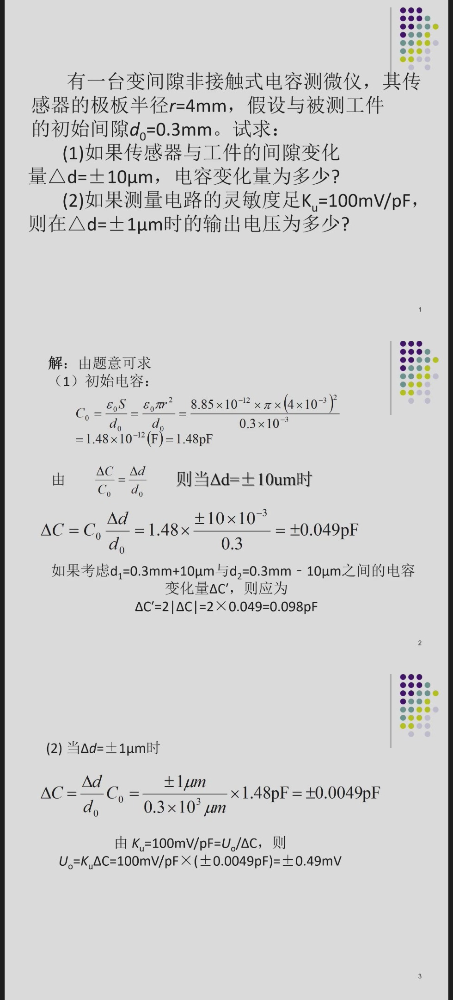
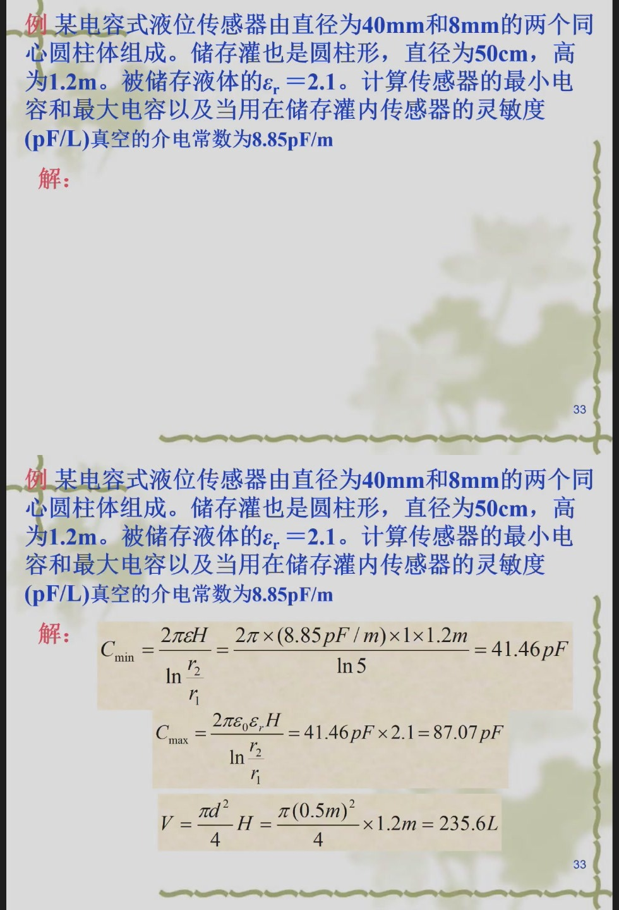

本文补充整理 2026 年 4 月 27 日至 6 月 10 日的前序课件，并结合课程进度推测 6 月 15 日缺失课件可能覆盖或强化的内容。

需要特别说明：

- 6 月 15 日目录中虽有课件文件，但其中只有课堂系统截图，没有有效教学内容；
- 以下“已讲知识点”和例题均来自此前的完整课件；
- “可能考什么”是根据章节推进、教师反复讲解的公式以及课件例题推测，不等于确定考题；
- 最后两节课的重点仍应配合 [01、最后两节课例题精讲.md](01、最后两节课例题精讲.md) 一起复习。

---

# 一、从课程进度推测缺失课次可能考什么

前序课件的知识推进大致如下：

```text
传感器基本特性
  ↓
电阻应变式传感器与电桥
  ↓
电容式传感器
  ↓
电感式、差动变压器与电涡流传感器
  ↓
热电偶、霍尔、光电与编码器
  ↓
超声波检测
  ↓
测量误差与数据处理
```

6 月 8 日和 6 月 10 日已经进入“测量误差与数据处理”，6 月 17 日又回顾热电偶、补偿和超声波，6 月 22 日进行了综合例题复习。因此，缺失课次最可能承担以下作用：

1. 补完测量误差与数据处理，包括有效数字、系统误差削弱、误差传递；
2. 串联此前各类传感器的典型计算；
3. 强调差动结构、补偿电路和实际测量电路；
4. 为最后综合复习整理公式和题型。

据此，除了最后两节课明确出现的内容，还应重点防下面六类题。

| 优先级 | 知识点            | 最可能题型            |
| --- | -------------- | ---------------- |
| 很高  | 一阶、二阶传感器动态特性   | 简答、识图、参数含义       |
| 很高  | 电容式传感器         | 原理、线性化、位移或液位计算   |
| 很高  | 电感式传感器         | 电感、品质因数、等效电感综合计算 |
| 高   | 应变片温度误差及补偿     | 简答、画桥路、判断桥臂      |
| 高   | 霍尔元件、编码器和格雷码   | 简答、填空、编码转换       |
| 高   | 有效数字、系统误差和误差传递 | 判断、计算、方法简答       |

---

# 二、传感器的动态特性

静态特性研究输入不随时间变化或变化很慢时，传感器输出是否准确；动态特性研究输入快速变化时，输出能不能及时跟随。

例如温度突然升高，温度传感器不会瞬间到达最终示值，而会经历一个响应过程。这个“跟得快不快、有没有超调、多久稳定”就是动态特性。


## 1. 一阶传感器

一阶传感器典型传递函数为：

$$
H(s)=\frac{K}{\tau s+1}
$$

其中：

- $K$ 为静态灵敏度；
- $\tau$ 为时间常数；
- $\tau$ 越小，传感器响应越快。

当输入为单位阶跃时，输出为：

$$
y(t)=K\left(1-e^{-t/\tau}\right)
$$

当：

$$
t=\tau
$$

有：

$$
y(\tau)=K(1-e^{-1})\approx0.632K
$$

因此要直接记住：

> 一阶传感器受到阶跃输入后，经过一个时间常数 $\tau$，输出达到最终值的约 $63.2\%$。

经过约 $3\tau$ 时，输出达到最终值的 $95\%$ 左右；经过约 $5\tau$ 时，可认为基本稳定。

### 例题：由阶跃响应求时间常数

某一阶温度传感器最终稳定输出为 $100mV$。加阶跃温度后，经过 $2s$，输出达到 $63.2mV$，求时间常数。

因为：

$$
\frac{63.2}{100}=63.2\%
$$

一阶系统在 $t=\tau$ 时达到最终值的 $63.2\%$，所以：

$$
\tau=2s
$$

若问大约多久可基本稳定，可取：

$$
t\approx5\tau=10s
$$

## 2. 一阶传感器的频率响应

令 $s=j\omega$：

$$
H(j\omega)=\frac{K}{1+j\omega\tau}
$$

幅频特性：

$$
|H(j\omega)|=
\frac{K}{\sqrt{1+(\omega\tau)^2}}
$$

相频特性：

$$
\varphi(\omega)=-\arctan(\omega\tau)
$$

输入频率越高，输出幅值衰减越明显，相位滞后也越大。因此传感器必须具有足够宽的工作频带。

### 例题：判断能否不失真测量

某传感器的可用频率上限为 $100Hz$，现测量一个主要频率为 $20Hz$ 的信号。

由于：

$$
20Hz<100Hz
$$

输入处于传感器可用频带内，幅值失真通常较小，可以进行测量。若信号频率接近或超过 $100Hz$，输出将明显衰减，不能再认为是无失真测量。

## 3. 二阶传感器

二阶传感器典型传递函数为：

$$
H(s)=
\frac{K\omega_n^2}
{s^2+2\zeta\omega_n s+\omega_n^2}
$$

其中：

- $\omega_n$ 为固有角频率；
- $\zeta$ 为阻尼比；
- $K$ 为静态灵敏度。

阻尼比决定阶跃响应形状：

| 阻尼情况 | 特点 |
|---|---|
| $0<\zeta<1$ | 欠阻尼，有超调和振荡 |
| $\zeta=1$ | 临界阻尼，无振荡且响应较快 |
| $\zeta>1$ | 过阻尼，无振荡但响应较慢 |

### 例题：由曲线判断系统性质

若二阶传感器受到阶跃输入后，输出越过最终值并来回振荡，最后才趋于稳定，则它属于欠阻尼系统：

$$
0<\zeta<1
$$

图中峰值超过最终稳定值的部分称为超调量，进入规定误差带并不再离开的时间称为调节时间或稳定时间。

---

# 三、电阻应变片与温度补偿

应变片基本关系为：

$$
K=
\frac{\Delta R/R}{\varepsilon}
$$

所以：

$$
\frac{\Delta R}{R}=K\varepsilon
$$

$$
\Delta R=KR\varepsilon
$$

## 1. 温度为什么会造成误差

温度变化会同时造成两类影响：

1. 应变片自身电阻随温度改变；
2. 应变片和被测构件热膨胀系数不同，产生附加应变。

即使被测件没有受到外力，电桥也可能产生输出，这就是温度误差。

## 2. 补偿片法

常用方法是设置一片与工作应变片参数相同的补偿片：

- 工作片粘贴在受力位置；
- 补偿片处于相同温度环境；
- 补偿片不承受被测机械应变；
- 两片接入电桥相邻桥臂。

温度引起的电阻变化近似相同，在电桥输出中相互抵消；机械应变只作用于工作片，因此仍能形成测量输出。

### 例题：应变片与单臂电桥


已知：

$$
R_0=120\Omega,\quad K=2.05,\quad
\varepsilon=800\mu\varepsilon,\quad U_i=3V
$$

先换算应变：

$$
800\mu\varepsilon=800\times10^{-6}
$$

电阻相对变化量：

$$
\frac{\Delta R}{R}
=K\varepsilon
=2.05\times800\times10^{-6}
=1.64\times10^{-3}
$$

电阻变化量：

$$
\Delta R
=R\frac{\Delta R}{R}
=120\times1.64\times10^{-3}
\approx0.197\Omega
$$

单臂电桥近似输出：

$$
U_o\approx
\frac{U_i}{4}\frac{\Delta R}{R}
$$

所以：

$$
U_o=
\frac{3}{4}\times1.64\times10^{-3}
=1.23mV
$$

这类题固定按照下面的公式链做：

```text
应变 ε
  ↓
相对电阻变化 ΔR/R=Kε
  ↓
电阻变化 ΔR=KRε
  ↓
电桥输出
```

### 可能变式

若改成半桥或全桥，在桥臂变化方向安排正确时：

$$
U_{o,\text{半桥}}
\approx\frac{U_i}{2}\frac{\Delta R}{R}
$$

$$
U_{o,\text{全桥}}
\approx U_i\frac{\Delta R}{R}
$$

因此半桥灵敏度约为单臂的 2 倍，全桥约为单臂的 4 倍。

---

# 四、电容式传感器

平行板电容器基本公式：

$$
C=\varepsilon_0\varepsilon_r\frac{S}{d}
$$

可改变三个参数：

| 类型 | 改变参数 | 常见用途 |
|---|---|---|
| 变间隙式 | $d$ | 微小位移、压力、振动 |
| 变面积式 | $S$ | 直线位移、角位移 |
| 变介质式 | $\varepsilon_r$ | 液位、湿度、物料检测 |

## 1. 变间隙式的非线性

若初始间隙为 $d_0$，位移使间隙变为 $d_0-\Delta d$：

$$
C=
\frac{\varepsilon S}{d_0-\Delta d}
=\frac{C_0}{1-\Delta d/d_0}
$$

这不是线性关系。只有：

$$
\left|\frac{\Delta d}{d_0}\right|\ll1
$$

时，才能近似为：

$$
\frac{\Delta C}{C_0}
\approx
\frac{\Delta d}{d_0}
$$

所以变间隙式灵敏度高，但测量范围通常较小。

## 2. 差动结构

差动结构让一个电容增大、另一个电容减小。它可以：

- 提高灵敏度；
- 减小非线性；
- 抑制温度、电源等共同变化的影响；
- 判断位移方向。

### 例题：变间隙电容测微



已知：

$$
r=4mm,\quad d_0=0.3mm,\quad
\varepsilon_0=8.85\times10^{-12}F/m
$$

初始电容：

$$
C_0=
\frac{\varepsilon_0\pi r^2}{d_0}
\approx1.48pF
$$

当：

$$
\Delta d=\pm10\mu m
$$

采用小位移近似：

$$
\Delta C=
C_0\frac{\Delta d}{d_0}
$$

得到：

$$
\Delta C\approx\pm0.049pF
$$

若题目把从 $-10\mu m$ 到 $+10\mu m$ 的总变化量作为答案，则：

$$
\Delta C'=2|\Delta C|=0.098pF
$$

当：

$$
\Delta d=\pm1\mu m,\quad
K_u=100mV/pF
$$

有：

$$
\Delta C\approx\pm0.0049pF
$$

输出：

$$
U_o=K_u\Delta C
=100\times(\pm0.0049)
=\pm0.49mV
$$

### 易错点

1. $mm$、$\mu m$ 和 $m$ 必须统一；
2. 要分清“相对初始位置的变化量”和“正负极限之间的总变化量”；
3. 小位移近似有使用条件，不能在位移很大时直接套用。

## 3. 同轴圆柱电容

同轴圆柱电容器：

$$
C=
\frac{2\pi\varepsilon H}
{\ln(r_2/r_1)}
$$

其中 $H$ 为有效高度。

液体进入后，介电常数从 $\varepsilon_0$ 变为：

$$
\varepsilon=\varepsilon_0\varepsilon_r
$$

因此可以利用电容变化测量液位和体积。

### 例题：电容式液位传感器



已知两圆柱直径为 $40mm$ 和 $8mm$，所以：

$$
\frac{r_2}{r_1}=\frac{40}{8}=5
$$

高度：

$$
H=1.2m
$$

空气中最小电容：

$$
C_{\min}=
\frac{2\pi\varepsilon_0H}{\ln5}
\approx41.46pF
$$

液体充满后：

$$
C_{\max}=
\varepsilon_rC_{\min}
=2.1\times41.46
\approx87.07pF
$$

储罐直径为 $0.5m$，最大体积：

$$
V=
\frac{\pi D^2}{4}H
=\frac{\pi(0.5)^2}{4}\times1.2
\approx0.2356m^3
$$

因为：

$$
1m^3=1000L
$$

所以：

$$
V\approx235.6L
$$

若用满量程电容变化除以满量程体积，灵敏度为：

$$
S_C=
\frac{C_{\max}-C_{\min}}{V}
=\frac{87.07-41.46}{235.6}
\approx0.194pF/L
$$

---

# 五、电感式传感器、差动变压器与电涡流

## 1. 气隙型自感传感器

忽略铁芯磁阻时，磁路磁阻主要由气隙决定，电感近似为：

$$
L=\frac{\mu_0N^2S}{\delta}
$$

其中：

- $N$ 为线圈匝数；
- $S$ 为气隙截面积；
- $\delta$ 为气隙总长度。

因为：

$$
L\propto\frac{1}{\delta}
$$

气隙减小，电感增大；气隙增大，电感减小。

## 2. 品质因数

线圈品质因数：

$$
Q=\frac{\omega L}{R}
=\frac{2\pi fL}{R}
$$

$Q$ 越高，线圈的电感特性越明显，损耗相对越小。

## 3. 分布电容的影响

线圈实际存在分布电容。课件采用的等效电感关系为：

$$
L_p=
\frac{L}{1-\omega^2LC}
$$

当工作频率接近谐振频率时，分母变小，等效参数会明显变化。因此电感传感器不能忽略工作频率和寄生电容。

### 例题：气隙型电感传感器综合题


已知：

$$
S=4\times4mm^2,\quad
\delta=0.8mm,\quad
\Delta\delta=\pm0.08mm
$$

$$
N=2500,\quad
d=0.06mm,\quad
f=4000Hz,\quad
C=200pF
$$

初始电感：

$$
L=
\frac{\mu_0N^2S}{\delta}
\approx157mH
$$

当衔铁向气隙增大的方向移动时，课件按总气隙变化 $2\Delta\delta$ 计算：

$$
L_+=
\frac{\mu_0N^2S}
{\delta+2\Delta\delta}
\approx131mH
$$

向气隙减小方向移动：

$$
L_-=
\frac{\mu_0N^2S}
{\delta-2\Delta\delta}
\approx196mH
$$

正负极限之间的最大变化量：

$$
\Delta L_{\max}=L_--L_+
=196-131
=65mH
$$

课件进一步计算得到线圈直流电阻：

$$
R\approx249.6\Omega
$$

品质因数：

$$
Q=
\frac{2\pi fL}{R}
\approx15.8
$$

代入 $C=200pF$ 后，等效电感约为：

$$
L_p\approx160mH
$$

这是一道很典型的综合题，可能拆成多个小问：

1. 由磁路参数求电感；
2. 由位移求电感变化；
3. 由导线长度和截面积求电阻；
4. 求品质因数；
5. 考虑分布电容修正等效电感。

## 4. 差动变压器

差动变压器通常由一个初级线圈和两个反向串联的次级线圈构成：

```text
             可移动铁芯
                  ↕
        ┌─────────────────┐
激励 →  │ 初级   次级1 次级2 │
        └─────────────────┘
                    │   │
                    └─反向串联─→ 输出
```

中间位置：

$$
U_{21}=U_{22}
$$

因此：

$$
U_o=U_{21}-U_{22}=0
$$

铁芯偏向一侧后，两个次级感应电压不再相等。输出幅值表示位移大小，相位表示位移方向。

### 例题：判断位移方向

若铁芯右移后 $U_{21}>U_{22}$，则：

$$
U_o=U_{21}-U_{22}>0
$$

若铁芯左移后 $U_{21}<U_{22}$，则输出反相。实际回答时要结合题图中两个次级线圈的绕向和输出定义，不能只背“左正右负”。

## 5. 电涡流传感器

高频线圈接近导体时，导体内部产生电涡流。电涡流的反磁场会改变线圈的等效电阻和电感。

常见用途：

- 非接触位移和间隙测量；
- 轴振动和转速测量；
- 金属厚度测量；
- 金属材料和表面缺陷检测。

### 例题：辨别影响因素

若探头线圈和金属板距离减小，耦合增强，电涡流增强，线圈等效阻抗变化更明显。因此可通过检测线圈阻抗反推出距离。

但更换金属材料后，即使距离不变，电导率和磁导率变化也会引起输出变化，所以使用前必须按被测材料标定。

---

# 六、霍尔元件、光电器件与编码器


## 1. 霍尔效应

霍尔元件中通入控制电流 $I$，并施加垂直磁场 $B$，可在另一方向产生霍尔电压：

$$
U_H=K_HIB
$$

因此：

$$
U_H\propto I,\qquad U_H\propto B
$$

实际霍尔元件还存在：

- 不等位电势；
- 温度误差；
- 零位误差。

课件把霍尔元件等效为四臂电桥。不等位电势可理解为桥路初始不平衡输出，可通过外接电阻调零。

### 例题：霍尔电流测量

若磁路结构使磁感应强度与被测电流 $I_x$ 成正比：

$$
B=kI_x
$$

而霍尔元件控制电流保持恒定，则：

$$
U_H=K_HI(kI_x)
$$

所以：

$$
U_H\propto I_x
$$

这就是霍尔电流传感器实现电流到电压转换的基本原理。

## 2. 光电器件

复习时至少要区分：

| 器件 | 主要特征 |
|---|---|
| 光敏电阻 | 光照增强时电阻通常减小，响应相对较慢 |
| 光电二极管 | 常在反向偏置下工作，响应较快 |
| 光电三极管 | 具有电流放大作用，灵敏度较高 |
| 光电池 | 可直接产生光生电动势 |

### 例题：器件选择

若要求高速检测光脉冲，应优先考虑光电二极管；若主要追求较高灵敏度且速度要求不高，可考虑光电三极管；若是简单环境亮度检测，可使用光敏电阻。

## 3. 增量式编码器

若码盘每转产生 $N$ 个脉冲，脉冲频率为 $f$，则转速为：

$$
n=\frac{60f}{N}
$$

其中 $n$ 的单位为 $r/min$。

### 例题：由脉冲频率求转速

某编码器每转输出 $600$ 个脉冲，测得脉冲频率为 $3000Hz$：

$$
n=\frac{60\times3000}{600}
=300r/min
$$

## 4. 绝对式编码器与格雷码

$m$ 位绝对式编码器共有：

$$
2^m
$$

个不同编码，理论角分辨力为：

$$
\theta_{\min}=\frac{360^\circ}{2^m}
$$

普通二进制码在相邻位置可能同时改变多位，码道切换不同步时容易出现较大读数错误。格雷码相邻编码只变化一位，因此抗过渡误码能力更好。

二进制码 $B$ 与格雷码 $G$ 的常用转换关系：

$$
G=B\oplus(B\gg1)
$$

格雷码转二进制时，从最高位开始逐位异或：

$$
B_n=G_n
$$

$$
B_i=B_{i+1}\oplus G_i
$$

### 例题：格雷码转二进制码

格雷码为：

$$
G=0110
$$

从最高位开始：

$$
B_3=G_3=0
$$

$$
B_2=B_3\oplus G_2=0\oplus1=1
$$

$$
B_1=B_2\oplus G_1=1\oplus1=0
$$

$$
B_0=B_1\oplus G_0=0\oplus0=0
$$

所以：

$$
B=0100
$$

即十进制数 $4$。

---

# 七、有效数字、系统误差和误差传递


## 1. 有效数字

从第一个非零数字起，到误差允许保留的末位数字止，均为有效数字。

例如：

| 数值 | 有效数字位数 |
|---|---:|
| $3.1416$ | 5 |
| $0.087$ | 2 |
| $0.807$ | 3 |
| $8700$ | 含义不明确，需用科学记数法说明 |
| $8.7\times10^3$ | 2 |
| $8.700\times10^3$ | 4 |

测量结果不能无依据地保留很多小数位。保留过多会虚构精度，保留过少会损失测量信息。

### 例题：按误差位数表达结果

若测量结果为：

$$
x=12.3476
$$

估计误差为：

$$
\Delta x=\pm0.03
$$

误差保留到百分位，测量值也应保留到百分位：

$$
x=(12.35\pm0.03)
$$

不能写成：

$$
12.3476\pm0.03
$$

因为后两位没有相应的测量精度支持。

## 2. 系统误差的特征

测量误差可写为：

$$
\Delta x_i=\varepsilon_i+\delta_i
$$

其中：

- $\varepsilon_i$ 为系统误差；
- $\delta_i$ 为随机误差。

随机误差多次平均后趋于抵消，而恒定系统误差不会因增加测量次数而自动消失。

## 3. 削弱系统误差的方法

### 替代法

先测未知量，再用已知标准量替代未知量，并使仪器示值保持相同。由于测量系统状态基本不变，可削弱固定系统误差。

### 交换法

交换被测量在测量系统中的位置，比较交换前后的结果，以消除位置、方向或通道差异造成的误差。

### 差动法

同时测量两个相近量并取差：

$$
\Delta x=x_1-x_2
$$

两路共同受到的误差可在相减时抵消。

### 对称测量法

在误差因素作用方向相反的两个状态下测量，取平均值消除奇对称误差。

### 微差法

把被测量与同量级标准量比较，只测量两者的微小差值。测量结果的准确度主要取决于标准量和差值测量精度。

### 例题：判断应采用哪种方法

使用同一台仪器先测未知电阻，再接入标准电阻并调到相同示值。这属于替代法。

若将天平左右两盘物体交换位置后再测一次，以削弱两臂不等造成的误差，属于交换法。

若两个温度传感器同时处于相同环境，最后只取两者输出之差，以消除环境温度共同影响，属于差动法。

## 4. 误差传递

若间接测量结果为：

$$
y=f(x_1,x_2,\ldots,x_n)
$$

小误差条件下，系统误差的线性传递近似为：

$$
\Delta y
\approx
\sum_{i=1}^{n}
\frac{\partial f}{\partial x_i}\Delta x_i
$$

若各随机误差相互独立，合成标准不确定度常采用均方根形式：

$$
u_y=
\sqrt{
\sum_{i=1}^{n}
\left(
\frac{\partial f}{\partial x_i}u_{x_i}
\right)^2
}
$$

### 例题：乘除关系的相对误差

若：

$$
y=\frac{ab}{c}
$$

取对数微分：

$$
\frac{\Delta y}{y}
\approx
\frac{\Delta a}{a}
+\frac{\Delta b}{b}
-\frac{\Delta c}{c}
$$

求最大可能相对误差时通常取绝对值相加：

$$
\left|\frac{\Delta y}{y}\right|_{\max}
\approx
\left|\frac{\Delta a}{a}\right|
+\left|\frac{\Delta b}{b}\right|
+\left|\frac{\Delta c}{c}\right|
$$

若计算独立随机误差的合成，则使用平方和开方：

$$
\frac{u_y}{|y|}
\approx
\sqrt{
\left(\frac{u_a}{a}\right)^2+
\left(\frac{u_b}{b}\right)^2+
\left(\frac{u_c}{c}\right)^2
}
$$

---

# 八、最可能出现的前序课件题目

## 1. 简答题

可能问：

1. 静态特性与动态特性有什么区别？
2. 一阶传感器时间常数有什么物理意义？
3. 差动结构为什么能够提高灵敏度和改善线性？
4. 应变片为什么会产生温度误差？如何补偿？
5. 差动变压器如何判断位移大小和方向？
6. 霍尔元件为什么存在不等位电势？怎样补偿？
7. 二进制码盘为什么常改用格雷码？
8. 常用的系统误差削弱方法有哪些？

## 2. 识图题

可能给出：

- 一阶或二阶阶跃响应曲线；
- 差动电容结构；
- 差动变压器线圈结构；
- 霍尔元件调零电路；
- 二进制码盘或格雷码表。

要求说明图中参数、输出变化或结构作用。

## 3. 小计算题

高概率题型：

1. 根据 $\tau$ 和阶跃响应计算响应时间；
2. 应变、电阻变化和电桥输出；
3. 变间隙电容的 $\Delta C$ 和输出电压；
4. 同轴圆柱电容的液位灵敏度；
5. 气隙型电感、品质因数和等效电感；
6. 编码器脉冲频率与转速；
7. 二进制码与格雷码转换；
8. 有效数字和间接测量误差传递。

## 4. 综合题

最值得防的一条完整链路是：

```text
被测位移、力、液位或温度
        ↓
敏感元件参数变化
R、C、L、热电势、霍尔电压
        ↓
测量电路转换
电桥、差动结构、放大电路
        ↓
输出电压或数字量
        ↓
误差分析与结果表达
```

老师如果要考“系统”，往往不会只问一个公式，而会让你说明从被测量到最终输出的整个转换过程。

---

# 九、针对性复习顺序

第一轮，先背核心关系：

$$
H(s)=\frac{K}{\tau s+1}
$$

$$
\frac{\Delta R}{R}=K\varepsilon
$$

$$
C=\varepsilon\frac{S}{d}
$$

$$
L=\frac{\mu_0N^2S}{\delta}
$$

$$
Q=\frac{2\pi fL}{R}
$$

$$
U_H=K_HIB
$$

$$
n=\frac{60f}{N}
$$

第二轮，独立重做本文四道课件原题：

1. 应变片与单臂电桥；
2. 变间隙电容测微；
3. 电容式液位传感器；
4. 气隙型电感传感器。

第三轮，用一句话回答每类传感器：

```text
测什么？
改变什么电参数？
用什么电路取出信号？
主要误差是什么？
怎样补偿？
```

第四轮，再复习最后两节课的误差、热电偶和超声波综合例题。

---

# 十、考前自检

- [ ] 能解释一阶系统在 $t=\tau$ 时为什么达到 $63.2\%$。
- [ ] 能根据二阶响应曲线判断欠阻尼、临界阻尼和过阻尼。
- [ ] 能由应变求 $\Delta R/R$、$\Delta R$ 和电桥输出。
- [ ] 能说明应变片温度补偿片怎样接入电桥。
- [ ] 能区分变间隙、变面积和变介质电容传感器。
- [ ] 能计算平行板和同轴圆柱电容。
- [ ] 能计算气隙型传感器的电感与品质因数。
- [ ] 能说明差动变压器如何判断位移方向。
- [ ] 能说明霍尔不等位电势和补偿思路。
- [ ] 能计算编码器转速，并完成简单格雷码转换。
- [ ] 能正确保留有效数字。
- [ ] 能区分替代法、交换法、差动法和微差法。
- [ ] 能写出间接测量误差传递公式。
