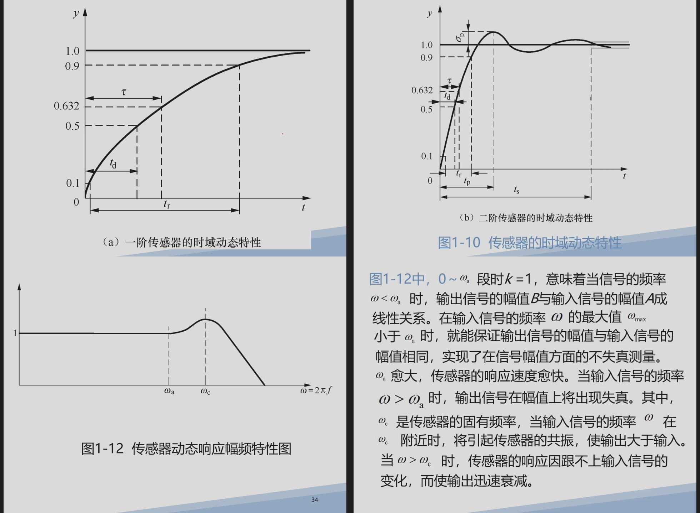

本文件对应 PPT 前半部分的基础内容，主要来自 4 月 27 日课件。它通常不一定出大计算题，但很容易出**名词解释、填空、简答、画框图**，也是后面电阻式、电容式、电感式、热电偶、超声波题目的共同基础。

---

# 一、现代检测系统的组成

## 1. 什么是检测系统

检测系统的任务是把被测对象中的物理量、化学量或状态量转换成可以显示、记录、分析或控制的信息。

常见被测量包括：

```text
温度、压力、位移、速度、加速度、流量、液位、力、转矩、振动、成分浓度
```

考试表达可以写：

> 现代检测系统是利用传感器、信号调理、数据采集和信息处理装置，对被测对象的有关参数进行获取、转换、处理、显示和控制的系统。

## 2. 检测系统基本框图

PPT 中检测系统通常可以抽象为：

```text
被测对象
   ↓
敏感元件 / 传感器
   ↓
信号调理电路
   ↓
A/D 转换与数据采集
   ↓
微机 / 单片机 / 仪表处理
   ↓
显示、记录、报警、控制
```

每一环节的作用：

| 环节 | 作用 |
|---|---|
| 被测对象 | 提供被测物理量，如温度、压力、位移 |
| 敏感元件 | 直接感受被测量 |
| 转换元件 | 把非电量转换成电压、电阻、电容、电感、电荷等电量 |
| 信号调理 | 放大、滤波、补偿、线性化、隔离 |
| 数据采集 | 采样、保持、A/D 转换 |
| 处理与显示 | 计算结果、显示数据、记录曲线或参与控制 |

### 例题：画出检测系统组成框图

题目：

```text
请画出一个现代检测系统的基本组成框图，并说明各部分作用。
```

答案可写：

```text
被测对象 → 传感器 → 信号调理电路 → 数据采集与A/D转换 → 微机处理 → 显示/记录/控制
```

说明时抓住关键词：

```text
传感器：非电量到电量
信号调理：放大、滤波、补偿、线性化
数据采集：采样和数字化
处理显示：计算、显示、控制
```

---

# 二、传感器的定义与分类

## 1. 传感器的定义

传感器是检测系统的前端核心。它能感受规定的被测量，并按一定规律转换成可用输出信号。

考试简答：

> 传感器是能感受被测量并按一定规律转换成可用输出信号的器件或装置，通常由敏感元件、转换元件和基本转换电路组成。

注意这里有两个关键词：

```text
感受被测量
按一定规律转换成可用信号
```

传感器不是简单“检测一下”，而是要把输入和输出建立确定关系。

## 2. 传感器组成

```text
被测量
  ↓
敏感元件：直接感受被测量
  ↓
转换元件：转换为电参量
  ↓
转换电路：变成电压、电流或数字信号
```

例如电阻应变片：

```text
力 → 应变 → 电阻变化 → 电桥输出电压
```

热电偶：

```text
温度差 → 热电势 → 毫伏信号
```

电容式液位传感器：

```text
液位高度 → 介电常数等效变化 → 电容量变化
```

### 例题：传感器是不是测量仪表

题目：

```text
传感器和完整测量仪表有什么区别？
```

答案：

传感器通常只是检测系统的前端转换部分，负责把被测非电量转换成可处理的电信号；完整测量仪表还包括信号调理、显示、记录、供电、外壳和人机接口等部分。

---

# 三、传感器静态特性

静态特性研究的是输入量不随时间变化或变化很慢时，传感器输出与输入之间的关系。

如果题目出现：

```text
灵敏度、线性度、迟滞、重复性、分辨力、精度
```

基本就是静态特性。

## 1. 灵敏度

灵敏度表示输出变化量与输入变化量之比：

$$
S=\frac{\Delta y}{\Delta x}
$$

若输入输出关系为：

$$
y=kx+b
$$

则灵敏度就是斜率：

$$
S=k
$$

灵敏度越大，同样输入变化引起的输出变化越大。

但要注意：

```text
灵敏度高 ≠ 准确度一定高
```

灵敏度高只能说明“反应明显”，不代表误差小。

### 例题：由输入输出表求灵敏度

题目：

```text
某位移传感器位移从 0mm 增加到 10mm，输出电压从 1V 增加到 6V，求平均灵敏度。
```

计算：

$$
S=\frac{6-1}{10-0}=0.5V/mm
$$

答案：

```text
平均灵敏度为 0.5V/mm。
```

## 2. 线性度

线性度反映传感器实际输入输出曲线偏离拟合直线的程度。

常用表达：

$$
\delta_L=\frac{\Delta L_{\max}}{Y_{FS}}\times100\%
$$

其中：

- $\Delta L_{\max}$：实际曲线相对拟合直线的最大偏差；
- $Y_{FS}$：满量程输出。

线性度误差越小，输入输出关系越接近直线。

### 例题：线性度误差

题目：

```text
某传感器满量程输出为 5V，实际曲线相对拟合直线最大偏差为 0.05V，求线性度。
```

计算：

$$
\delta_L=\frac{0.05}{5}\times100\%=1\%
$$

答案：

```text
线性度误差为 1%。
```

## 3. 迟滞

迟滞是指在同一输入值下，输入量增大过程和减小过程得到的输出值不同。

可以这样理解：

```text
正行程输出 ≠ 反行程输出
```

迟滞常来自弹性元件、摩擦、磁滞、机械间隙等。

考试关键词：

```text
同一输入、正反行程、输出不一致
```

## 4. 重复性

重复性是指在相同条件下，对同一输入量多次重复测量时，输出值之间的一致程度。

关键词：

```text
同方向、同条件、同输入、多次测量、输出分散程度
```

重复性误差越小，说明传感器输出越稳定。

## 5. 分辨力与阈值

分辨力是传感器能够检测到的最小输入变化量。

例如：

```text
位移传感器能分辨 0.01mm 的变化
```

说明其分辨力为 $0.01mm$。

阈值是能引起输出可察觉变化的最小输入量。

### 例题：静态特性概念辨析

题目：

```text
同一输入值下，传感器在输入量增加和减少过程中输出不同，这属于什么静态特性？
```

答案：

```text
迟滞。
```

原因：迟滞强调“正反行程不重合”。

---

# 四、传感器动态特性

动态特性研究输入量随时间变化时，传感器输出能否及时、准确地跟随输入变化。

PPT 中这一部分常结合一阶、二阶系统图像讲。图如下：



## 1. 一阶传感器

一阶传感器典型传递函数：

$$
H(s)=\frac{K}{\tau s+1}
$$

其中：

- $K$：静态灵敏度；
- $\tau$：时间常数。

单位阶跃输入下：

$$
y(t)=K\left(1-e^{-t/\tau}\right)
$$

必须记住：

$$
y(\tau)=K(1-e^{-1})\approx0.632K
$$

也就是：

```text
一阶传感器经过一个时间常数 τ，输出达到最终值的约 63.2%。
```

大致稳定时间：

```text
3τ：约 95%
5τ：约 99%，工程上常认为基本稳定
```

### 例题：求时间常数

题目：

```text
某一阶温度传感器最终输出为 100mV。输入阶跃温度后，经过 2s 输出为 63.2mV，求时间常数。
```

分析：

$$
\frac{63.2}{100}=63.2\%
$$

一阶系统在 $t=\tau$ 时达到最终值的 $63.2\%$，所以：

$$
\tau=2s
$$

若问大约多久基本稳定：

$$
t\approx5\tau=10s
$$

## 2. 二阶传感器

二阶传感器常用传递函数：

$$
H(s)=\frac{K\omega_n^2}{s^2+2\xi\omega_ns+\omega_n^2}
$$

其中：

- $\omega_n$：固有角频率；
- $\xi$：阻尼比；
- $K$：静态灵敏度。

阻尼比决定响应形态：

| 阻尼比 | 响应特点 |
|---|---|
| $\xi=0$ | 无阻尼振荡 |
| $0<\xi<1$ | 欠阻尼，有超调和振荡 |
| $\xi=1$ | 临界阻尼，较快且无振荡 |
| $\xi>1$ | 过阻尼，无振荡但响应慢 |

考试最容易问：

```text
固有频率越高，传感器可跟随的输入变化越快；
阻尼比影响超调、振荡和稳定时间。
```

### 例题：二阶响应判断

题目：

```text
某压力传感器阶跃响应出现明显超调和衰减振荡，应判断阻尼比范围是什么？
```

答案：

```text
欠阻尼，0<ξ<1。
```

---

# 五、本章背诵版

```text
现代检测系统通常由传感器、信号调理、数据采集与转换、显示记录或控制装置组成。传感器用于感受被测量，并按一定规律转换成可用输出信号，通常由敏感元件、转换元件和转换电路组成。

传感器静态特性包括灵敏度、线性度、迟滞、重复性、分辨力等。灵敏度是输出变化量与输入变化量之比；线性度表示实际特性曲线偏离拟合直线的程度；迟滞是同一输入下正反行程输出不一致；重复性是相同条件下多次测量输出的一致程度。

动态特性研究输入随时间变化时传感器输出的跟随能力。一阶传感器传递函数常写为 K/(τs+1)，时间常数 τ 越小响应越快；阶跃输入经过一个 τ 时输出达到最终值的约 63.2%。二阶传感器的固有频率和阻尼比决定响应速度、超调和振荡情况。
```
