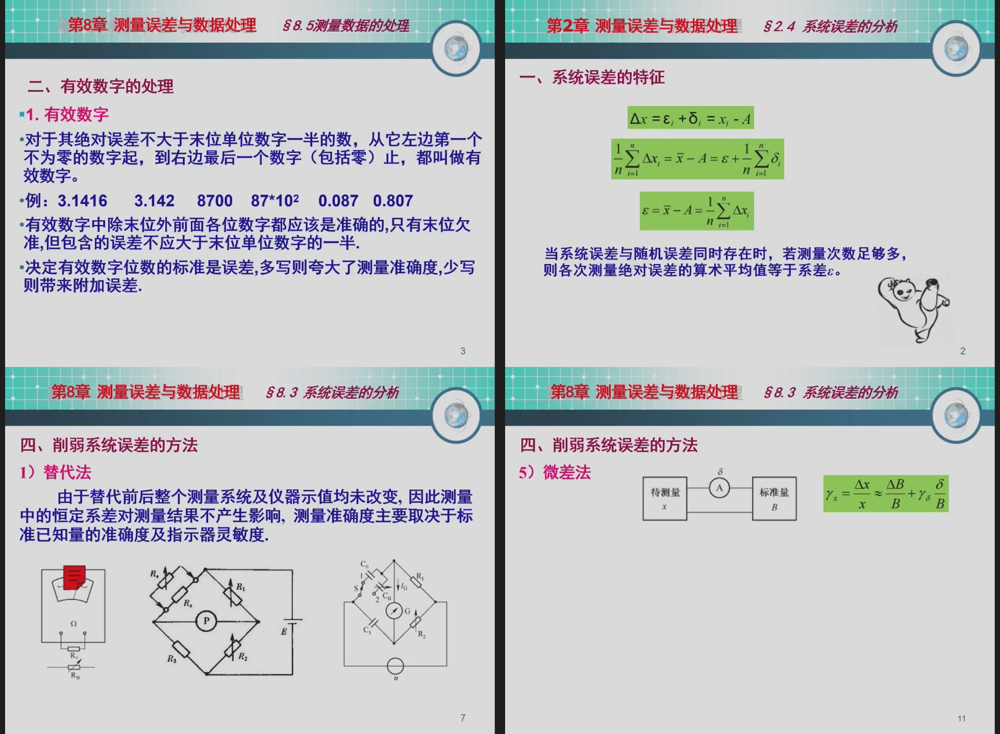

这一部分在 6 月 10 日、6 月 17 日、6 月 22 日复习课中反复出现，考试可能性很高。它既能出**选择填空**，也能出**计算大题**。核心是会区分误差类型，会算绝对误差、相对误差、引用误差、仪表等级，会处理重复测量数据和置信区间。

---

# 一、误差的基本概念

## 1. 绝对误差

绝对误差是测量值与真值或约定真值之差：

$$
\Delta x=x-A
$$

其中：

- $x$：测量值；
- $A$：真值或约定真值。

绝对误差有单位，也有正负号。

### PPT例题：绝对误差与相对误差


若真值为 $100V$，测得 $101V$：

$$
\Delta U=101-100=1V
$$

若真值为 $5V$，测得 $6V$：

$$
\Delta U=6-5=1V
$$

两者绝对误差都是 $1V$，但测量质量不一样，因为相对误差不同。

## 2. 相对误差

相对误差是绝对误差与真值之比：

$$
\gamma=\frac{\Delta x}{A}\times100\%
$$

上面的两个例子：

$$
\gamma_1=\frac{1}{100}\times100\%=1\%
$$

$$
\gamma_2=\frac{1}{5}\times100\%=20\%
$$

所以：

```text
同样 1V 误差，对 5V 测量影响很大，对 100V 测量影响较小。
```

## 3. 修正值

修正值是为了消除系统误差而加到测量值上的值：

$$
C=-\Delta x
$$

修正后结果：

$$
x_c=x+C
$$

### 例题：修正值

题目：

```text
某仪表测量 100V 标准电压时示值为 101V，求绝对误差和修正值。
```

解：

$$
\Delta U=101-100=1V
$$

$$
C=-1V
$$

答案：

```text
绝对误差为 +1V，修正值为 -1V。
```

---

# 二、引用误差与仪表准确度等级

## 1. 引用误差

引用误差通常按满量程计算：

$$
\gamma_m=\frac{\Delta x_{\max}}{x_m}\times100\%
$$

其中：

- $\Delta x_{\max}$：最大绝对误差；
- $x_m$：仪表满量程。

## 2. 准确度等级

仪表等级 $s$ 表示允许引用误差的百分数。

允许最大绝对误差：

$$
|\Delta x|_{\max}=\frac{s}{100}x_m
$$

注意：

```text
等级数字越小，仪表准确度越高。
0.5级 比 1.5级 更准确。
```

### PPT例题：仪表选型

题目类型通常是：

```text
给出被测量范围、允许误差、仪表量程，判断应选几级仪表。
```

解题步骤：

1. 找满量程 $x_m$；
2. 找允许最大绝对误差 $|\Delta x|_{\max}$；
3. 计算等级：

$$
s\leq \frac{|\Delta x|_{\max}}{x_m}\times100
$$

4. 选择等级数字不大于计算值的仪表。

### 例题：计算仪表等级

题目：

```text
用满量程 100V 的电压表测量电压，要求最大误差不超过 0.5V，仪表等级至少应为多少？
```

计算：

$$
s\leq\frac{0.5}{100}\times100=0.5
$$

答案：

```text
应选 0.5 级或更高准确度的仪表。
```

---

# 三、误差分类

## 1. 系统误差

系统误差是在相同条件下重复测量时，误差大小和符号保持不变或按一定规律变化的误差。

来源：

```text
仪表零点偏差
刻度不准
环境温度影响
测量方法不完善
理论模型近似
```

系统误差可以通过修正、补偿、校准等方法削弱。

## 2. 随机误差

随机误差是由许多不可控制的小因素引起的，大小和符号随机变化。

特点：

```text
单次测量无法确定
多次测量服从统计规律
可通过多次测量取平均减小影响
```

## 3. 粗大误差

粗大误差是明显偏离正常测量结果的误差，又叫过失误差。

来源：

```text
读数错误
记录错误
操作失误
仪器异常
外界突发干扰
```

处理原则：

```text
发现粗大误差后，应剔除该异常数据，不能拿来求平均。
```

### 例题：误差分类判断

题目：

```text
某电压表零点偏高，每次读数都偏大，这属于什么误差？
```

答案：

```text
系统误差。
```

原因：误差方向固定，具有规律性。

---

# 四、等精度重复测量

重复测量大题很可能这样考：

```text
给一组测量数据
求平均值
求残差
求标准差
判断粗大误差
写最终测量结果
```

PPT 例题如下：


## 1. 算术平均值

$$
\bar{x}=\frac{1}{n}\sum_{i=1}^{n}x_i
$$

平均值是多次测量结果的最佳估计值。

## 2. 残差

$$
v_i=x_i-\bar{x}
$$

残差反映第 $i$ 次测量相对平均值的偏离程度。

残差有一个重要性质：

$$
\sum_{i=1}^{n}v_i=0
$$

这可以用来检查计算有没有错。

## 3. 标准差

单次测量标准差：

$$
s=\sqrt{\frac{\sum v_i^2}{n-1}}
$$

平均值标准差：

$$
s_{\bar{x}}=\frac{s}{\sqrt{n}}
$$

## 4. 粗大误差判断

常见准则有：

```text
3σ准则
格拉布斯准则
```

如果题目没有给表，一般考基础判断：

$$
|v_i|>3s
$$

则可认为该测量值含粗大误差。

### 例题：重复测量结果表达

题目：

```text
某量重复测量 n 次，平均值为 20.15mm，平均值标准差为 0.03mm，取置信系数 k=2，写出测量结果。
```

扩展不确定度：

$$
U=ks_{\bar{x}}=2\times0.03=0.06mm
$$

测量结果：

$$
x=(20.15\pm0.06)mm
$$

---

# 五、置信区间

PPT 中置信区间例题图如下：


当测量次数较少，且标准差由样本估计时，常用 $t$ 分布：

$$
\bar{x}\pm t_{\alpha}\frac{s}{\sqrt{n}}
$$

其中：

- $\bar{x}$：平均值；
- $s$：单次测量标准差；
- $n$：测量次数；
- $t_{\alpha}$：由置信概率和自由度查表得到。

考试中若给出 $t$ 值，只需要代公式。

### 例题：置信区间计算

题目：

```text
某量测量 10 次，平均值为 50.00，标准差 s=0.20。置信概率对应 t=2.26，求平均值置信区间。
```

计算：

$$
\Delta=t\frac{s}{\sqrt{n}}
=2.26\times\frac{0.20}{\sqrt{10}}
\approx0.143
$$

答案：

$$
x=50.00\pm0.14
$$

---

# 六、系统误差削弱方法

PPT 前序补漏中强调过有效数字、系统误差和误差传递：



常见方法：

| 方法 | 含义 | 适用场景 |
|---|---|---|
| 交换法 | 调换被测对象或测量位置 | 消除位置、臂长、接触等固定误差 |
| 替代法 | 用标准量替代被测量 | 比较测量 |
| 差动法 | 两个相反变化信号相减 | 提高灵敏度、抑制共模误差 |
| 补偿法 | 引入反向误差抵消原误差 | 温度补偿、零点补偿 |
| 对称观测法 | 前后对称观测取平均 | 消除线性变化的系统误差 |

### 例题：方法选择

题目：

```text
为了消除温度变化对电阻应变片测量的影响，常在桥路中接入温度补偿片。这属于什么方法？
```

答案：

```text
补偿法。
```

---

# 七、本章背诵版

```text
绝对误差等于测量值减真值，相对误差等于绝对误差除以真值，引用误差等于最大绝对误差除以满量程。仪表准确度等级表示允许引用误差的百分数，等级数字越小，准确度越高。

误差按性质可分为系统误差、随机误差和粗大误差。系统误差具有确定规律，可通过修正、补偿、校准等方法削弱；随机误差服从统计规律，可通过多次测量取平均减小影响；粗大误差通常由操作或记录错误引起，应剔除。

等精度重复测量中，先求平均值，再求残差和标准差。单次测量标准差为 sqrt(Σv_i^2/(n-1))，平均值标准差为 s/sqrt(n)。置信区间常写为 x̄±t·s/sqrt(n)。
```
