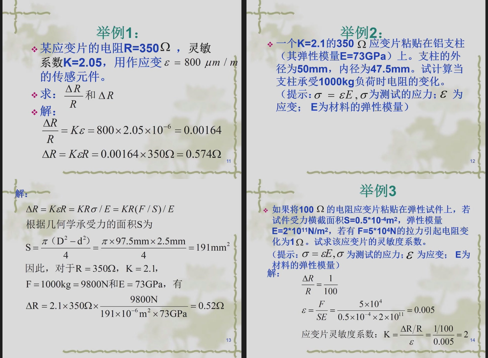
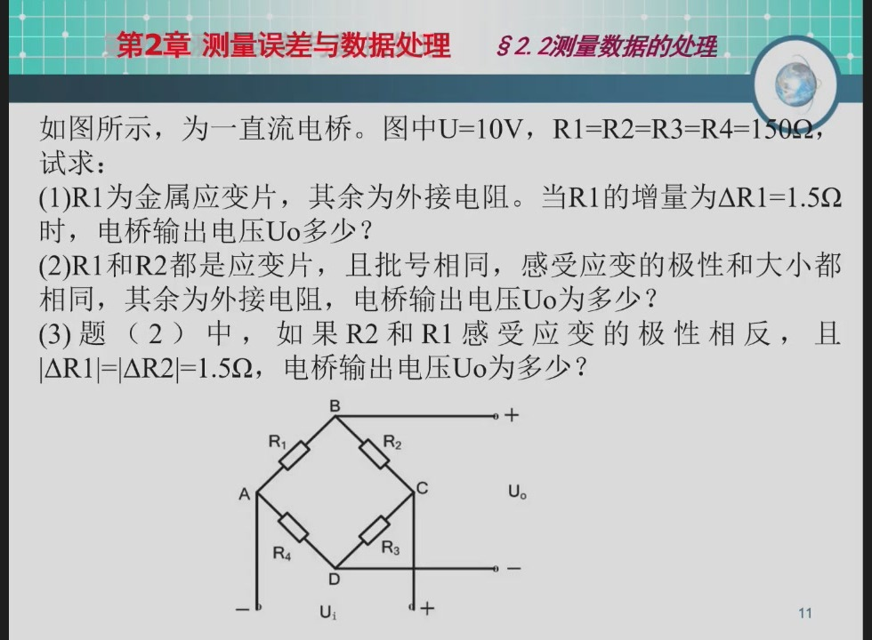
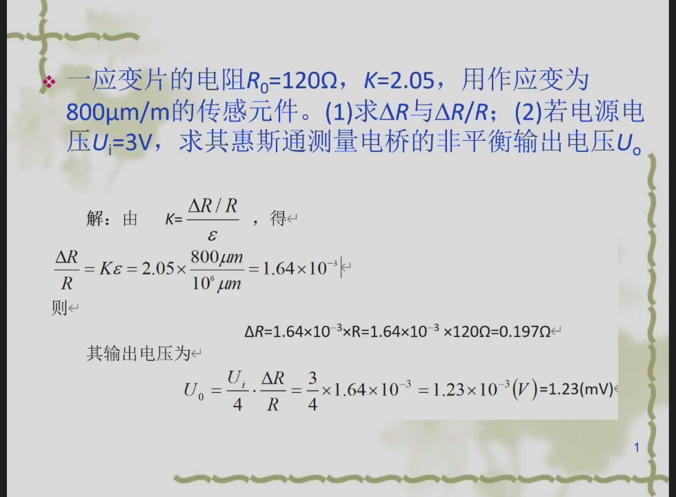

这一部分在 PPT 中出现频率很高，尤其是 4 月 29 日、5 月 6 日、6 月 22 日复习课。它最容易出**综合计算题**：受力、应力、应变、电阻变化、电桥输出一条链算到底。

---

# 一、电阻式传感器基本思想

电阻式传感器把被测非电量转换为电阻变化。

常见输入：

```text
位移、压力、力、重量、应变、温度
```

基本形式：

```text
被测量变化 → 几何尺寸或材料电阻率变化 → 电阻值变化
```

电阻公式：

$$
R=\rho\frac{l}{A}
$$

其中：

- $\rho$：电阻率；
- $l$：导体长度；
- $A$：截面积。

如果导体被拉长：

```text
l 增大，A 减小，R 增大
```

---

# 二、电阻应变片

## 1. 应变的定义

应变表示单位长度的相对变形：

$$
\varepsilon=\frac{\Delta l}{l}
$$

应变没有量纲。工程上常用微应变：

$$
1\mu\varepsilon=10^{-6}
$$

## 2. 应变片灵敏系数

电阻应变片的核心公式：

$$
\frac{\Delta R}{R}=K\varepsilon
$$

其中：

- $K$：应变片灵敏系数；
- $\varepsilon$：应变；
- $\Delta R/R$：电阻相对变化。

考试中只要看到：

```text
应变片、灵敏系数、电阻变化
```

基本就用这条公式。

### PPT例题：电阻应变片计算



常见计算链：

$$
\sigma=\frac{F}{S}
$$

$$
\varepsilon=\frac{\sigma}{E}
$$

$$
\frac{\Delta R}{R}=K\varepsilon
$$

$$
\Delta R=RK\varepsilon
$$

### 例题：由力求电阻变化

题目：

```text
某构件受拉力后产生应变 ε=500με，应变片阻值 R=120Ω，灵敏系数 K=2，求电阻变化量。
```

先换算：

$$
\varepsilon=500\times10^{-6}
$$

计算：

$$
\Delta R=RK\varepsilon
=120\times2\times500\times10^{-6}
=0.12\Omega
$$

答案：

```text
电阻增加 0.12Ω。
```

---

# 三、应变片温度误差与补偿

应变片受温度影响时，即使没有机械应变，电阻也可能变化。

主要原因：

```text
应变片电阻温度系数
试件与应变片线膨胀系数不同
环境温度变化
```

温度误差会让输出里混入“假应变”。

## 1. 温度补偿片

补偿思路：

```text
工作片：同时受机械应变和温度影响
补偿片：只受温度影响，不受机械应变
桥路相减后，温度影响互相抵消
```

这就是补偿法和差动思想的结合。

### 例题：补偿片判断

题目：

```text
应变测量中，为消除环境温度变化引起的电阻变化，在桥路相邻臂接入一片不受力但温度条件相同的应变片。该应变片叫什么？作用是什么？
```

答案：

```text
该应变片称为温度补偿片，用于抵消温度变化导致的电阻变化，减小温度误差。
```

---

# 四、直流电桥

电阻应变片的电阻变化通常很小，不能直接测量，所以要接入电桥，把微小电阻变化转换成电压输出。

## 1. 电桥平衡条件

直流电桥基本结构：

```text
        R1
   +---/\/\/---+
   |           |
  Ui          Uo
   |           |
   +---/\/\/---+
        R2
```

实际桥路为四臂结构。平衡条件：

$$
R_1R_3=R_2R_4
$$

或：

$$
\frac{R_1}{R_2}=\frac{R_4}{R_3}
$$

PPT例题：



### 例题：判断电桥是否平衡

题目：

```text
R1=100Ω，R2=200Ω，R3=150Ω，R4=300Ω，判断电桥是否平衡。
```

计算：

$$
R_1R_3=100\times150=15000
$$

$$
R_2R_4=200\times300=60000
$$

不相等，所以：

```text
电桥不平衡。
```

## 2. 单臂电桥

只有一个桥臂为工作应变片时，近似输出：

$$
U_o\approx\frac{U_i}{4}\frac{\Delta R}{R}
$$

如果：

$$
\frac{\Delta R}{R}=K\varepsilon
$$

则：

$$
U_o\approx\frac{U_i}{4}K\varepsilon
$$

PPT例题：



### 例题：单臂电桥输出

题目：

```text
单臂电桥供桥电压 Ui=10V，应变片 K=2，应变 ε=500με，求输出电压近似值。
```

计算：

$$
U_o=\frac{10}{4}\times2\times500\times10^{-6}
=0.0025V
=2.5mV
$$

答案：

```text
输出约为 2.5mV。
```

## 3. 半桥与全桥

半桥两个工作臂，全桥四个工作臂。

若桥臂安排正确，使输出同向叠加，则：

| 桥路 | 近似输出 |
|---|---|
| 单臂 | $U_o\approx \frac{U_i}{4}K\varepsilon$ |
| 半桥 | $U_o\approx \frac{U_i}{2}K\varepsilon$ |
| 全桥 | $U_o\approx U_iK\varepsilon$ |

也就是说：

```text
半桥灵敏度约为单臂 2 倍
全桥灵敏度约为单臂 4 倍
```

前提是工作片受力方向和桥臂位置安排正确。

### 例题：桥路灵敏度比较

题目：

```text
同样供桥电压、同样应变片和应变条件下，全桥输出大约是单臂电桥的几倍？
```

答案：

```text
约 4 倍。
```

---

# 五、综合题解题模板

看到应变片综合题，按下面顺序写：

```text
1. 由力和面积求应力 σ=F/S
2. 由应力和弹性模量求应变 ε=σ/E
3. 由应变片公式求 ΔR/R=Kε
4. 由桥路类型求输出 Uo
```

完整公式链：

$$
\sigma=\frac{F}{S}
$$

$$
\varepsilon=\frac{\sigma}{E}
$$

$$
\frac{\Delta R}{R}=K\varepsilon
$$

$$
U_o\approx
\begin{cases}
\frac{U_i}{4}K\varepsilon,& 单臂\\
\frac{U_i}{2}K\varepsilon,& 半桥\\
U_iK\varepsilon,& 全桥
\end{cases}
$$

### 例题：综合计算

题目：

```text
某金属杆截面积 S=100mm²，受拉力 F=1000N，弹性模量 E=2×10^11Pa，应变片 K=2，供桥电压 Ui=10V，采用单臂电桥，求输出电压。
```

单位换算：

$$
100mm^2=100\times10^{-6}m^2=1\times10^{-4}m^2
$$

应力：

$$
\sigma=\frac{1000}{1\times10^{-4}}=1\times10^7Pa
$$

应变：

$$
\varepsilon=\frac{1\times10^7}{2\times10^{11}}=5\times10^{-5}
$$

电桥输出：

$$
U_o=\frac{10}{4}\times2\times5\times10^{-5}
=2.5\times10^{-4}V
=0.25mV
$$

---

# 六、本章背诵版

```text
电阻应变片利用应变引起电阻变化的原理工作，核心公式为 ΔR/R=Kε。应变 ε=Δl/l，也可由应力和弹性模量求得：ε=σ/E，σ=F/S。

电桥用于把微小电阻变化转换为电压输出。直流电桥平衡条件为 R1R3=R2R4。单臂电桥输出近似为 Uo=(Ui/4)(ΔR/R)，半桥约为单臂 2 倍，全桥约为单臂 4 倍。

应变片温度误差主要来自电阻温度系数和热膨胀差异，可用温度补偿片、差动桥路等方法减小。
```
