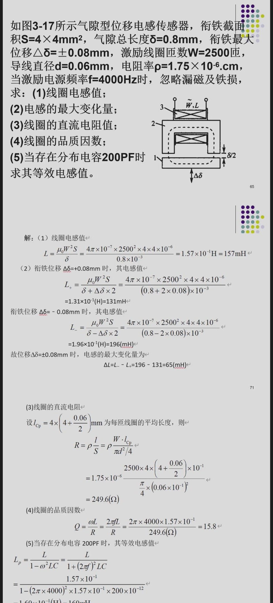

电感式传感器在前序 PPT 中讲得比较细，尤其有气隙型电感传感器综合题。它容易考**结构原理、差动变压器、零点残余电压、电涡流应用、气隙型电感计算**。

---

# 一、自感式电感传感器

电感式传感器把被测量转换为电感量变化。

线圈电感近似与磁路磁阻有关：

$$
L=\frac{N^2}{R_m}
$$

其中：

- $N$：线圈匝数；
- $R_m$：磁阻。

磁阻：

$$
R_m=\frac{l}{\mu S}
$$

气隙磁阻通常远大于铁芯磁阻，所以气隙变化对电感影响很明显。

基本关系：

```text
气隙 δ 增大 → 磁阻增大 → 电感 L 减小
气隙 δ 减小 → 磁阻减小 → 电感 L 增大
```

PPT例题：



### 例题：气隙变化判断

题目：

```text
某气隙型电感传感器测位移时，衔铁靠近铁芯，使气隙减小。电感如何变化？
```

答案：

```text
气隙减小，磁阻减小，电感增大。
```

---

# 二、差动电感传感器

差动结构由两个电感组成，一个增大、一个减小。

```text
位移向上：L1 增大，L2 减小
位移向下：L1 减小，L2 增大
```

优点：

```text
灵敏度提高
线性范围扩大
温度和电源波动等共模影响减小
可判断位移方向
```

### 例题：差动电感方向判断

题目：

```text
差动电感传感器中，衔铁向上移动使上部气隙减小、下部气隙增大，则 L1 和 L2 如何变化？
```

答案：

```text
上部电感 L1 增大，下部电感 L2 减小。
```

---

# 三、差动变压器

差动变压器又称 LVDT，是一种互感式电感传感器。

基本结构：

```text
一个一次绕组
两个对称二次绕组
中间有可移动铁芯
```

输出是两个二次绕组感应电压的差：

$$
U_o=U_{21}-U_{22}
$$

当铁芯在中间位置：

```text
两个二次感应电压大小相等、相位相反，输出约为 0
```

铁芯偏离中心：

```text
一侧耦合增强，另一侧耦合减弱，输出幅值与位移有关
```

输出相位可判断位移方向。

### 例题：差动变压器零位

题目：

```text
差动变压器铁芯位于中间位置时，理想输出电压是多少？为什么实际中可能不为零？
```

答案：

理想情况下输出为 $0$。实际中由于绕组不完全对称、磁路不均匀、寄生参数和谐波影响，会出现零点残余电压。

---

# 四、零点残余电压

差动变压器在零位时输出不为零的电压称为零点残余电压。

来源：

```text
两个二次绕组参数不完全一致
铁芯和磁路不对称
激励电源含谐波
分布电容和漏感影响
```

减小方法：

```text
提高绕组和磁路对称性
采用相敏检波
电路补偿
滤波
调零
```

### 例题：零点残余电压简答

题目：

```text
什么是差动变压器的零点残余电压？如何减小？
```

答案：

零点残余电压是指差动变压器铁芯处于零位时输出端仍存在的电压。可通过提高结构对称性、采用相敏检波、补偿电路、滤波和调零等方法减小。

---

# 五、电涡流传感器

电涡流传感器利用金属导体在交变磁场中产生涡流的现象。

工作过程：

```text
线圈通交流电 → 产生交变磁场
金属被测体中产生电涡流
电涡流反过来影响线圈等效阻抗
阻抗变化反映位移、厚度、转速等
```

影响电涡流的因素：

```text
线圈与金属距离
金属电导率
磁导率
材料厚度
激励频率
线圈结构
```

常见应用：

```text
非接触位移测量
振动测量
转速测量
金属厚度测量
无损探伤
```

### 例题：电涡流适用对象

题目：

```text
电涡流传感器能否直接测量塑料板厚度？为什么？
```

答案：

一般不能直接测量。电涡流需要被测体为导电材料，塑料不导电，不能在交变磁场中产生明显涡流。

---

# 六、品质因数与等效电路

电感线圈不是理想电感，还存在电阻。

品质因数：

$$
Q=\frac{\omega L}{R}
$$

其中：

- $\omega$：角频率；
- $L$：电感；
- $R$：线圈等效电阻。

电感越大、频率越高、损耗电阻越小，$Q$ 越高。

### 例题：品质因数计算

题目：

```text
某线圈电感 L=10mH，电阻 R=10Ω，工作频率 f=1kHz，求品质因数 Q。
```

计算：

$$
\omega=2\pi f=2\pi\times1000
$$

$$
Q=\frac{\omega L}{R}
=\frac{2\pi\times1000\times10\times10^{-3}}{10}
\approx6.28
$$

---

# 七、本章背诵版

```text
电感式传感器把位移等非电量转换成电感量变化。自感式传感器常通过气隙变化改变磁阻，气隙减小则磁阻减小、电感增大。差动电感结构可提高灵敏度、改善线性并判断位移方向。

差动变压器由一个一次绕组、两个二次绕组和活动铁芯组成，输出为两个二次电压之差。铁芯在中间时理想输出为零，实际存在零点残余电压，可通过结构对称、相敏检波和补偿减小。

电涡流传感器利用导体在交变磁场中产生涡流的原理工作，可非接触测量金属位移、振动、厚度和缺陷，但要求被测体具有导电性。
```
