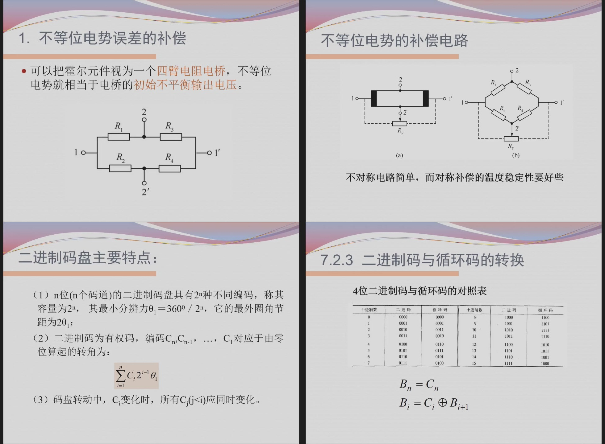

这一组内容分散在中后段 PPT 中，通常不如误差、电桥、热电偶那样容易出大计算，但很适合出**填空、选择、简答、结构识图**。重点是每类传感器“输入是什么、转换成什么、适合测什么”。

---

# 一、压电式传感器

## 1. 压电效应

某些晶体或陶瓷受到外力作用时，表面会产生电荷，这种现象称为压电效应。

```text
力 / 压力 / 加速度 → 电荷 → 电压信号
```

常见压电材料：

```text
石英晶体
压电陶瓷
钛酸钡
锆钛酸铅 PZT
```

## 2. 基本公式

压电元件产生的电荷与作用力近似成正比：

$$
Q=dF
$$

其中：

- $Q$：电荷；
- $d$：压电常数；
- $F$：作用力。

若等效电容为 $C$，输出电压：

$$
U=\frac{Q}{C}
$$

## 3. 为什么不适合静态测量

压电传感器输出电荷会通过内部电阻、放大器输入电阻等逐渐泄漏。

所以它适合：

```text
动态力
振动
冲击
加速度
动态压力
```

不适合长期静态力测量。

### 例题：压电传感器适用场景

题目：

```text
压电式传感器为什么常用于振动和冲击测量，而不适合静态重量测量？
```

答案：

压电式传感器受力时产生电荷，但电荷会通过等效电阻泄漏，静态输出不能长期保持；振动和冲击属于动态变化量，能产生连续变化的电荷信号，因此更适合用压电式传感器测量。

---

# 二、磁电式传感器

磁电式传感器基于电磁感应原理。

当线圈与磁场发生相对运动时，线圈中产生感应电动势：

$$
e=-N\frac{d\Phi}{dt}
$$

其中：

- $N$：线圈匝数；
- $\Phi$：磁通量。

如果速度越大，磁通变化率越大，输出电压越大。

常用于：

```text
速度测量
振动测量
转速测量
```

### 例题：磁电式传感器能否测静态位移

题目：

```text
磁电式传感器能否直接测量静态位移？为什么？
```

答案：

一般不能。磁电式传感器依靠磁通变化产生感应电动势，静态位移没有持续的磁通变化，输出趋近于零，因此更适合测速度、振动等动态量。

---

# 三、霍尔传感器

## 1. 霍尔效应

载流半导体或导体置于磁场中，载流子受洛伦兹力偏转，在垂直于电流和磁场方向产生电势差，这就是霍尔效应。

霍尔电压：

$$
U_H=K_HIB
$$

更完整可写：

$$
U_H=\frac{R_H}{d}IB
$$

其中：

- $I$：控制电流；
- $B$：磁感应强度；
- $d$：霍尔片厚度；
- $K_H$：霍尔灵敏度。

## 2. 应用

```text
磁场测量
位移测量
转速测量
接近开关
电流测量
无刷电机位置检测
```

PPT补充图：



### 例题：霍尔电压方向

题目：

```text
霍尔元件中，若控制电流 I 和磁场 B 均不变，霍尔片厚度 d 增大，霍尔电压如何变化？
```

由：

$$
U_H=\frac{R_H}{d}IB
$$

可知 $d$ 增大时：

```text
霍尔电压减小。
```

---

# 四、光电式传感器

光电式传感器把光信号转换成电信号。

常见光电效应：

| 类型 | 含义 | 器件 |
|---|---|---|
| 外光电效应 | 光照使电子逸出材料表面 | 光电管、光电倍增管 |
| 内光电效应 | 光照改变材料电导率 | 光敏电阻 |
| 光生伏特效应 | 光照产生电动势 | 光电池、光电二极管 |

应用：

```text
光电开关
转速测量
计数
位置检测
条码识别
烟雾检测
```

### 例题：光敏电阻属于哪类效应

题目：

```text
光敏电阻受光照后电阻发生变化，这属于哪种光电效应？
```

答案：

```text
内光电效应。
```

---

# 五、光电编码器

编码器常用于角位移和转速测量。

## 1. 增量式编码器

增量式编码器输出脉冲。

```text
转过一定角度 → 输出一定数量脉冲
```

若码盘每转输出 $N$ 个脉冲，测得频率为 $f$，转速为：

$$
n=\frac{60f}{N}
$$

单位为 $r/min$。

### 例题：增量式编码器测速

题目：

```text
某增量式编码器每转输出 600 个脉冲，测得脉冲频率为 3000Hz，求转速。
```

计算：

$$
n=\frac{60f}{N}
=\frac{60\times3000}{600}
=300r/min
$$

## 2. 绝对式编码器

绝对式编码器每一个角位置对应唯一编码。

优点：

```text
断电后重新上电仍能知道当前位置
不需要从零位开始累计脉冲
```

## 3. 格雷码

格雷码相邻两个编码只有一位不同。

优点：

```text
减少多位同时变化造成的读数错误
```

### 例题：格雷码特点

题目：

```text
为什么绝对式光电编码器常采用格雷码？
```

答案：

因为格雷码相邻位置编码只变化一位，可减少码盘过渡位置多位同时变化造成的误读，提高位置检测可靠性。

---

# 六、本章背诵版

```text
压电式传感器利用压电效应，受力产生电荷，适合动态力、振动、冲击和加速度测量，不适合长期静态测量。

磁电式传感器基于电磁感应，输出电动势与磁通变化率有关，适合速度、振动和转速测量。

霍尔传感器利用霍尔效应，霍尔电压与控制电流和磁感应强度成正比，可用于磁场、位移、转速和电流检测。

光电传感器把光信号转换成电信号。增量式编码器输出脉冲，可由 n=60f/N 求转速；绝对式编码器每个位置有唯一编码，常用格雷码减少误读。
```
