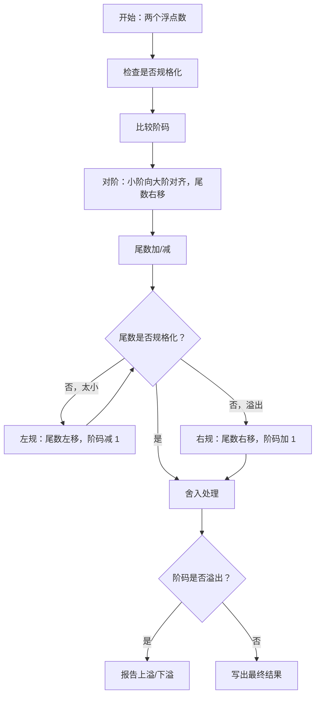

这一部分对应课程目标 1 中的前三个重点：

```text
定点加减法运算
定点乘法运算
浮点加减法运算
```

课程总结还特别提醒：课程先导基本知识包括**进制转换、真值/补码的相互转换**。课堂截图前几次课也大量出现真值、机器数、原码、补码、浮点规格化例题，所以这部分基本可以认为是计算题基础。

> 教材查阅：数的机器码、定点数和浮点数表示见第 18-29 页；定点加减法见第 57-61 页；定点乘法见第 66-72 页；浮点加减法见第 78-81 页。

---

# 一、真值、机器数和常见编码

> 教材查阅：第 18-23 页，重点看 2.2.1“数的机器码表示”。

## 1. 真值

真值就是带正负号的实际数值。

例如：

```text
+1011
-1011
+0.1011
-0.1011
```

真值强调数学意义，符号直接写成 `+` 或 `-`。

---

## 2. 机器数

机器数是计算机内部存储的二进制编码。机器数通常把符号也编码进二进制位中。

常见约定：

```text
最高位为符号位
0 表示正数
1 表示负数
```

例如 8 位机器数：

```text
0000 1011
```

如果按原码理解，它表示 `+11`。

```text
1000 1011
```

如果按原码理解，它表示 `-11`。

注意：同一个二进制串按不同编码解释，数值可能不同。所以考试必须看清题目要求是原码、反码还是补码。

---

## 例题1：数制转换

将十进制数 $45.625$ 转换为二进制和十六进制。

整数部分：

$$
45=32+8+4+1
$$

所以：

$$
45_{10}=101101_2
$$

小数部分用乘 2 取整：

$$
0.625\times2=1.25
$$

取整数位 $1$，余 $0.25$。

$$
0.25\times2=0.5
$$

取整数位 $0$，余 $0.5$。

$$
0.5\times2=1.0
$$

取整数位 $1$，余 $0$。

所以：

$$
0.625_{10}=0.101_2
$$

合起来：

$$
45.625_{10}=101101.101_2
$$

二进制转十六进制，从小数点两侧分别每 4 位分组：

$$
101101.101_2=0010\ 1101.1010_2
$$

因此：

$$
45.625_{10}=101101.101_2=2D.A_{16}
$$

---

# 二、原码、反码、补码

## 1. 原码

原码规则：

```text
符号位表示正负
数值位表示绝对值
```

例如 8 位原码：

```text
+5 = 0000 0101
-5 = 1000 0101
```

原码的优点是直观，缺点是不方便做加减运算，并且有 `+0` 和 `-0` 两种表示。

---

## 2. 反码

反码规则：

```text
正数反码 = 原码
负数反码 = 符号位不变，数值位逐位取反
```

例如 8 位：

```text
+5 原码 = 0000 0101
+5 反码 = 0000 0101

-5 原码 = 1000 0101
-5 反码 = 1111 1010
```

反码也有 `+0` 和 `-0` 的问题。

---

## 3. 补码

补码规则：

```text
正数补码 = 原码
负数补码 = 反码 + 1
```

例如 8 位：

```text
+5 补码 = 0000 0101

-5 原码 = 1000 0101
-5 反码 = 1111 1010
-5 补码 = 1111 1011
```

补码最重要的优点是：

```text
减法可以转换为加法
符号位可以一起参与运算
0 的表示唯一
```

所以计算机中定点整数加减通常使用补码。

---

## 例题2：原码、反码、补码

用 8 位机器数表示 $-37$ 的原码、反码和补码。

先写出 $+37$：

$$
37=32+4+1
$$

所以：

$$
+37=00100101_2
$$

负数原码：符号位为 $1$，数值位不变。

$$
[-37]_{原}=10100101
$$

负数反码：符号位不变，数值位取反。

$$
[-37]_{反}=11011010
$$

负数补码：反码加 $1$。

$$
[-37]_{补}=11011010+1=11011011
$$

答案：

$$
[-37]_{原}=10100101,\quad [-37]_{反}=11011010,\quad [-37]_{补}=11011011
$$

---

# 三、补码范围

> 教材查阅：第 23-25 页，重点看 2.2.2“定点数表示”。

## 1. n 位补码整数范围

若机器字长为 n 位，其中 1 位符号位，补码整数范围是：

$$
-2^{n-1} \leq x \leq 2^{n-1}-1
$$

例如 8 位补码整数：

$$
-2^7 \leq x \leq 2^7-1
$$

即：

$$
-128 \leq x \leq 127
$$

容易错的点：

```text
补码负数比正数多表示一个最小负数
8位补码最小值是 -128，不是 -127
```

---

## 2. 定点小数补码范围

如果是 1 位符号位加 n 位小数位，补码定点小数范围为：

$$
-1 \leq x \leq 1-2^{-n}
$$

例如 1 位符号位加 7 位小数位：

$$
-1 \leq x \leq 1-2^{-7}
$$

---

# 四、补码加减法

> 教材查阅：第 57-59 页，重点看 3.2.1“补码加减法运算方法”。

## 1. 基本思想

补码加法：

$$
[x+y]_{补} = [x]_{补} + [y]_{补}
$$

补码减法：

$$
[x-y]_{补} = [x]_{补} + [-y]_{补}
$$

也就是说，减法先把减数变成相反数的补码，再做加法。

---

## 2. 补码加减的一般步骤

做题时可以按下面写：

1. 根据题目位数写出 $[x]_{补}$ 和 $[y]_{补}$。
2. 如果是减法，先求 $[-y]_{补}$。
3. 按二进制加法相加，符号位一起参加运算。
4. 舍弃最高进位。
5. 根据符号位和溢出规则判断结果是否正确。
6. 若无溢出，把补码结果转换成真值。

---

# 五、变形补码和溢出判断

> 教材查阅：第 59-61 页，重点看 3.2.2“溢出及检测”。

课程总结特别强调：**掌握补码加减法及溢出判断过程，尤其是变形补码。**

变形补码也叫双符号位补码，用两个符号位表示结果符号和溢出情况。

课程总结给出的判断表：

| 双符号位 $S_{f1}S_{f2}$ | 含义 |
|---|---|
| 00 | 结果为正数，无溢出 |
| 01 | 正溢，也叫上溢 |
| 10 | 负溢，也叫下溢 |
| 11 | 结果为负数，无溢出 |

记忆方法：

```text
两个符号位相同：无溢出
两个符号位不同：有溢出
01：正数方向溢出
10：负数方向溢出
```

---

## 例题模板：补码加法

题目类型：

```text
已知 x 和 y，求 x+y，并判断是否溢出。
```

答题模板：

```text
第一步：写出 x、y 的补码。
第二步：进行补码加法。
第三步：观察双符号位。
第四步：判断是否溢出。
第五步：若无溢出，转换为真值。
```

如果双符号位是 `01` 或 `10`，就不要再硬解释成普通结果，应先写溢出。

---

## 例题3：补码加法与溢出判断

用 8 位补码计算 $58+77$，并判断是否溢出。

先写补码：

$$
58=00111010
$$

$$
77=01001101
$$

相加：

$$
00111010+01001101=10000111
$$

两个加数都是正数，符号位都是 $0$，但结果符号位为 $1$，说明正数加正数得到负数，发生正溢出。

也可以从表示范围判断。8 位补码整数范围为：

$$
-128\leq x\leq127
$$

而：

$$
58+77=135>127
$$

所以超出表示范围。

答案：机器结果为 $10000111$，但发生正溢出，不能表示正确真值 $135$。

---

# 六、定点乘法

> 教材查阅：第 66-72 页，重点看 3.3“定点乘法运算”、3.3.3“阵列乘法器”、3.3.4“补码阵列乘法器”。

课程总结列出四种乘法：

1. 原码一位乘法。
2. 补码一位乘法。
3. 带求补器的补码阵列乘法器。
4. 直接补码阵列乘法。

其中要求“了解”的是原码一位乘法、补码一位乘法；要求“掌握”的是两种补码阵列乘法。

---

## 1. 定点乘法最容易错什么

定点乘法不是只看乘出来的数，考试最容易扣分的是：

```text
补码位数写错
结果位数写错
符号位是否参与运算搞错
最高位权值搞错
最后真值没写
```

课程总结特别提醒：注意位数，尤其是计算结果位数。

---

## 2. 带求补器的补码阵列乘法器

基本过程：

1. 先求出 $x$、$y$ 的补码。
2. 符号位单独运算。
3. 算前求补：对负数的数值部分求补，正数不求补。
4. 阵列乘法只让数值位参与运算。
5. 根据符号位异或结果判断乘积符号。
6. 若结果为负，算后求补。
7. 写出最终乘积补码和真值。

符号位规则：

$$
S_z = S_x \oplus S_y
$$

即：

```text
同号为正
异号为负
```

结果位数：

$$
结果数值位数 = 被乘数数值位数 + 乘数数值位数
$$

---

## 3. 直接补码阵列乘法

直接补码阵列乘法与带求补器方法不同，关键在于：

```text
符号位含权，并且和数值位一起参加运算
```

课程总结强调：

- 先求补码。
- 符号位和数值位一起参与运算。
- 结果位数等于被乘数位数加乘数位数。
- 最高位含权，其它位不含权。
- 最高 2 位为符号位。

直接补码阵列乘法中的特殊规则：

$$
(1)+1=0
$$

$$
(1)+0=(1)
$$

$$
(1)+(1)=(1)(0)
$$

乘法规则：

$$
(1)\times 1=(1)
$$

$$
(1)\times 0=(0)
$$

$$
(1)\times (1)=1
$$

这里的 `(1)` 不是普通的 1，而是带负权的符号位含义。考试如果出现直接补码阵列乘法，必须按老师课件规则写，不要按普通无符号乘法硬算。

---

## 例题4：定点乘法结果位数

用 8 位补码表示两个整数相乘：$11\times(-6)$。写出真值结果和 16 位补码结果。

先算真值：

$$
11\times(-6)=-66
$$

16 位正数 $66$ 为：

$$
+66=00000000\ 01000010
$$

求 $-66$ 的 16 位补码，先取反：

$$
11111111\ 10111101
$$

再加 $1$：

$$
11111111\ 10111110
$$

答案：

$$
11\times(-6)=-66
$$

16 位补码结果为：

$$
11111111\ 10111110
$$

注意：两个 8 位数相乘，结果通常按 16 位保存。

---

# 七、浮点数加减法

> 教材查阅：第 25-29 页看浮点数表示；第 78-81 页看 3.5.1“浮点加减法运算”。

课程总结明确要求掌握浮点加减过程：

1. 运算前规格化。
2. 对阶。
3. 尾数运算。
4. 结果规格化。
5. 舍入处理。
6. 溢出判断。

---

## 1. 浮点数一般形式

浮点数一般可以写成：

$$
N = M \times r^E
$$

其中：

- $M$ 是尾数。
- $E$ 是阶码。
- $r$ 是基数，二进制通常为 2。

可以理解为：

```text
尾数决定有效数字
阶码决定小数点位置
```

---

## 2. 运算前规格化

规格化的目的是让浮点数表示唯一，并尽量保留有效位。

二进制规格化常见形式：

```text
尾数最高有效位要满足规定形式
```

如果尾数不是规格化数，需要先调整尾数和阶码。

---

## 3. 对阶

浮点加减必须先让两个数阶码相同。

规则：

```text
小阶向大阶对齐
尾数右移
阶码加 1
```

为什么是小阶向大阶？

因为如果大阶向小阶对齐，尾数要左移，可能造成有效位溢出；小阶向大阶时尾数右移，只是损失低位精度，更符合浮点运算规则。

---

## 4. 尾数加减

对阶后，阶码相同，就可以对尾数进行定点加减。

公式理解：

$$
M_x \times 2^E \pm M_y \times 2^E = (M_x \pm M_y)\times 2^E
$$

所以尾数运算本质上就是定点加减法。

---

## 5. 规格化处理

尾数运算后可能不再规格化，需要调整。

## 左规

如果尾数绝对值太小，最高有效位不满足规格化要求，就左移尾数，同时阶码减 1。

可以记成：

```text
尾数左移一位，阶码减一
```

## 右规

如果尾数运算后产生溢出，需要尾数右移，同时阶码加 1。

可以记成：

```text
尾数右移一位，阶码加一
```

---

## 6. 舍入处理

尾数右移或规格化后，可能丢失低位，需要舍入。

常见舍入方法：

- 截断法。
- 0 舍 1 入。
- 恒置 1 法。

考试若没有特别要求，按题目给出的舍入规则做。

---

## 7. 溢出判断

浮点数溢出主要看阶码。

```text
阶码超过最大值：上溢
阶码小于最小值：下溢
```

注意：尾数溢出不一定是最终溢出，因为可以通过右规调整；阶码溢出才是真正的浮点范围溢出。

---

## 例题5：浮点加法

计算：

$$
x=1.101_2\times2^3
$$

$$
y=1.010_2\times2^1
$$

求 $x+y$。

第一步，对阶。小阶向大阶对齐，$y$ 的阶码从 $1$ 对到 $3$，尾数右移 $2$ 位：

$$
1.010_2\times2^1=0.01010_2\times2^3
$$

第二步，尾数相加：

$$
1.10100_2+0.01010_2=1.11110_2
$$

第三步，规格化。结果已经是 $1.xxx$ 形式，不需要左规或右规。

所以：

$$
x+y=1.11110_2\times2^3
$$

答案：

$$
x+y=1.11110_2\times2^3
$$

---

# 八、浮点加减答题模板

遇到浮点加减题，建议固定写成：

```text
1. 检查两个操作数是否规格化。
2. 比较阶码，进行对阶，小阶向大阶对齐。
3. 对尾数进行加法或减法。
4. 对结果尾数进行规格化，必要时左规或右规。
5. 按题目要求舍入。
6. 判断阶码是否溢出。
7. 写出最终浮点结果。
```

流程图：



这张图的核心记忆点是：

```text
先对阶，再尾数运算；
尾数不规格化就左规/右规；
最后才舍入和判断阶码溢出。
```

---

# 九、新增题库高频补充

这一部分来自新增的作业和测验题，主要是闭卷中很容易被拿来做选择、填空和短计算的小知识点。

## 1. 移码

移码常用于浮点数的阶码表示。它可以理解为在补码基础上把符号位取反，也可以理解为给真值加上一个固定偏置。

以 16 位机器数为例，若真值为 $-18$，则：

$$
-18=-0000000000010010_2
$$

常见编码为：

| 编码 | 结果 |
|---|---|
| 原码 | $8012H$ |
| 反码 | $FFEDH$ |
| 补码 | $FFEEH$ |
| 移码 | $7FEEH$ |

考试记忆点：

```text
补码符号位取反，就是移码。
```

---

## 2. 逻辑右移和算术右移

逻辑右移不管符号，左边补 $0$；算术右移要保持符号，左边补符号位。

例如 8 位数：

$$
X=11011000
$$

逻辑右移 1 位：

$$
X_{逻辑右移}=01101100
$$

算术右移 1 位：

$$
X_{算术右移}=11101100
$$

原因是原数最高位为 $1$，算术右移要继续补 $1$，保持负数符号。

---

## 3. 变形补码判断溢出的题型

变形补码使用双符号位，判断规则非常适合闭卷背诵：

| 双符号位 | 含义 |
|---|---|
| $00$ | 正数，无溢出 |
| $01$ | 正溢出 |
| $10$ | 负溢出 |
| $11$ | 负数，无溢出 |

如果题目问“如何判断溢出”，不要只说“看符号位”，要说清楚：

```text
两个符号位相同表示没有溢出；
两个符号位不同表示发生溢出。
```

---

## 4. 一位乘法和阵列乘法

一位乘法题通常考“每次看乘数最低位，决定是否加被乘数，然后移位”。阵列乘法器则更偏硬件结构，强调用多个全加器并行形成部分积并累加。

简单区分：

| 项目 | 一位乘法 | 阵列乘法 |
|---|---|---|
| 思想 | 逐位判断、逐步累加 | 部分积并行形成、阵列累加 |
| 速度 | 较慢 | 较快 |
| 硬件 | 较少 | 较多 |
| 常考点 | 手算过程 | 结构特点、适合硬件实现 |

如果题目只是让“说明阵列乘法器的特点”，可以答：

```text
阵列乘法器通过形成多个部分积，并利用规则排列的加法器阵列并行完成累加，速度较快，但硬件开销较大。
```

---

# 十、本章最容易混淆的点

## 1. 原码、反码、补码不要混

```text
正数：原码 = 反码 = 补码
负数：反码是数值位取反，补码是反码加 1
```

## 2. 补码加法最高进位要舍弃

补码加法中如果超出机器字长，最高进位通常舍弃。

## 3. 双符号位不同就是溢出

```text
00：正数，无溢出
01：正溢
10：负溢
11：负数，无溢出
```

## 4. 浮点对阶方向别写反

一定是：

```text
小阶向大阶对齐
尾数右移
阶码增大
```

## 5. 定点乘法重点看位数

乘法题不是只算数值，结果位数、符号位是否参与、最终补码形式都要写。
