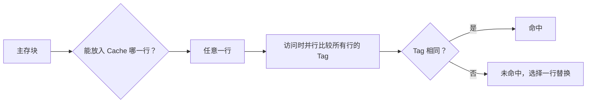
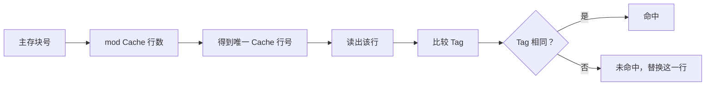
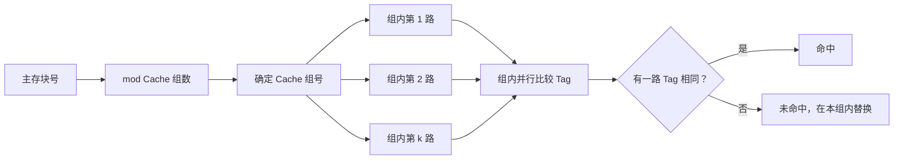

这一部分对应课程目标 1 的后三个重点：

```text
主存的组织及与 CPU 的连接
并行主存系统
高速缓冲存储器 Cache
```

这部分常考计算和分析，关键词是：**容量、地址线、数据线、片选、译码、映射、命中率、平均访问时间**。

> 教材查阅：存储器概述见第 90-94 页；半导体存储器 RAM/ROM 见第 95-105 页；主存与 CPU 连接、存储器扩展见第 109-111 页；并行主存系统见第 111-114 页；Cache 见第 114-130 页。

---

# 一、主存的基本概念

> 教材查阅：第 90-94 页，重点看 4.1“存储器概述”和 4.1.4“主存的基本结构”。

主存储器用于存放程序和数据，CPU 可以直接通过地址总线、数据总线、控制总线访问主存。

基本关系：

```text
地址线决定可寻址单元个数
数据线决定一次读写的数据宽度
控制线决定读、写、片选等操作
```

按 PPT 里的硬件框图画法，可以先把 CPU 和主存连接看成“三总线结构”：

```text
                 地址总线 Address Bus
          A0~An  ----------------------------->
        +------+                               +-----------+
        |      |                               |           |
        | CPU  |<----------------------------->|   主存    |
        |      |        数据总线 Data Bus      | RAM / ROM |
        +------+                               +-----------+
          RD/WR ----------------------------->  控制总线
                 读/写/片选等控制信号
```

这张图要看出三件事：

```text
地址总线：通常 CPU 输出，告诉主存访问哪个单元；
数据总线：双向，读时主存到 CPU，写时 CPU 到主存；
控制总线：决定当前是读、写，哪片芯片被选中。
```

如果是 ROM，通常只需要读控制；如果是 RAM，既要能读，也要能写。

```text
ROM：存程序/常量，常用 OE/RD 控制输出，一般没有写信号参与普通读写。
RAM：存临时数据，既要 OE/RD，也要 WE/WR。
```

若有 $n$ 根地址线，则最多可寻址：

$$
2^n
$$

个存储单元。

若每个单元 1 字节，则容量为：

$$
2^n \text{ B}
$$

---

# 二、存储芯片规格怎么看

> 教材查阅：第 91-92 页看存储器技术指标；第 95-105 页结合 SRAM、DRAM、ROM 芯片理解容量规格。

常见芯片规格写法：

```text
8K × 8
16K × 4
32K × 8
64K × 1
```

含义：

```text
存储单元数 × 每个单元位数
```

例如：

```text
8K × 8
```

表示有 8K 个单元，每个单元 8 位。

容量：

$$
8K \times 8bit = 8KB
$$

注意：

```text
8 位 = 1 字节
```

所以 `8K × 8` 是 `8KB`，不是 `64KB`。

---

# 三、片内地址线数量

如果芯片有 $N$ 个存储单元，则片内地址线数量为：

$$
\log_2 N
$$

例如：

```text
8K × 8
```

因为：

$$
8K = 8 \times 1024 = 2^{13}
$$

所以片内需要 13 根地址线。

```text
A0 ~ A12 用于片内寻址
```

课程总结强调：根据芯片规格求片内译码地址线数量，片内地址全 0 是首址，全 1 是末址。

---

# 四、位扩展和字扩展

> 教材查阅：第 109-111 页，重点看 4.3“主存的组织及与 CPU 的连接”和 4.3.2“存储器的扩展”。

## 1. 位扩展

位扩展解决的是**数据位数不够**的问题。

例如 CPU 数据总线需要 8 位，但芯片是：

```text
8K × 4
```

每片只有 4 位，要组成 8 位字长，需要：

$$
8 / 4 = 2
$$

片并联。

特点：

```text
地址线共用
片选信号共用
数据线分别接不同位
容量单元数不变，字长变宽
```

位扩展图示，以两片 `8K×4` 组成 `8K×8` 为例：

```text
                 A0~A12 地址线共用
        +--------------------------------+
        |                                |
        v                                v
   +-----------+                    +-----------+
   |  8K × 4   |                    |  8K × 4   |
   |  芯片 1   |                    |  芯片 2   |
   | D3~D0     |                    | D7~D4     |
   +-----------+                    +-----------+
        ^                                ^
        |                                |
        +----------- CS 片选共用 --------+

   CPU 数据总线：D7 D6 D5 D4 D3 D2 D1 D0
                  |  |  |  |  |  |  |  |
                  +--+--+--+--+  +--+--+--+--+
                    芯片2高4位     芯片1低4位
```

读图重点：

```text
两片芯片地址线完全一样，所以它们同时访问同一个单元号；
芯片1提供低4位，芯片2提供高4位；
两个4位拼成CPU需要的8位数据。
```

---

## 2. 字扩展

字扩展解决的是**存储单元数不够**的问题。

例如需要：

```text
32K × 8
```

但芯片是：

```text
8K × 8
```

每片只有 8K 个单元，需要：

$$
32K / 8K = 4
$$

片。

特点：

```text
低位地址线接芯片片内地址
高位地址线经过译码产生片选信号
数据线共用
不同芯片占据不同地址范围
```

字扩展图示，以四片 `8K×8` 组成 `32K×8` 为例：

```text
CPU 地址线：

 A14 A13 ───────┐
                v
          +-----------+
          | 2-4译码器 |
          |           |
          | Y0 Y1 Y2 Y3
          +--+--+--+--+
             |  |  |  |
             |  |  |  +---------------- CS3
             |  |  +------------------- CS2
             |  +---------------------- CS1
             +------------------------- CS0

 A12~A0  -----------------------------------------+
                                                   |
        +-----------+ +-----------+ +-----------+ +-----------+
        | 8K×8 RAM0 | | 8K×8 RAM1 | | 8K×8 RAM2 | | 8K×8 RAM3 |
        | A12~A0    | | A12~A0    | | A12~A0    | | A12~A0    |
        +-----------+ +-----------+ +-----------+ +-----------+
             |             |             |             |
 D7~D0  <----+-------------+-------------+-------------+----> CPU数据总线
```

读图重点：

```text
A12~A0：片内地址线，四片都接同一组低位地址；
A14~A13：高位地址线，不进芯片内部，而是送译码器；
译码器 Y0~Y3：一次只选中一片芯片；
数据线 D7~D0：四片共用，但只有被片选的芯片能真正驱动数据总线。
```

地址范围可以这样理解：

| A14 A13 | 被选芯片 | 地址范围 |
|---|---|---|
| 00 | RAM0 | 0000H ~ 1FFFH |
| 01 | RAM1 | 2000H ~ 3FFFH |
| 10 | RAM2 | 4000H ~ 5FFFH |
| 11 | RAM3 | 6000H ~ 7FFFH |

---

## 3. 字位同时扩展

如果容量和字长都不够，就要同时扩展。

例：

```text
用 8K×4 芯片组成 32K×8 存储器
```

位扩展需要：

$$
8/4=2
$$

字扩展需要：

$$
32K/8K=4
$$

总芯片数：

$$
2 \times 4 = 8
$$

字位同时扩展图示，可以把它看成“每一组先位扩展，再用译码器做字扩展”：

```text
目标：32K × 8
芯片： 8K × 4

                 高位地址 A14~A13
                       |
                       v
                +-------------+
                |   2-4译码器  |
                +--+--+--+--+-+
                   |  |  |  |
        CS0 -------+  |  |  +-------- CS3
        CS1 ----------+  +----------- CS2

低位地址 A12~A0 同时接到每一片芯片
数据总线每组由两片 4 位芯片拼成 8 位

        第0组：地址 0000H~1FFFH
        +------------+   +------------+
        | 8K×4 低4位 |   | 8K×4 高4位 |
        +------------+   +------------+
              |                |
             D3~D0           D7~D4

        第1组：地址 2000H~3FFFH
        +------------+   +------------+
        | 8K×4 低4位 |   | 8K×4 高4位 |
        +------------+   +------------+

        第2组：地址 4000H~5FFFH
        +------------+   +------------+
        | 8K×4 低4位 |   | 8K×4 高4位 |
        +------------+   +------------+

        第3组：地址 6000H~7FFFH
        +------------+   +------------+
        | 8K×4 低4位 |   | 8K×4 高4位 |
        +------------+   +------------+
```

这个图的看法：

```text
横向两片拼字长：4位 + 4位 = 8位；
纵向四组扩容量：8K + 8K + 8K + 8K = 32K；
所以总芯片数 = 每组2片 × 4组 = 8片。
```

---

## 例题1：主存芯片字位扩展

用 $8K\times4$ 位的存储芯片组成 $32K\times8$ 位的存储器，问需要多少片芯片？地址线如何连接？

目标字长是 $8$ 位，芯片字长是 $4$ 位，所以字长方向需要：

$$
\frac{8}{4}=2
$$

片并联，这叫位扩展。

目标容量是 $32K$，芯片容量是 $8K$，所以字数方向需要：

$$
\frac{32K}{8K}=4
$$

组，这叫字扩展。

总芯片数：

$$
2\times4=8
$$

每片芯片有 $8K=2^{13}$ 个存储单元，因此片内地址线需要：

$$
13
$$

根，即 $A_0\sim A_{12}$ 接到每片芯片的地址端。

总容量 $32K=2^{15}$，总地址线需要 $15$ 根，即 $A_0\sim A_{14}$。高位地址线 $A_{13},A_{14}$ 送入 $2$ 线-$4$ 线译码器，选择 $4$ 组芯片中的一组。

```text
                 A14 A13
                   |
                   v
              2-4 译码器
            /    |    |    \
          组0   组1   组2   组3
          |     |     |     |
       每组两片 8K×4 并联成 8K×8

A0~A12  -----------------> 所有芯片片内地址端
D0~D3   <----------------> 每组低 4 位芯片
D4~D7   <----------------> 每组高 4 位芯片
```

答案：需要 $8$ 片芯片。$A_0\sim A_{12}$ 接片内地址端，$A_{13},A_{14}$ 接译码器产生片选信号，每组两片并联组成 $8$ 位字长。

---

# 五、主存与 CPU 连接题答题模板

题目常见形式：

```text
某 CPU 有若干地址线和数据线，要求用若干规格的 RAM/ROM 芯片组成一定容量的存储系统，画出连接或写出地址范围。
```

答题步骤：

1. 求总容量和芯片容量。
2. 判断是否需要位扩展。
3. 判断是否需要字扩展。
4. 求片内地址线数量。
5. 确定低位地址线接片内地址端。
6. 确定高位地址线用于片选译码。
7. 写出每片或每组芯片地址范围。
8. 注意片选端有效电平。

---

## RAM 和 ROM 混合连接图

> 教材查阅：ROM 见第 104-105 页；RAM/SRAM/DRAM 见第 95-103 页；CPU 与存储器连接见第 109-111 页。

考试题有时会要求同时接 ROM 和 RAM，比如：

```text
低地址区放 ROM，用于存放系统程序；
高地址区放 RAM，用于存放运行数据。
```

可以按下面这种 PPT 式框图理解：

```text
                         +----------------+
 A15~A13 --------------->|  3-8 译码器     |
                         |                |
                         | Y0  Y1 ... Y7  |
                         +--+---+-----+---+
                            |         |
                           CS_ROM    CS_RAM
                            |         |
                +-----------+         +-----------+
                |                                 |
                v                                 v
          +-----------+                     +-----------+
 A12~A0 ->|   ROM     |             A12~A0 ->|   RAM     |
          |  8K × 8   |                     |  8K × 8   |
          | OE <- RD  |                     | OE <- RD  |
          |           |                     | WE <- WR  |
          +-----------+                     +-----------+
                |                                 |
                +-------------- D7~D0 ------------+
                               数据总线
```

读图时要注意：

```text
1. A12~A0 是片内地址线，因为 8K = 2^13。
2. A15~A13 是高位地址线，送译码器产生片选。
3. ROM 只接读控制 RD/OE，不需要普通写控制。
4. RAM 同时接读控制 RD/OE 和写控制 WR/WE。
5. ROM 和 RAM 共用数据总线，但同一时刻只能有一片被片选。
```

如果译码器输出低有效，图中 `CS_ROM`、`CS_RAM` 可能要画成带小圆圈的片选端，或写成：

```text
/CS、/OE、/WE
```

其中斜杠 `/` 表示低电平有效。考试画图时如果题目给的是低有效片选，一定不要漏这个小圆圈或斜杠。

---

## 例题2：RAM 和 ROM 与 CPU 的连接

某系统有 16 根地址线，要求 ROM 占用地址 $0000H\sim1FFFH$，RAM 占用地址 $2000H\sim3FFFH$。ROM 和 RAM 都是 $8K\times8$。说明地址线、数据线和读写控制线如何连接。

$8K=2^{13}$，所以 ROM 和 RAM 的片内地址线都需要：

$$
13
$$

根，即 $A_0\sim A_{12}$。

地址范围分析：

$$
0000H\sim1FFFH
$$

对应高位 $A_{15}A_{14}A_{13}=000$，选中 ROM。

$$
2000H\sim3FFFH
$$

对应高位 $A_{15}A_{14}A_{13}=001$，选中 RAM。

数据线 $D_0\sim D_7$ 连接到 ROM 和 RAM 的数据端，但同一时刻只能有一个芯片被片选。

控制线：

- ROM 只读，接读控制信号 $RD$ 到输出允许端 $OE$。
- RAM 可读可写，$RD$ 接 $OE$，$WR$ 接写允许端 $WE$。

```text
 A15 A14 A13 -----> 译码器 ---- CS_ROM：000
                         \
                          ---- CS_RAM：001

 A0~A12  ---------------------> ROM/RAM 地址端
 D0~D7   <--------------------> ROM/RAM 数据端

 RD  -------------------------> ROM OE
 RD  -------------------------> RAM OE
 WR  -------------------------> RAM WE
```

答案：$A_0\sim A_{12}$ 接片内地址端，$A_{15}\sim A_{13}$ 译码产生片选；$000$ 选 ROM，$001$ 选 RAM；数据总线共用，ROM 只接读控制，RAM 同时接读写控制。

---

# 六、地址范围计算

假设某芯片片内地址线有 13 根，则片内地址范围为：

$$
0000H \sim 1FFFH
$$

因为：

$$
2^{13}=8192=8K
$$

十六进制范围长度为：

$$
2000H
$$

如果某片起始地址是：

$$
4000H
$$

则末地址为：

$$
4000H + 2000H - 1 = 5FFFH
$$

记住：

```text
末地址 = 首地址 + 容量 - 1
```

不要漏掉 `-1`。

---

# 七、并行主存系统

> 教材查阅：第 111-114 页，重点看 4.4“并行主存系统”。

并行主存用于提高连续访问速度。课程总结给出重点公式：

设：

- 模块字长为 $w$。
- 存储周期为 $T$。
- 总线周期为 $\tau$。
- 模块数为 $m$。
- 连续读出 $n$ 个字。

若：

$$
T=m\tau
$$

则读出 $n$ 个字的数据量为：

$$
q = w \times n
$$

---

## 1. 顺序方式

顺序方式下，连续读 $n$ 个字需要：

$$
t_{顺}=nT
$$

带宽：

$$
W_{顺}=\frac{w}{T}
$$

理解：

```text
一个字读完，再读下一个字
每个字都要等一个完整存储周期
```

---

## 2. 交叉方式

交叉方式下，连续读 $n$ 个字需要：

$$
t_{交}=T+(n-1)\tau
$$

带宽：

$$
W_{交}=\frac{w n}{T+(n-1)\tau}
$$

理解：

```text
第一个字需要完整启动时间 T
之后每隔一个总线周期 τ 就能取出一个字
```

---

## 3. 并行主存题型

常见问题：

```text
求顺序方式访问时间
求交叉方式访问时间
求顺序带宽
求交叉带宽
比较速度提升
```

答题关键是分清：

```text
T：存储周期
τ：总线周期
m：模块数
n：连续访问字数
w：每个字位数
```

---

## 例题3：并行主存交叉访问

某主存由多个模块交叉编址，模块字长 $w=32$ 位，存储周期 $T=200ns$，总线传送周期 $\tau=50ns$。连续读取 $16$ 个字，求顺序访问时间、交叉访问时间和交叉访问带宽。

顺序访问时间：

$$
t_{顺}=nT=16\times200ns=3200ns
$$

交叉访问时间：

$$
t_{交}=T+(n-1)\tau
$$

代入：

$$
t_{交}=200ns+15\times50ns=950ns
$$

总数据量：

$$
q=wn=32\times16=512bit
$$

交叉访问带宽：

$$
W_{交}=\frac{512bit}{950ns}\approx538.9Mbit/s
$$

答案：

$$
t_{顺}=3200ns,\quad t_{交}=950ns,\quad W_{交}\approx538.9Mbit/s
$$

---

# 八、Cache 基本原理

> 教材查阅：第 114-118 页，重点看 4.5.1“cache 工作原理”、4.5.2“程序局部性”、4.5.3“cache 的基本概念”。

Cache 是位于 CPU 和主存之间的小容量高速存储器，用于保存近期可能再次访问的主存块。

它依赖两个局部性原理：

```text
时间局部性：刚访问过的数据，近期可能再次访问
空间局部性：刚访问过某地址，附近地址近期可能也会访问
```

Cache 的特点：

- 容量小。
- 速度快。
- 按块与主存交换数据。
- 对程序员通常透明。

---

# 九、Cache 的三种映射方式

> 教材查阅：第 118-127 页，重点看 4.5.6“地址映射”。

## 1. 全相联映射

全相联映射规则：

```text
主存任意一块可以放入 Cache 任意一行
```

优点：

```text
冲突少，命中率较高
```

缺点：

```text
查找复杂，硬件成本高
```

地址划分：

$$
主存地址 = 标记 + 块内地址
$$

图示：



字段切分：

```text
|          标记 Tag          |      块内地址 Offset      |
|  判断 Cache 中是不是该块   |  判断块内第几个字/字节    |
```

---

## 2. 直接映射

直接映射规则：

```text
主存某一块只能放入 Cache 中唯一指定的一行
```

映射关系：

$$
Cache行号 = 主存块号 \bmod Cache行数
$$

优点：

```text
硬件简单，查找快
```

缺点：

```text
冲突多，命中率可能较低
```

地址划分：

$$
主存地址 = 标记 + 行号 + 块内地址
$$

课程总结写法中也常把标记叫“区地址”。

图示：



字段切分：

```text
|        标记 Tag        |      Cache 行号 Line      |    块内地址 Offset    |
|  判断该行里是不是它    |  决定只能去 Cache 哪一行  |  决定块内第几个单元   |
```

---

## 3. 组相联映射

组相联映射是全相联和直接映射的折中。

规则：

```text
Cache 分成若干组
主存块先映射到某一组
在组内可以放任意一行
```

映射关系：

$$
Cache组号 = 主存块号 \bmod Cache组数
$$

地址划分：

$$
主存地址 = 标记 + 组号 + 块内地址
$$

图示：



字段切分：

```text
|        标记 Tag        |      Cache 组号 Set       |    块内地址 Offset    |
|  进入该组后比较标记    |  决定进入 Cache 哪一组    |  决定块内第几个单元   |
```

---

# 十、Cache 地址划分题

做 Cache 地址划分题时，先判断三个量：

1. 主存总容量。
2. Cache 容量。
3. 块大小。

然后求：

```text
主存地址总位数
块内地址位数
Cache 行数或组数
行号/组号位数
标记位数
```

---

## 1. 块内地址位数

若块大小为 $B$ 个字节，则块内地址位数为：

$$
\log_2 B
$$

如果是字编址，要按“字”为单位算；如果是字节编址，要按“字节”为单位算。

这是考试最容易错的地方。

---

## 2. 直接映射模板

设：

- 主存地址共 $A$ 位。
- Cache 有 $L$ 行。
- 每块大小为 $B$。

则：

$$
块内地址位数 = \log_2 B
$$

$$
行号位数 = \log_2 L
$$

$$
标记位数 = A - 行号位数 - 块内地址位数
$$

---

## 3. 组相联模板

设 Cache 有 $L$ 行，$k$ 路组相联。

组数：

$$
G=\frac{L}{k}
$$

组号位数：

$$
\log_2 G
$$

标记位数：

$$
A - 组号位数 - 块内地址位数
$$

---

## 例题4：Cache 地址字段划分

主存容量为 $1MB$，按字节编址；Cache 容量为 $16KB$，块大小为 $16B$。若采用直接映射，求主存地址中的标记、行号、块内地址各多少位。

主存容量：

$$
1MB=2^{20}B
$$

按字节编址，所以主存地址长度为 $20$ 位。

块大小：

$$
16B=2^4B
$$

所以块内地址为 $4$ 位。

Cache 行数：

$$
\frac{16KB}{16B}=\frac{2^{14}}{2^4}=2^{10}
$$

所以行号为 $10$ 位。

标记位：

$$
20-10-4=6
$$

答案：

```text
标记 6 位 | 行号 10 位 | 块内地址 4 位
```

---

## 例题5：组相联 Cache 综合题

某系统主存容量为 $4MB$，Cache 容量为 $32KB$，块大小为 $32B$，采用 4 路组相联映射。问主存地址长度、块内地址位数、组号位数和标记位数。

主存容量：

$$
4MB=2^2\times2^{20}B=2^{22}B
$$

按字节编址时，主存地址长度为 $22$ 位。

块大小：

$$
32B=2^5B
$$

块内地址为 $5$ 位。

Cache 总行数：

$$
\frac{32KB}{32B}=\frac{2^{15}}{2^5}=2^{10}
$$

4 路组相联，所以组数：

$$
\frac{2^{10}}{4}=2^8
$$

组号位数为 $8$ 位。

标记位数：

$$
22-8-5=9
$$

答案：

```text
标记 9 位 | 组号 8 位 | 块内地址 5 位
```

---

# 十一、Cache 性能

> 教材查阅：第 114-130 页，Cache 读写流程、替换算法和写入策略可结合第 116-130 页查阅。

## 1. 命中率

命中率：

$$
H=\frac{命中次数}{访问总次数}
$$

未命中率：

$$
1-H
$$

---

## 2. 平均访问时间

设：

- Cache 命中访问时间为 $t_c$。
- 主存访问时间为 $t_m$。
- 命中率为 $H$。

常见平均访问时间：

$$
t_a = Ht_c + (1-H)t_m
$$

有的题目会把未命中访问时间写成：

$$
t_c + t_m
$$

这取决于题目描述。如果题目说“先访问 Cache，未命中再访问主存”，则：

$$
t_a = Ht_c + (1-H)(t_c+t_m)
$$

一定按题目语义选公式。

---

## 3. 访问效率

访问效率常可理解为理想 Cache 访问时间与平均访问时间之比：

$$
e = \frac{t_c}{t_a}
$$

有的教材也写为百分比：

$$
e = \frac{t_c}{t_a}\times 100\%
$$

---

## 例题6：Cache 平均访问时间

Cache 命中率 $H=0.95$，Cache 访问时间 $t_c=20ns$，主存访问时间 $t_m=200ns$。采用“先访 Cache，未命中再访主存”的方式，求平均访问时间和访问效率。

先访 Cache，未命中再访主存时：

$$
t_a=Ht_c+(1-H)(t_c+t_m)
$$

代入：

$$
t_a=0.95\times20+0.05\times(20+200)
$$

$$
t_a=19+11=30ns
$$

访问效率：

$$
e=\frac{t_c}{t_a}=\frac{20}{30}=66.7\%
$$

答案：

$$
t_a=30ns,\quad e=66.7\%
$$

---

# 十二、新增题库高频补充

新增题库中，存储系统除了容量扩展和 Cache 映射外，还反复出现 DRAM 刷新、大小端、相联存储器和连续访存命中率。

## 1. DRAM 为什么要刷新

DRAM 用电容存储信息，电容上的电荷会随着时间泄漏，所以必须周期性刷新。

考试可写：

```text
DRAM 存储单元依靠电容保存信息，电荷会逐渐泄漏，因此需要定期刷新以保持数据不丢失。
```

常见刷新方式：

| 刷新方式 | 特点 |
|---|---|
| 集中刷新 | 一段时间集中刷新所有行，刷新期间不能正常访存 |
| 分散刷新 | 把刷新操作分散插入到正常读写周期中 |
| 异步刷新 | 在最大刷新间隔内均匀安排刷新请求 |

容易考的判断：

```text
DRAM 需要刷新，SRAM 不需要刷新。
```

---

## 2. 大端和小端

大端和小端解决的是“多字节数据在连续字节地址中怎样存放”的问题。

以 32 位数据 $11223344H$ 存入地址 $1000H$ 开始的 4 个字节为例：

| 地址 | 大端方式 | 小端方式 |
|---|---|---|
| $1000H$ | $11H$ | $44H$ |
| $1001H$ | $22H$ | $33H$ |
| $1002H$ | $33H$ | $22H$ |
| $1003H$ | $44H$ | $11H$ |

记忆口诀：

```text
大端：高位字节放低地址。
小端：低位字节放低地址。
```

---

## 3. 相联存储器 CAM

相联存储器也叫内容可寻址存储器，英文常写为 CAM。

普通存储器是：

```text
给地址 -> 找内容
```

相联存储器是：

```text
给内容关键字 -> 找匹配项
```

所以它适合做快速查找，例如 Cache 标记比较、页表快表等。

考试表述：

```text
相联存储器按内容访问，能够把给定关键字与存储器中各单元内容并行比较，因此查找速度快，但硬件成本较高。
```

---

## 4. 连续访问时的 Cache 命中率

题库中常见题型是：给出 Cache 块大小，然后连续访问一段数据，问命中率。

核心思想：

```text
一个块第一次访问通常未命中；
同一块内后续字或字节访问通常命中。
```

例如块大小为 $4$ 个字，连续访问 $20$ 个字，且开始时 Cache 为空。

需要装入的主存块数：

$$
\frac{20}{4}=5
$$

未命中次数为 $5$，总访问次数为 $20$，命中次数为：

$$
20-5=15
$$

命中率为：

$$
H=\frac{15}{20}=75\%
$$

如果访问不是从块边界开始，就要先判断第一个块里还能用几个字，再分块计算。

---

# 十三、本章易错点

## 1. bit 和 Byte 不要混

```text
8 bit = 1 Byte
芯片 8K×8 = 8KB
芯片 8K×4 = 4KB
```

## 2. 片内地址线看单片容量

片内地址线只由“每片有多少个单元”决定，不由总系统容量决定。

## 3. 字扩展和位扩展要分开算

```text
字长不够：位扩展
容量不够：字扩展
两者都不够：字位同时扩展
```

## 4. Cache 地址划分一定先看编址单位

同样是块大小，如果题目按字编址和按字节编址，块内位数可能不同。

## 5. 直接映射和组相联公式不要写反

```text
直接映射：主存块号 mod Cache行数
组相联：主存块号 mod Cache组数
```
