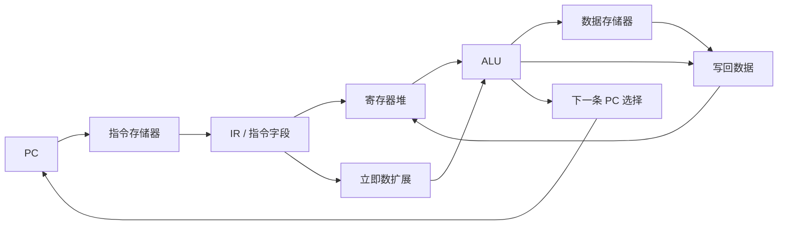
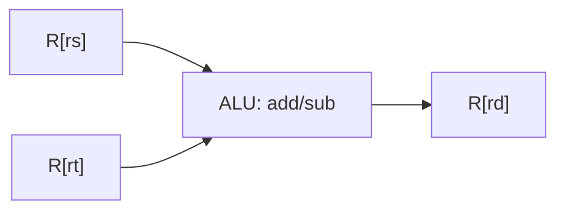
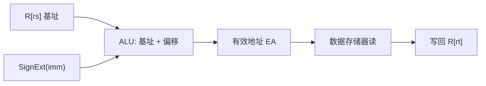
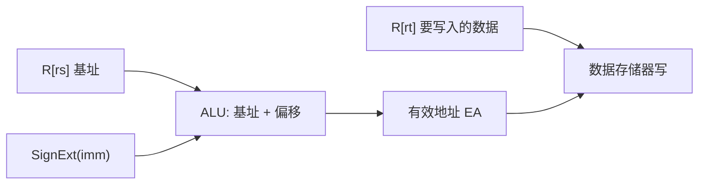
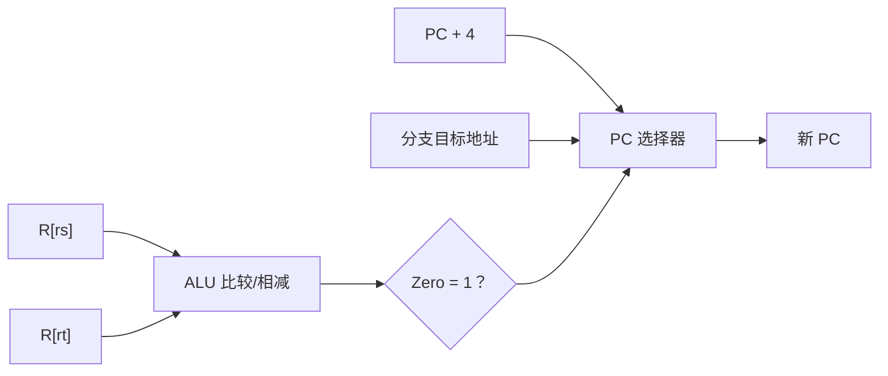

这一部分对应课程目标 2：

```text
指令格式
寻址方式
指令格式分析设计
CPU组成、指令周期及数据通路
```

课堂截图中 4 月中下旬大量出现取指、`lw`、`sw`、`beq`、`addi`、`add`、`sub` 的数据通路分析，所以这部分很可能不是纯背诵，而是会考“给图分析”或“按节拍写控制过程”。

> 教材查阅：指令格式和寻址方式见第 149-162 页；CPU 组成和指令周期见第 186-191 页；数据通路及指令操作流程见第 191-217 页。

---

# 一、指令格式的基本组成

> 教材查阅：第 149-152 页，重点看 5.2“指令格式”。

一条机器指令通常由两部分组成：

```text
操作码字段 + 地址码字段
```

## 1. 操作码字段

操作码用于说明“做什么操作”。

例如：

```text
ADD：加法
SUB：减法
LOAD：取数
STORE：存数
JMP：跳转
```

如果操作码有 $n$ 位，且采用定长操作码，则最多可以表示：

$$
2^n
$$

条不同指令。

---

## 2. 地址码字段

地址码用于说明“操作数在哪里”或“结果放哪里”。

地址码可能表示：

- 立即数。
- 寄存器编号。
- 主存地址。
- 偏移量。
- 跳转目标。

---

## 例题1：指令格式字段计算

某机器指令字长为 16 位，其中操作码占 4 位，寄存器字段占 3 位，地址字段占 9 位。问最多可表示多少条指令、多少个寄存器、直接寻址范围是多少？

操作码 4 位：

$$
2^4=16
$$

所以最多表示 $16$ 条指令。

寄存器字段 3 位：

$$
2^3=8
$$

所以最多表示 $8$ 个寄存器。

地址字段 9 位：

$$
2^9=512
$$

如果按地址单元编址，直接寻址范围为 $512$ 个地址单元。

答案：

- 最多 $16$ 条指令。
- 最多 $8$ 个寄存器。
- 直接寻址范围为 $512$ 个地址单元。

---

# 二、定长操作码和扩展操作码

## 1. 定长操作码

定长操作码就是所有指令的操作码长度相同。

优点：

```text
译码简单，速度快
```

缺点：

```text
编码利用率可能不高
指令格式灵活性较差
```

---

## 2. 扩展操作码

扩展操作码是指不同格式指令的操作码长度可以不同。

典型思路：

```text
地址码多的指令，操作码短一些
地址码少的指令，操作码长一些
```

课程总结强调扩展操作码的基本规则：

```text
短码至少给长码留一个扩展标志或识别标志
```

也就是说，不能把短操作码空间全部用完，否则就没有编码留给后续更长操作码。

---

## 3. 扩展操作码题型模板

常见题目：

```text
指令字长为 n 位，地址字段若干位，
要求设计若干条三地址、二地址、一地址、零地址指令。
```

做题步骤：

1. 先计算每种格式地址字段占多少位。
2. 得到该格式下可用操作码位数。
3. 从地址数最多的指令开始分配。
4. 每一级都要给下一种更长操作码留下扩展编码。
5. 检查最终编码是否满足指令条数要求。

---

# 三、寻址方式

> 教材查阅：第 152-159 页，重点看 5.3“寻址方式”。

寻址方式解决的问题是：

```text
如何找到操作数
```

考试一般会问：

- 这种寻址方式的特点是什么。
- 有效地址 EA 怎么求。
- 最大寻址范围是多少。

---

## 1. 立即寻址

操作数直接在指令中。

```text
操作数 = A
```

特点：

```text
不需要访问主存取操作数
速度快
数值范围受指令字段长度限制
```

---

## 2. 直接寻址

指令地址字段直接给出操作数所在主存地址。

$$
EA = A
$$

特点：

```text
简单直观
寻址范围受地址字段位数限制
```

若地址字段有 $n$ 位，则最大寻址空间为：

$$
2^n
$$

---

## 3. 间接寻址

指令地址字段给出的不是操作数地址，而是存放操作数地址的地址。

$$
EA = (A)
$$

其中 $(A)$ 表示主存地址 $A$ 中的内容。

特点：

```text
寻址范围扩大
但需要多访问一次主存
速度较慢
```

---

## 4. 寄存器寻址

操作数在寄存器中。

```text
操作数 = R_i
```

特点：

```text
访问速度快
寄存器数量有限
```

若寄存器编号字段有 $n$ 位，则可表示：

$$
2^n
$$

个寄存器。

---

## 5. 寄存器间接寻址

寄存器中存放操作数的有效地址。

$$
EA = (R_i)
$$

特点：

```text
地址可由寄存器动态给出
适合数组、指针、循环访问
```

---

## 6. 变址寻址

有效地址由形式地址和变址寄存器内容相加得到。

$$
EA = A + (IX)
$$

适合：

```text
数组访问
表格访问
循环处理
```

---

## 7. 基址寻址

有效地址由形式地址和基址寄存器内容相加得到。

$$
EA = A + (BR)
$$

适合：

```text
程序重定位
多道程序
存储管理
```

---

## 8. 相对寻址

有效地址由程序计数器 PC 和偏移量相加得到。

$$
EA = (PC) + A
$$

常用于：

```text
条件转移
循环跳转
分支指令
```

---

## 例题2：寻址方式和有效地址

已知：

$$
PC=2000H,\quad IX=0100H,\quad A=0020H
$$

存储单元内容：

$$
M[0020H]=1234H
$$

求直接寻址、间接寻址、变址寻址、相对寻址的有效地址。

直接寻址：

$$
EA=A=0020H
$$

间接寻址：

$$
EA=(A)=M[0020H]=1234H
$$

变址寻址：

$$
EA=A+(IX)=0020H+0100H=0120H
$$

相对寻址：

$$
EA=(PC)+A=2000H+0020H=2020H
$$

答案：

| 寻址方式 | 有效地址 |
|---|---|
| 直接寻址 | $0020H$ |
| 间接寻址 | $1234H$ |
| 变址寻址 | $0120H$ |
| 相对寻址 | $2020H$ |

---

# 四、指令格式分析设计

> 教材查阅：第 161-162 页，重点看 5.5“指令格式设计”。

课程总结明确要求：

```text
给指令格式，分析指令数、通用寄存器数、寻址方式、有效地址等；
给设计要求，完成格式设计并给寻址范围。
```

---

## 1. 分析指令格式时看什么

看到一个指令格式图，先标出：

```text
操作码字段位数
寄存器字段位数
寻址方式字段位数
地址字段位数
立即数字段位数
偏移字段位数
```

然后分别计算：

$$
指令条数 = 2^{操作码位数}
$$

$$
寄存器个数 = 2^{寄存器编号位数}
$$

$$
寻址方式种数 = 2^{寻址方式字段位数}
$$

$$
直接寻址范围 = 2^{地址字段位数}
$$

---

## 2. 设计指令格式时怎么写

设计题一般按下面结构答：

```text
指令字长为 ...
操作码字段占 ...
寻址方式字段占 ...
寄存器字段占 ...
地址字段占 ...
因此可以表示 ...
```

如果是扩展操作码，要写出编码分配方案，不能只写结论。

---

# 五、CPU 的基本组成

> 教材查阅：第 186-189 页，重点看 6.1“中央处理器概述”。

课程总结指出：

```text
CPU 主要由运算器和控制器组成
```

## 1. 运算器

运算器主要完成：

```text
算术运算
逻辑运算
移位
比较
```

核心部件包括：

- ALU。
- 通用寄存器组。
- 暂存寄存器。
- 标志寄存器。

---

## 2. 控制器

控制器负责：

```text
取指令
分析指令
发出控制信号
协调各部件按节拍工作
```

可以理解为 CPU 内部的指挥系统。

---

## 3. 常见 CPU 寄存器

| 寄存器 | 作用 |
|---|---|
| PC | 程序计数器，保存下一条指令地址 |
| IR | 指令寄存器，保存当前正在执行的指令 |
| MAR | 存储器地址寄存器，保存访问主存的地址 |
| MDR/MBR | 存储器数据寄存器，保存从主存读出或写入主存的数据 |
| ACC | 累加器，保存运算操作数或结果 |
| PSW | 程序状态字，保存标志位 |
| GPR | 通用寄存器组 |

---

# 六、指令周期

> 教材查阅：第 189-191 页，重点看 6.2“指令周期”。

指令周期是 CPU 取出并执行一条指令所需要的全部时间。

一般可分为：

```text
取指周期
间址周期
执行周期
中断周期
```

不是每条指令都有所有阶段。例如立即寻址可能不需要间址周期。

---

# 七、数据通路分析方法

> 教材查阅：第 191-217 页，重点看 6.3“数据通路及指令操作流程”；单总线数据通路见第 193-201 页，专用通路结构见第 201-217 页。

数据通路题的本质是：

```text
数据从哪里来
经过哪个部件
写到哪里去
需要哪些控制信号
```

课堂截图中反复出现的指令包括：

```text
lw
sw
beq
addi
add
sub
```

建议按“取指阶段 + 执行阶段”分析。

先建立一个整体图像：



这张图不用死背细节，先抓三条线：

```text
取指线：PC → 指令存储器 → IR
运算线：寄存器/立即数 → ALU → 写回
访存线：ALU 算地址 → 数据存储器 → 写回或写内存
```

---

## 1. 取指阶段通用过程

典型取指过程：

$$
MAR \leftarrow PC
$$

$$
IR \leftarrow M[MAR]
$$

$$
PC \leftarrow PC + 4
$$

如果是按字编址，也可能是：

$$
PC \leftarrow PC + 1
$$

要按题目给出的 CPU 模型判断。

---

## 2. R 型指令 add/sub

例如：

```text
add rd, rs, rt
```

含义：

$$
R[rd] \leftarrow R[rs] + R[rt]
$$

数据通路：

```text
寄存器 rs 读出
寄存器 rt 读出
ALU 做加法
结果写回 rd
```

R 型指令图示：



`sub` 只是在 ALU 中执行减法：

$$
R[rd] \leftarrow R[rs] - R[rt]
$$

---

## 3. lw 指令

例如：

```text
lw rt, imm(rs)
```

含义：

$$
R[rt] \leftarrow M[R[rs]+SignExt(imm)]
$$

数据通路：

1. 读寄存器 $R[rs]$。
2. 立即数符号扩展。
3. ALU 计算有效地址。
4. 访问数据存储器读数据。
5. 把读出的数据写回 $R[rt]$。

`lw` 图示：



---

## 4. sw 指令

例如：

```text
sw rt, imm(rs)
```

含义：

$$
M[R[rs]+SignExt(imm)] \leftarrow R[rt]
$$

数据通路：

1. 读寄存器 $R[rs]$ 作为基址。
2. 读寄存器 $R[rt]$ 作为要写入的数据。
3. 立即数符号扩展。
4. ALU 计算有效地址。
5. 将 $R[rt]$ 的内容写入数据存储器。

`sw` 图示：



---

## 5. beq 指令

例如：

```text
beq rs, rt, offset
```

含义：

```text
如果 R[rs] == R[rt]，则跳转
```

典型目标地址：

$$
PC \leftarrow PC + (SignExt(offset) << 2)
$$

如果题目按字编址，可能不需要左移 2 位。

数据通路：

1. 读 $R[rs]$ 和 $R[rt]$。
2. ALU 做减法或比较。
3. 若结果为 0，说明相等。
4. 计算分支目标地址。
5. 根据条件选择下一条 PC。

`beq` 图示：



---

## 6. addi 指令

例如：

```text
addi rt, rs, imm
```

含义：

$$
R[rt] \leftarrow R[rs] + SignExt(imm)
$$

数据通路：

```text
读 rs
立即数符号扩展
ALU 加法
结果写回 rt
```

---

## 例题3：数据通路分析

执行指令：

$$
lw\ \$t0,\ 8(\$s1)
$$

已知：

$$
R[\$s1]=1000,\quad M[1008]=1234
$$

问该指令的主要执行过程和最终结果。

`lw` 是从主存取数到寄存器，语义为：

$$
R[rt]\leftarrow M[R[rs]+SignExt(imm)]
$$

本题中：

$$
rs=\$s1,\quad rt=\$t0,\quad imm=8
$$

计算有效地址：

$$
EA=R[\$s1]+8=1000+8=1008
$$

访问主存：

$$
M[1008]=1234
$$

写回寄存器：

$$
R[\$t0]\leftarrow1234
$$

答案：

$$
R[\$t0]=1234
$$

主要路径可以记为：

```text
寄存器 rs → ALU 计算地址 → 数据存储器读 → 写回 rt
```

---

# 八、数据通路题答题模板

遇到数据通路分析题，按下面写：

```text
1. 写出指令语义。
2. 写出取指阶段公共操作。
3. 写出寄存器读操作。
4. 写出 ALU 输入来自哪里。
5. 写出 ALU 执行什么运算。
6. 写出是否访问数据存储器。
7. 写出结果写回哪里。
8. 写出关键控制信号。
```

即使控制信号名字和题图略有不同，过程写清楚也容易拿步骤分。

---

# 九、新增题库高频补充

新增题库里，指令系统部分高频点集中在扩展操作码、寻址方式和位移字段解释上。

## 1. 扩展操作码设计

扩展操作码的思想是：不同地址数的指令共用同一条指令字长，地址字段少的指令可以把空出来的地址字段扩展为操作码。

例如一台机器指令字长为 $16$ 位，每个地址字段 $4$ 位。

若三地址指令格式为：

```text
OP(4位) + A1(4位) + A2(4位) + A3(4位)
```

则最多有：

$$
2^4=16
$$

条三地址指令。

如果保留某些 OP 编码作为扩展标志，就可以构成二地址、一地址或零地址指令。答题时要注意：

```text
不是所有短操作码都能全部用于三地址指令；
被拿去扩展的编码不能再作为普通三地址操作码使用。
```

---

## 2. 相对寻址中的 PC

相对寻址常写为：

$$
EA=(PC)+D
$$

但这里的 $PC$ 通常是“取出当前指令后已经更新的 PC”，也就是指向下一条指令的地址。

闭卷题常见陷阱：

```text
不要用当前指令首地址直接加位移；
要看题目规定 PC 是否已经加 1 或加指令长度。
```

如果题目说明指令长度为 $2$ 字节，当前指令地址为 $1000H$，位移为 $+20H$，取指后 $PC=1002H$，则：

$$
EA=1002H+20H=1022H
$$

---

## 3. 基址寻址和变址寻址

二者形式很像，但语义不同：

| 寻址方式 | 常见形式 | 主要用途 |
|---|---|---|
| 基址寻址 | $EA=(BR)+D$ | 程序重定位、扩大寻址范围 |
| 变址寻址 | $EA=(IX)+D$ | 数组、表格、循环访问 |

可以这样记：

```text
基址寄存器给“基准位置”；
变址寄存器给“数组下标变化量”。
```

若位移字段是补码，要先把它解释成有符号数，再参与地址计算。

---

## 4. 操作数字节地址和大小端结合题

新增测验中有一种题会把“寻址方式”和“大小端”放在一起考。

答题步骤：

```text
1. 先根据寻址方式算出有效地址 EA。
2. 再根据数据字长确定要访问几个字节。
3. 最后按大端或小端方式确定每个字节放在哪个地址。
```

不要反过来先看大小端。大小端只决定“多字节内部顺序”，不决定有效地址怎么算。

---

# 十、易错点

## 1. PC 更新别忘

取指阶段通常要更新 PC。分支指令要注意到底是顺序地址还是目标地址。

## 2. lw 和 sw 写回方向相反

```text
lw：内存 → 寄存器
sw：寄存器 → 内存
```

## 3. beq 是比较，不是无条件跳转

只有条件满足才修改 PC 为分支目标。

## 4. 立即数通常要符号扩展

`lw`、`sw`、`addi`、`beq` 中的立即数字段通常需要符号扩展。

## 5. 寻址范围要看字段位数

不要看到机器字长就直接用机器字长算寻址范围，要看地址字段或偏移字段有几位。
