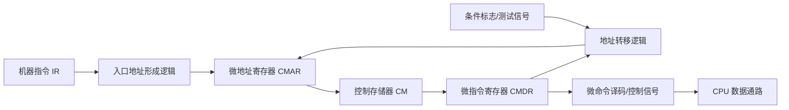

这一部分对应课程目标 2 中的：

```text
微程序控制器
微指令格式设计分析
操作控制字段编码方式
微程序入口地址形成
条件判别测试
```

课堂截图中 4 月下旬到 5 月初多次出现微程序控制器结构、时序发生器、节拍信号、微命令字段和练习题，所以这部分很适合出分析题或设计题。

> 教材查阅：微程序控制器见第 228-239 页；时序与控制可先看第 217-221 页。

---

# 一、为什么需要微程序控制器

> 教材查阅：第 228-230 页，重点看 6.6.1“微程序控制的基本概念”。

CPU 执行一条机器指令时，需要产生一系列控制信号。

例如一条取指操作可能需要：

```text
PC → MAR
主存读
MDR → IR
PC + 1 → PC
```

这些微小的控制动作称为**微操作**，控制这些微操作的信号称为**微命令**。

微程序控制器的思想是：

```text
把控制信号编码成微指令
把一条机器指令的控制过程写成一段微程序
执行机器指令时，按顺序读出并执行对应微指令
```

可以把它理解成：

```text
机器指令由微程序解释执行
微指令负责发出具体控制信号
```

---

# 二、微程序控制器的基本组成

> 教材查阅：第 230-233 页，重点看 6.6.2“微程序控制器组成原理”。

常见组成包括：

| 部件          | 作用                 |
| ----------- | ------------------ |
| 控制存储器 CM    | 存放微程序              |
| 微地址寄存器 CMAR | 保存下一条微指令地址         |
| 微指令寄存器 CMDR | 保存当前微指令            |
| 地址转移逻辑      | 根据条件、指令操作码等形成下一微地址 |
| 微命令形成部件     | 根据微指令字段产生控制信号      |

其中控制存储器通常是只读或半固定的，因为微程序一般由设计者预先写好。

结构图可以这样理解：



这张图里有两条主线：

```text
控制线：微指令 → 微命令 → CPU 数据通路
地址线：当前微指令 + 条件 → 下一条微地址
```

---

## 例题1：控制存储器容量

某微程序控制器的控制存储器中共有 256 条微指令，每条微指令 32 位。问控制存储器容量是多少？微地址寄存器至少多少位？

控制存储器容量：

$$
256\times32=8192bit
$$

换成字节：

$$
8192bit=1024B=1KB
$$

256 条微指令需要寻址：

$$
256=2^8
$$

所以微地址寄存器至少需要 $8$ 位。

答案：控制存储器容量为 $8192bit=1KB$，微地址寄存器至少 $8$ 位。

---

# 三、微指令格式

> 教材查阅：第 237-239 页，重点看 6.6.4“微指令及其编码方法”。

一条微指令通常包含两大部分：

```text
操作控制字段 + 顺序控制字段
```

微指令格式示意：

```text
|              操作控制字段              |             顺序控制字段             |
|  产生 PCout、MARin、MemRead 等微命令   |  指明下地址、转移条件、入口形成方式   |
```

## 1. 操作控制字段

操作控制字段用于产生微命令。

例如：

```text
PCout
MARin
MemRead
IRin
ALUAdd
RegWrite
```

这些信号控制数据通路中各部件工作。

---

## 2. 顺序控制字段

顺序控制字段用于决定下一条微指令地址。

可能包括：

- 下地址字段。
- 转移方式字段。
- 条件判别字段。
- 微程序入口形成控制字段。

---

# 四、操作控制字段的三种编码方式

> 教材查阅：第 237-239 页，重点看直接表示法、字段译码法等微指令编码方式。

课程总结明确提到：操作控制字段有三种编码方式及计算方法。

---

## 1. 直接控制法

直接控制法也叫不译码法。

规则：

```text
一个微命令对应微指令中的一位
该位为 1 表示发出该微命令
该位为 0 表示不发出
```

优点：

```text
控制速度快
可并行发出多个微命令
```

缺点：

```text
微指令字长很长
控制存储器容量大
```

如果有 $n$ 个互不排斥的微命令，直接控制法需要：

$$
n
$$

位。

---

## 2. 字段直接编码法

把互斥的微命令分在同一字段中，用编码表示其中一个微命令。

如果某字段中有 $m$ 个互斥微命令，并且还需要表示“不发命令”，则字段位数至少为：

$$
\lceil \log_2(m+1) \rceil
$$

为什么加 1？

因为同一字段某个节拍可能不发出该组中的任何微命令，需要一个空操作编码。

优点：

```text
微指令较短
```

缺点：

```text
需要译码
同一字段内微命令不能并行
```

---

## 3. 字段间接编码法

字段间接编码法中，某些字段的含义还要受其它字段控制。

特点：

```text
进一步压缩微指令长度
译码更复杂
速度可能更慢
```

这种方式考试一般考概念或比较，不一定要求复杂设计。

---

# 五、微指令字长计算

微指令字长一般由几部分相加：

$$
微指令字长 = 操作控制字段位数 + 顺序控制字段位数
$$

如果题目给出：

- 某些微命令互斥分组。
- 控制存储器容量。
- 下地址字段位数。
- 条件测试字段位数。

就按字段逐项求和。

---

## 例题模板

题目：

```text
有 30 个微命令，分成 5 组，每组分别有 7、5、4、3、2 个互斥微命令。
采用字段直接编码法，求操作控制字段至少多少位。
```

计算：

$$
\lceil \log_2(7+1) \rceil = 3
$$

$$
\lceil \log_2(5+1) \rceil = 3
$$

$$
\lceil \log_2(4+1) \rceil = 3
$$

$$
\lceil \log_2(3+1) \rceil = 2
$$

$$
\lceil \log_2(2+1) \rceil = 2
$$

总位数：

$$
3+3+3+2+2=13
$$

---

## 例题2：微指令字段编码

某微指令中有 4 个独立微命令需要直接控制；另有三组互斥微命令，数量分别为 7 个、5 个、3 个。若互斥组采用字段直接编码，问操作控制字段至少需要多少位？

4 个独立微命令直接控制，需要 $4$ 位。

互斥组采用字段直接编码时，若一组有 $m$ 个互斥微命令，需要：

$$
\lceil\log_2(m+1)\rceil
$$

位。这里的 $+1$ 是为了保留“本组无微命令”的空操作编码。

第一组有 7 个：

$$
\lceil\log_2(7+1)\rceil=3
$$

第二组有 5 个：

$$
\lceil\log_2(5+1)\rceil=3
$$

第三组有 3 个：

$$
\lceil\log_2(3+1)\rceil=2
$$

总位数：

$$
4+3+3+2=12
$$

答案：操作控制字段至少需要 $12$ 位。

---

# 六、微程序入口地址形成

> 教材查阅：第 233-237 页，重点看 6.6.3“微程序控制器设计”。

每条机器指令通常对应一段微程序。取指完成后，需要根据机器指令操作码找到该指令微程序的入口地址。

这就需要：

```text
微程序入口地址形成逻辑
```

基本过程：

1. 机器指令进入 IR。
2. 取出操作码字段。
3. 操作码经组合逻辑转换成微程序入口地址。
4. 入口地址送入微地址寄存器。
5. 控制存储器从该地址开始读出对应微指令。

---

# 七、条件判别测试

有些微程序执行过程中需要根据条件转移。

例如：

```text
零标志 Z 是否为 1
进位标志 C 是否为 1
中断请求是否有效
指令某字段是否满足条件
```

条件判别测试逻辑根据这些条件决定下一微地址。

可以理解为微程序内部的分支判断。

---

# 八、微程序设计题怎么答

如果题目给出 CPU 数据通路，要求设计某条指令的微程序，可以按下面步骤写：

1. 写出该机器指令功能。
2. 写出取指阶段微操作。
3. 写出执行阶段微操作。
4. 把能并行的相容微操作放在同一微指令中。
5. 为每条微指令写出控制信号。
6. 写出下一微地址或转移方式。

---

## 取指阶段常见微操作

常见写法：

$$
MAR \leftarrow PC
$$

$$
MDR \leftarrow M[MAR]
$$

$$
IR \leftarrow MDR
$$

$$
PC \leftarrow PC + 1
$$

如果题目数据通路允许并行，可以合并：

$$
MAR \leftarrow PC,\quad PC \leftarrow PC+1
$$

然后下一拍读存储器。

---

# 九、新增题库高频补充

新增题库中，微程序控制器常和“控制存储器容量”“微指令字段位数”“微命令编码方式”一起考。

## 1. 控制存储器容量

控制存储器用来存放微程序，容量通常按下面思路计算：

$$
控制存储器容量=微指令条数\times 每条微指令位数
$$

如果题目给“控存有 $256$ 个单元，每条微指令 $32$ 位”，则容量为：

$$
256\times32=8192bit=1024B
$$

也可以写成：

$$
256\times32bit
$$

考试时注意单位，题目问 bit 就不要换成 Byte 后忘记乘 8。

---

## 2. 下址字段位数

下址字段用于指出下一条微指令的地址。若控制存储器有 $N$ 个微地址单元，则下址字段至少需要：

$$
\lceil\log_2N\rceil
$$

位。

例如控存有 $512$ 个微地址单元：

$$
\log_2512=9
$$

所以下址字段至少 $9$ 位。

如果题目给的是“微程序条数”，要先判断它是否等价于控存地址空间，不能机械套数。

---

## 3. 微命令编码方式

微命令编码常见三类：

| 编码方式 | 特点 |
|---|---|
| 直接控制法 | 每个微命令一个控制位，速度快，字长长 |
| 字段直接编码法 | 互斥微命令放同一字段，字长较短 |
| 字段间接编码法 | 通过译码或其他字段共同决定微命令，字长更短但速度较慢 |

闭卷题常见问法是“哪种速度最快、哪种微指令字长最长”。答案通常是：

```text
直接控制法速度最快，但微指令字长最长。
字段编码法可缩短微指令字长，但需要译码，速度较慢。
```

---

## 4. 字段编码为什么要加 1

如果某字段中有 $m$ 个互斥微命令，该字段位数常取：

$$
\lceil \log_2(m+1)\rceil
$$

其中 $+1$ 是给“本字段无微命令”留一个空操作编码。

例如某字段有 $5$ 个互斥微命令，则：

$$
\lceil \log_2(5+1)\rceil=\lceil\log_26\rceil=3
$$

所以需要 $3$ 位。

---

# 十、易错点

## 1. 微指令不是机器指令

机器指令是程序员或编译器看到的指令；微指令是控制器内部用来产生控制信号的指令。

## 2. 互斥微命令才能放同一字段

如果两个微命令可能同时发出，就不能放在同一个互斥编码字段中。

## 3. 字段直接编码要给空操作留编码

计算位数时常常要用：

$$
\lceil \log_2(m+1) \rceil
$$

而不是：

$$
\lceil \log_2m \rceil
$$

## 4. 下地址字段位数看控制存储器容量

如果控制存储器有 $N$ 个微地址单元，则下地址字段至少：

$$
\log_2N
$$

位。
