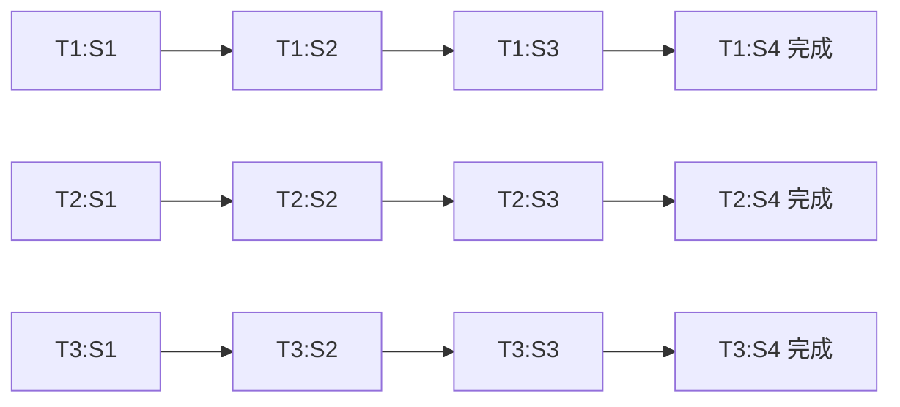
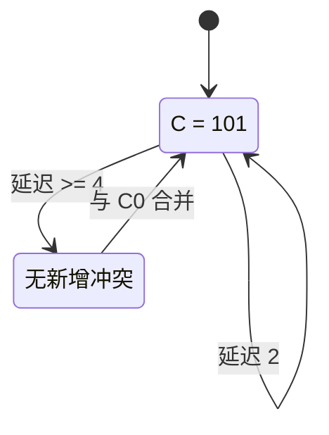

这一部分对应课程目标 3：

```text
线性流水线性能分析
非线性流水线调度
```

课程总结明确要求会设计时空图，计算吞吐率、加速比、效率；还要会根据预约表求延迟禁止表、初始冲突向量、状态转换图和最优调度方案。

> 教材查阅：组成原理教材中，线性指令流水线见第 254-280 页，其中时空图见第 255-256 页，流水线性能分析见第 279-280 页。《计算机系统结构 第 2 版》中，流水线基础见第 76-88 页，非线性流水线、预约表、冲突向量和状态转换图见第 89-93 页。系统结构教材用 PDF 阅读器跳页时，页码通常约等于“教材页码 + 11”。

---

# 一、流水线的基本思想

> 教材查阅：组成原理教材第 254-256 页，重点看 7.1“流水线概述”；系统结构教材第 76-79 页也可对照复习流水线的工作原理、特点和分类。

流水线的核心思想是：

```text
把一个任务分成多个阶段
不同任务在不同阶段上重叠执行
```

类似工厂流水线：

```text
第1个任务在第2段加工时
第2个任务可以进入第1段
```

这样可以提高单位时间完成任务的数量。

---

# 二、线性流水线

线性流水线是指每个任务经过的功能段顺序固定，并且每段最多使用一次。

例如 4 段流水线：

```text
S1 → S2 → S3 → S4
```

每个任务都按这个顺序经过。

---

# 三、时空图

> 教材查阅：组成原理教材第 255-256 页，重点看 7.1.3“流水线的时空图表示”；系统结构教材第 76-79 页可辅助理解时空图和流水线重叠执行过程。

课程总结强调要会设计时空图。

时空图一般：

```text
横坐标：时间
纵坐标：流水段
方格：某一任务在某一时间占用某一流水段
```

画图时要注意：

1. 纵坐标写流水段，如 $S_1,S_2,S_3$。
2. 横坐标写时钟周期。
3. 每个任务按阶段推进。
4. 被占用的格子涂阴影或标任务号。

下面是一个最典型的 4 段流水线连续执行 5 个任务的时空图。横向是时间，纵向是流水段，格子里的 `T1`、`T2` 表示第几个任务正在占用该流水段。

| 流水段/周期 | 1 | 2 | 3 | 4 | 5 | 6 | 7 | 8 |
|---|---|---|---|---|---|---|---|---|
| $S_1$ | T1 | T2 | T3 | T4 | T5 |  |  |  |
| $S_2$ |  | T1 | T2 | T3 | T4 | T5 |  |  |
| $S_3$ |  |  | T1 | T2 | T3 | T4 | T5 |  |
| $S_4$ |  |  |  | T1 | T2 | T3 | T4 | T5 |

读图方法：

```text
第 1 个任务 T1 在第 4 个周期结束；
第 2 个任务 T2 在第 5 个周期结束；
流水线装满后，基本每个周期完成一个任务；
总周期数 = 流水段数 + 任务数 - 1 = 4 + 5 - 1 = 8。
```

如果你的 Markdown 支持 Mermaid，也可以把流水过程看成下面这种“每个任务依次经过各段”的结构图：



注意：Mermaid 图帮助理解“任务经过哪些段”，真正考试计算时，还是以上面的时空表为准。

---

# 四、线性流水线性能指标

> 教材查阅：组成原理教材第 279-280 页，重点看 7.3.7“流水线性能分析”；系统结构教材第 83-88 页也讲线性流水线性能分析。

## 1. 吞吐率

吞吐率表示单位时间内完成的任务数。

$$
TP = \frac{n}{T_k}
$$

其中：

- $n$ 是完成任务数。
- $T_k$ 是完成这些任务所用总时间。

若一条 $k$ 段流水线，每段时间为 $\Delta t$，连续完成 $n$ 个任务，则总时间通常为：

$$
T_k = (k+n-1)\Delta t
$$

吞吐率：

$$
TP = \frac{n}{(k+n-1)\Delta t}
$$

当 $n$ 很大时，最大吞吐率趋近：

$$
TP_{max} = \frac{1}{\Delta t}
$$

---

## 2. 加速比

加速比表示不用流水线与使用流水线所需时间之比。

$$
S = \frac{T_{非流水}}{T_{流水}}
$$

若非流水执行 $n$ 个任务，每个任务经过 $k$ 段，每段 $\Delta t$：

$$
T_{非流水}=nk\Delta t
$$

流水执行时间：

$$
T_{流水}=(k+n-1)\Delta t
$$

所以：

$$
S=\frac{nk}{k+n-1}
$$

当 $n$ 很大时：

$$
S_{max} \approx k
$$

---

## 3. 效率

效率表示流水线设备的利用率。

$$
E = \frac{实际使用的时空区}{总时空区}
$$

对理想 $k$ 段线性流水线：

$$
E = \frac{n k \Delta t}{k(k+n-1)\Delta t}
$$

化简：

$$
E = \frac{n}{k+n-1}
$$

也可以理解为：

$$
E = \frac{S}{k}
$$

---

## 例题1：线性流水线性能

某流水线有 $k=5$ 段，每段时间 $\Delta t=10ns$，连续完成 $n=20$ 个任务。求流水线总时间、吞吐率、加速比和效率。

流水线总时间：

$$
T=(k+n-1)\Delta t
$$

代入：

$$
T=(5+20-1)\times10ns=240ns
$$

吞吐率：

$$
TP=\frac{n}{T}=\frac{20}{240ns}
$$

$$
TP\approx83.3\times10^6\ 次/s
$$

非流水时间：

$$
T_{非流水}=nk\Delta t=20\times5\times10ns=1000ns
$$

加速比：

$$
S=\frac{T_{非流水}}{T_{流水}}=\frac{1000}{240}\approx4.17
$$

效率：

$$
E=\frac{S}{k}=\frac{4.17}{5}\approx83.3\%
$$

也可以直接：

$$
E=\frac{n}{k+n-1}=\frac{20}{24}=83.3\%
$$

答案：

$$
T=240ns,\quad TP\approx83.3M次/s,\quad S\approx4.17,\quad E\approx83.3\%
$$

---

# 五、非均匀流水段

如果各段时间不相同，流水线时钟周期应取最大段时间：

$$
\Delta t = \max(\Delta t_1,\Delta t_2,\ldots,\Delta t_k)
$$

因为流水线必须按最慢阶段同步。

这类题容易问：

```text
哪个阶段成为瓶颈？
流水线周期是多少？
吞吐率是多少？
```

---

## 例题2：非均匀流水线

某 4 段流水线各段时间分别为 $20ns,35ns,30ns,25ns$，连续处理 10 个任务。求流水线时钟周期和总时间。

非均匀流水线的时钟周期取最慢段：

$$
\Delta t=\max(20,35,30,25)=35ns
$$

总时间：

$$
T=(k+n-1)\Delta t
$$

代入：

$$
T=(4+10-1)\times35ns=455ns
$$

答案：流水线时钟周期为 $35ns$，总时间为 $455ns$。瓶颈段是时间为 $35ns$ 的流水段。

---

# 六、非线性流水线

> 教材查阅：系统结构教材第 89-93 页，重点看 4.5“非线性流水线的调度技术”。其中第 89 页讲基本概念，第 90 页起讲无冲突调度方法，第 92 页起讲优化调度方法。

非线性流水线是指一个任务可能：

```text
多次使用同一功能段
跳过某些功能段
不同任务使用功能段的顺序不完全线性
```

因此可能出现功能段冲突。

非线性流水线调度的目标是：

```text
选择合适的任务启动间隔，避免冲突，并尽量提高吞吐率
```

---

# 七、预约表

预约表描述一个任务在各个时间步占用哪些功能段。

例如：

```text
第1拍用 S1
第2拍用 S2
第3拍又用 S1
```

如果另一个任务延迟若干拍启动，两个任务可能同时占用同一功能段，这就产生冲突。

例如有下面这个预约表：

| 功能段/时间 | 1 | 2 | 3 | 4 | 5 |
|---|---|---|---|---|---|
| $S_1$ | X |  | X |  |  |
| $S_2$ |  | X |  | X |  |
| $S_3$ |  |  |  |  | X |

从图上读：

```text
S1 在时间 1 和 3 被占用，距离为 2，所以延迟 2 禁止；
S2 在时间 2 和 4 被占用，距离为 2，所以延迟 2 禁止；
S3 只出现一次，不产生禁止延迟。
```

所以这个例子的延迟禁止表是：

$$
F=\{2\}
$$

---

# 八、延迟禁止表

延迟禁止表表示哪些启动间隔不能使用。

求法：

```text
在预约表同一行中，找任意两个被占用格子的时间距离
这些距离就是禁止延迟
```

如果同一功能段在时间 $t_i$ 和 $t_j$ 被同一任务占用，则：

$$
d = |t_j - t_i|
$$

这个 $d$ 就是禁止延迟。

把所有行的禁止延迟合并，得到延迟禁止表。

---

# 九、冲突向量

如果最大禁止延迟为 $m$，则冲突向量有 $m$ 位。

规则：

```text
第 i 位为 1：延迟 i 被禁止
第 i 位为 0：延迟 i 可用
```

通常最低位对应延迟 1。

例如禁止延迟集合为：

$$
F=\{1,3,4\}
$$

则初始冲突向量可以写成：

```text
1101
```

但具体左右顺序要看教材约定，考试时最好在答案中说明“第 i 位对应延迟 i”。

---

# 十、状态转换图

状态转换图用于分析可行调度序列。

基本做法：

1. 初始状态为初始冲突向量。
2. 选择一个允许延迟 $d$。
3. 将当前冲突向量右移 $d$ 位。
4. 与初始冲突向量按位或。
5. 得到新状态。
6. 重复直到状态闭合。

状态转移公式可理解为：

$$
C_{new} = (C_{old} >> d) \lor C_0
$$

其中：

- $C_0$ 是初始冲突向量。
- $d$ 是本次选择的启动延迟。

一个简化状态转换图可以这样看。假设初始冲突向量为 `101`，表示延迟 1 和 3 禁止，延迟 2 允许：



真实题目的状态可能更多，但画法不变：

```text
圆圈里写冲突向量；
箭头上写允许延迟；
从状态图中找平均延迟最小的循环。
```

---

## 例题3：非线性流水线预约表

某非线性流水线预约表如下，求延迟禁止表、初始冲突向量，并给出从初始状态出发的部分状态转移。

| 功能段/时间 | 1 | 2 | 3 | 4 | 5 |
|---|---|---|---|---|---|
| $S_1$ | X |  |  | X |  |
| $S_2$ |  | X |  |  | X |
| $S_3$ |  |  | X |  |  |

延迟禁止表来自同一功能段同一行中两个 X 的时间距离。

对 $S_1$：

$$
4-1=3
$$

对 $S_2$：

$$
5-2=3
$$

$S_3$ 只有一个 X，不产生禁止延迟。

所以延迟禁止表：

$$
F=\{3\}
$$

最大禁止延迟为 $3$，设冲突向量按 $c_3c_2c_1$ 排列。因为只有延迟 $3$ 被禁止：

$$
C_0=100
$$

允许的启动延迟为：

$$
1,2,4,5,\ldots
$$

状态转移公式：

$$
C_{new}=(C_{old}>>d)\lor C_0
$$

从初始状态 $100$ 出发：

若选 $d=1$：

$$
C_{new}=(100>>1)\lor100=010\lor100=110
$$

若选 $d=2$：

$$
C_{new}=(100>>2)\lor100=001\lor100=101
$$

若选 $d=4$：

$$
C_{new}=(100>>4)\lor100=000\lor100=100
$$

答案：

$$
F=\{3\},\quad C_0=100
$$

部分状态转移：

```text
100 --1--> 110
100 --2--> 101
100 --4--> 100
```

注意：如果老师规定冲突向量位序为 $c_1c_2c_3$，写法会变成 `001`。考试时最好说明自己的位序。

---

# 十一、最优调度方案

最优调度通常是指平均启动间隔最小的循环调度。

平均延迟：

$$
\bar{d} = \frac{d_1+d_2+\cdots+d_r}{r}
$$

吞吐率：

$$
TP = \frac{1}{\bar{d}\Delta t}
$$

如果时钟周期按 1 个时间单位计算，则：

$$
TP = \frac{1}{\bar{d}}
$$

---

# 十二、非线性流水线题答题模板

遇到预约表题，按下面步骤写：

```text
1. 根据预约表逐行找被占用格子的距离。
2. 合并得到延迟禁止表 F。
3. 根据 F 写初始冲突向量 C0。
4. 从 C0 出发画状态转换图。
5. 找出可行循环调度。
6. 计算每个循环的平均延迟。
7. 选择平均延迟最小者作为最优调度。
8. 写吞吐率。
```

---

# 十三、新增题库高频补充

新增题库中的流水线题不只考公式，还会问流水线为什么不能理想加速、相关冲突怎样分类，以及静态流水线和动态流水线的区别。

## 1. 流水线相关和冲突

流水线不能一直满速运行，主要原因是相关或冲突。

| 类型 | 含义 | 例子 |
|---|---|---|
| 结构相关 | 多条指令争用同一硬件资源 | 取指和访存同时争用存储器 |
| 数据相关 | 后一条指令需要前一条指令结果 | `ADD R1,...` 后紧跟 `SUB ...,R1` |
| 控制相关 | 分支、跳转导致下一条指令地址不确定 | 条件转移指令 |

答简答题可以写：

```text
流水线相关主要包括结构相关、数据相关和控制相关。结构相关由资源冲突引起，数据相关由指令间数据依赖引起，控制相关由转移指令改变程序执行方向引起。
```

---

## 2. 控制相关的处理方法

控制相关通常由条件转移指令引起。常见处理方法：

| 方法 | 思想 |
|---|---|
| 暂停流水线 | 等转移结果确定后再取指 |
| 分支预测 | 预测是否转移以及转移目标 |
| 延迟转移 | 把与分支无关的指令放入延迟槽 |
| 目标缓冲器 BTB | 缓存转移目标地址，加快取指 |

其中 BTB 是 Branch Target Buffer，中文常叫转移目标缓冲器。

---

## 3. 静态流水线和动态流水线

多功能流水线按连接方式和调度能力可分为静态流水线和动态流水线。

| 项目 | 静态流水线 | 动态流水线 |
|---|---|---|
| 功能切换 | 一段时间内固定执行某一类功能 | 可按任务动态改变连接和功能 |
| 控制复杂度 | 较低 | 较高 |
| 灵活性 | 较差 | 较好 |
| 适用 | 功能比较固定的处理 | 多种任务混合处理 |

闭卷答法：

```text
静态流水线在同一时间段内只能按固定方式完成某一功能；动态流水线可根据不同任务动态改变各段连接和功能，灵活性较高但控制复杂。
```

---

## 4. 超标量、超流水线和 VLIW

题库中也可能以选择题形式考三者区别。

| 技术 | 核心思想 |
|---|---|
| 超标量 | 一个时钟周期发射多条指令 |
| 超流水线 | 把流水段划分得更细，提高时钟频率 |
| VLIW | 编译器把多个可并行操作打包成超长指令字 |

记忆方式：

```text
超标量：同一拍做多条。
超流水：一条流水切更细。
VLIW：编译器提前打包并行操作。
```

---

# 十四、易错点

## 1. 线性流水线总时间别写成 $n k \Delta t$

那是非流水时间。流水线时间通常是：

$$
(k+n-1)\Delta t
$$

## 2. 效率不是吞吐率

吞吐率是单位时间完成任务数；效率是设备利用率。

## 3. 非线性流水线禁止延迟来自同一行

必须在预约表同一功能段行内找时间距离，不要跨行乱减。

## 4. 状态转换图中只能选择允许延迟

如果冲突向量对应位是 1，该延迟禁止，不能作为边。

## 5. 最优调度看平均延迟

不是看单次延迟最小，而是看循环调度的平均延迟最小。
