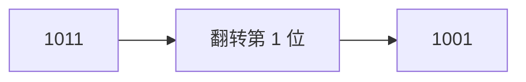
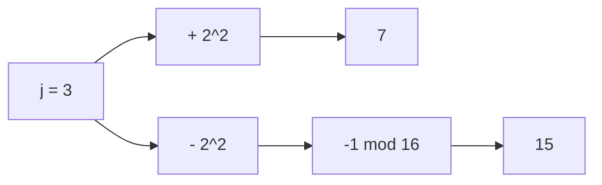
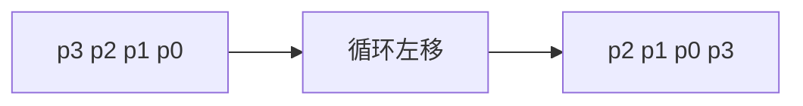
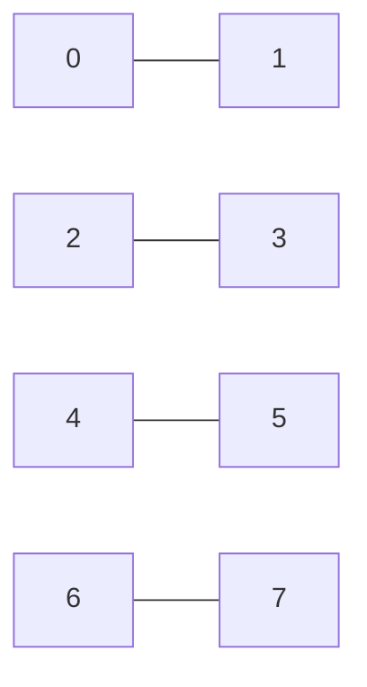
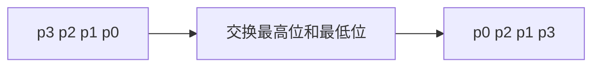
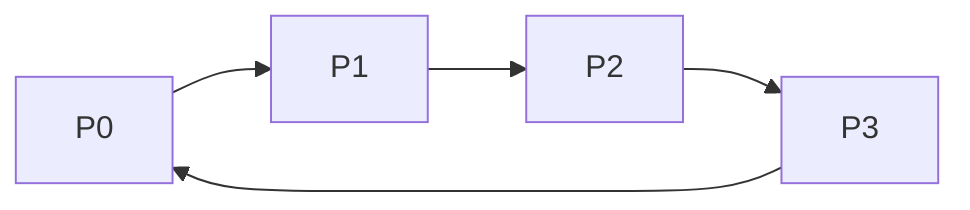
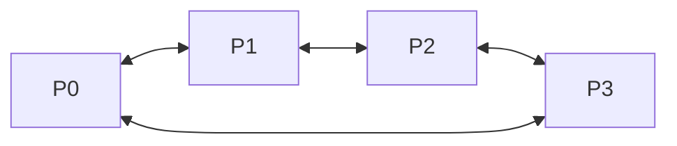
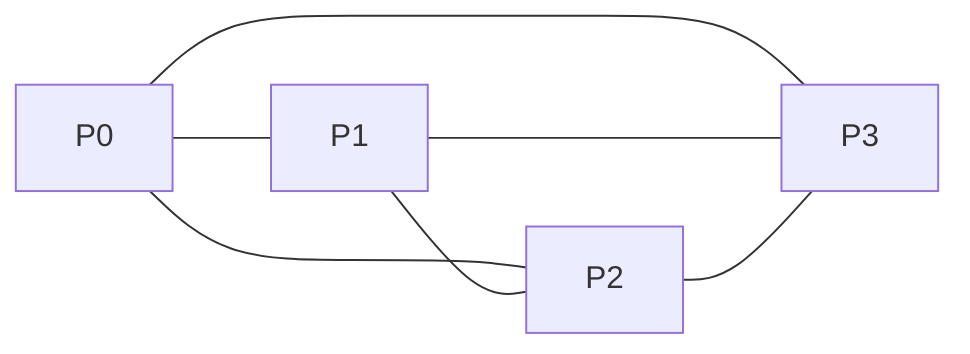

这一部分对应课程目标 3 的后半部分：

```text
SIMD 互连网络
静态网络
动态网络
程序划分和调度
并行计算机模型
```

这部分容易考公式、网络函数和并行时间分析。不要只背网络名字，要会根据编号算连接关系。

> 教材查阅：组成原理教材可参考第 282-286 页“指令级并行技术”作背景；系统结构教材对这一章更直接，SIMD 并行处理机见第 115-121 页，互连网络见第 122-144 页，并行计算机模型见第 187-201 页，并行算法与并行编程基础见第 203-230 页。系统结构教材 PDF 阅读器页码通常约等于“教材页码 + 11”。

---

# 一、SIMD 互连网络

> 教材查阅：系统结构教材第 115-121 页，重点看 5.2“SIMD 并行处理机”；组成原理教材第 282-286 页可作为指令级并行背景。

SIMD 是 Single Instruction Multiple Data，即：

```text
单指令流多数据流
```

特点：

```text
多个处理单元在同一控制器控制下执行同一条指令
但处理不同的数据
```

适合：

- 向量运算。
- 矩阵运算。
- 图像处理。
- 大量规则数据并行处理。

---

# 二、单级互连网络

> 教材查阅：系统结构教材第 122-125 页，重点看 5.3“SIMD 计算机的互连网络”和 5.4“网络特性”。Cube、PM2I、Shuffle-Exchange、Butterfly 的具体函数写法仍按课程 PPT 和老师例题复习。

课程总结列出的单级互连网络包括：

```text
Cube
PM2I
Shuffle-Exchange
Butterfly
```

设系统有 $N=2^n$ 个处理器，处理器编号可写成 n 位二进制：

$$
P = p_{n-1}p_{n-2}\cdots p_1p_0
$$

---

## 1. Cube 互连函数

Cube 函数的核心是：翻转某一位。

第 $i$ 维 Cube 连接：

$$
Cube_i(P)=P \oplus 2^i
$$

也就是把编号二进制中的第 $i$ 位取反，其它位不变。

例：

设 $P=1011_2$，求 $Cube_1(P)$。

第 1 位取反：

```text
1011 → 1001
```

所以：

$$
Cube_1(1011_2)=1001_2
$$

图示：



---

## 2. PM2I 互连函数

PM2I 表示 Plus-Minus $2^i$。

课程总结给出的形式：

$$
PM2_{+i}(j) = j + 2^i \pmod N
$$

$$
PM2_{-i}(j) = j - 2^i \pmod N
$$

其中 $N$ 是处理器总数。

例：

若 $N=16$，$j=3$，$i=2$：

$$
PM2_{+2}(3)=3+2^2=7
$$

$$
PM2_{-2}(3)=3-4=-1 \equiv 15 \pmod{16}
$$

图示：



---

## 3. Shuffle 互连函数

Shuffle 通常是循环左移。

若：

$$
P=p_{n-1}p_{n-2}\cdots p_1p_0
$$

则 Shuffle 后：

$$
Shuffle(P)=p_{n-2}\cdots p_1p_0p_{n-1}
$$

也就是最高位移到最低位，其余位左移。

图示：

```text
原编号：p3 p2 p1 p0
Shuffle：p2 p1 p0 p3
```



---

## 4. Exchange 互连函数

Exchange 通常是最低位取反。

$$
Exchange(P)=P \oplus 1
$$

也就是相邻奇偶编号互连：

```text
0 ↔ 1
2 ↔ 3
4 ↔ 5
```

图示：



---

## 5. Butterfly 互连函数

Butterfly 的典型规则是交换最高位和最低位。

若：

$$
P=p_{n-1}p_{n-2}\cdots p_1p_0
$$

则：

$$
Butterfly(P)=p_0p_{n-2}\cdots p_1p_{n-1}
$$

图示：

```text
原编号：p3 p2 p1 p0
Butterfly：p0 p2 p1 p3
```



---

## 例题1：互连函数

设 $N=16$，处理器编号 $P=1010_2$。求 $Cube_2(P)$、$Shuffle(P)$、$Exchange(P)$、$Butterfly(P)$。另求 $PM2_{+2}(13)$ 和 $PM2_{-3}(2)$。

$P=1010_2$，从右往左编号为第 $0,1,2,3$ 位。

Cube 函数：

$$
Cube_i(P)=P\oplus2^i
$$

$Cube_2$ 表示第 2 位取反：

$$
1010_2\rightarrow1110_2
$$

Shuffle 是循环左移：

$$
1010_2\rightarrow0101_2
$$

Exchange 是最低位取反：

$$
Exchange(P)=P\oplus1
$$

所以：

$$
1010_2\rightarrow1011_2
$$

Butterfly 通常交换最高位和最低位：

$$
1010_2\rightarrow0011_2
$$

PM2I：

$$
PM2_{+2}(13)=13+2^2\pmod {16}=17\pmod {16}=1
$$

$$
PM2_{-3}(2)=2-2^3\pmod {16}=-6\pmod {16}=10
$$

答案：

$$
Cube_2(1010_2)=1110_2
$$

$$
Shuffle(1010_2)=0101_2
$$

$$
Exchange(1010_2)=1011_2
$$

$$
Butterfly(1010_2)=0011_2
$$

$$
PM2_{+2}(13)=1,\quad PM2_{-3}(2)=10
$$

---

# 三、静态网络

> 教材查阅：系统结构教材第 126-129 页，重点看 5.5“静态网络”，包括线性阵列、环、带弦环、循环移数网络、全连接、树形、星形、网格、环网和超立方体等结构。

静态网络是指处理器之间的连接关系固定，程序运行过程中连接结构不变。

课程总结提到重点：

```text
单向环
双向环
全连接
数据寻径算法
```

---

## 1. 单向环

处理器按环形连接，数据只能沿一个方向传送。

特点：

```text
结构简单
成本低
远距离通信延迟较大
```



---

## 2. 双向环

在环上可以两个方向传送。

特点：

```text
比单向环灵活
平均通信距离更短
```



---

## 3. 全连接

任意两个处理器之间都有直接连接。

特点：

```text
通信速度快
硬件连接复杂
成本高
扩展性差
```



---

# 四、静态网络计算时间公式

课程总结给出了计算：

$$
S=\sum A_iB_i
$$

时的静态网络时间公式。设：

$$
N=2^m
$$

则双向环：

$$
T_S=\left\lceil\frac{n}{N}\right\rceil t_1+
\left(\left\lceil\frac{n}{N}\right\rceil-1\right)t_2+
m t_2+
m t_3
$$

单向环：

$$
T_S=\left\lceil\frac{n}{N}\right\rceil t_1+
\left(\left\lceil\frac{n}{N}\right\rceil-1\right)t_2+
m t_2+
(2m-1)t_3
$$

全连接：

$$
T_S=\left\lceil\frac{n}{N}\right\rceil t_1+
\left(\left\lceil\frac{n}{N}\right\rceil-1\right)t_2+
m t_2+
(2^m-1)t_3
$$

做题时要先解释符号：

- $n$：数据规模。
- $N$：处理器个数。
- $m$：满足 $N=2^m$。
- $t_1$：乘法或局部计算时间参数。
- $t_2$：局部累加时间参数。
- $t_3$：通信或归约时间参数。

具体含义以题目说明为准。

---

## 例题2：静态网络时间公式

计算 $S=\sum A_iB_i$，设处理器数 $N=8$，数据规模 $n=64$，$t_1=2ns$，$t_2=1ns$，$t_3=5ns$。按课程公式分别求双向环、单向环、全连接网络时间。

先由：

$$
N=2^m
$$

得到：

$$
8=2^3
$$

所以：

$$
m=3
$$

每个处理器分到的数据组数：

$$
\left\lceil\frac{n}{N}\right\rceil=\left\lceil\frac{64}{8}\right\rceil=8
$$

双向环：

$$
T_S=\left\lceil\frac{n}{N}\right\rceil t_1+
\left(\left\lceil\frac{n}{N}\right\rceil-1\right)t_2+
m t_2+
m t_3
$$

代入：

$$
T_S=8\times2+7\times1+3\times1+3\times5=41ns
$$

单向环：

$$
T_S=\left\lceil\frac{n}{N}\right\rceil t_1+
\left(\left\lceil\frac{n}{N}\right\rceil-1\right)t_2+
m t_2+
(2m-1)t_3
$$

代入：

$$
T_S=16+7+3+(6-1)\times5=51ns
$$

全连接：

$$
T_S=\left\lceil\frac{n}{N}\right\rceil t_1+
\left(\left\lceil\frac{n}{N}\right\rceil-1\right)t_2+
m t_2+
(2^m-1)t_3
$$

代入：

$$
T_S=16+7+3+(8-1)\times5=61ns
$$

答案：

| 网络 | 时间 |
|---|---:|
| 双向环 | $41ns$ |
| 单向环 | $51ns$ |
| 全连接 | $61ns$ |

注意：这里按课程总结中的公式代入；如果试卷给出不同含义的 $t_1,t_2,t_3$，以题目定义为准。

---

# 五、动态网络

> 教材查阅：系统结构教材第 132-142 页，重点看 5.6“动态网络”，包括总线互连、交叉开关互连、多级网络、蝶式网络和组合网络。组成原理教材第 287-308 页的总线系统可作总线互连背景参考。

动态网络是指连接关系可以通过开关动态改变。

课程总结列出的重点：

```text
总线互连
交叉开关
多级立方体网络 STAREN
Omega 网络
多级 PM2I 网络
```

---

## 1. 总线互连

多个部件共享一组总线。

优点：

```text
结构简单
成本低
```

缺点：

```text
同一时刻通信数量有限
总线容易成为瓶颈
```

---

## 2. 交叉开关

输入和输出之间通过交叉开关矩阵连接。

优点：

```text
并行通信能力强
```

缺点：

```text
硬件复杂度高
成本随规模快速增长
```

---

## 3. 多级立方体网络 STAREN

课程总结中给出：

```text
出端编号 = 入端处理器编号 xor 级控信号
```

即：

$$
Output = Input \oplus Control
$$

其中 $\oplus$ 是按位异或。

---

## 4. Omega 网络

Omega 网络通常由多级交换单元和 Shuffle 连接组成。

特点：

```text
级数通常为 log2N
结构规则
可能发生阻塞
```

---

## 例题3：动态互连网络

一个 $N=8$ 的 Omega 网络由 $2\times2$ 交换单元组成。问通常需要多少级？每级多少个交换单元？总共多少个交换单元？

Omega 网络级数通常为：

$$
\log_2N
$$

所以：

$$
\log_2 8=3
$$

级。

每级需要连接 $8$ 个输入输出，每个交换单元处理 $2$ 路，因此每级交换单元数为：

$$
\frac{N}{2}=\frac{8}{2}=4
$$

总交换单元数：

$$
3\times4=12
$$

答案：需要 $3$ 级；每级 $4$ 个 $2\times2$ 交换单元；总共 $12$ 个交换单元。

---

# 六、程序划分与调度

程序划分和调度关注的是：

```text
怎样把一个计算任务拆给多个处理器
怎样安排计算和通信顺序
怎样计算并行执行时间
```

常见任务：

- 累加。
- 累乘。
- 点积。
- 矩阵运算。

对比方式：

```text
串行
流水
SIMD
MIMD
```

---

# 七、BSP 模型

> 教材查阅：系统结构教材目录中没有直接列出 BSP 名称，可参考第 187-201 页多处理机性能模型，以及第 203-230 页并行算法与并行编程基础；本节具体公式按课程 PPT 和老师例题复习。

BSP 是 Bulk Synchronous Parallel，整体同步并行模型。

课程总结给出的公式：

$$
T_{BSP}=
\frac{m}{N}(t_{multi}+t_{add})+
\log_2N(g h+l+t_{add})
$$

加速比：

$$
S_p=
\frac{m(t_{multi}+t_{add})}{T_{BSP}}
$$

理解：

```text
第一项：每个处理器分到的数据计算时间
第二项：并行归约/通信/同步的时间
```

其中：

- $m$：任务规模或数据个数。
- $N$：处理器个数。
- $g$：通信带宽相关参数。
- $h$：通信量。
- $l$：同步延迟。
- $t_{multi}$：乘法时间。
- $t_{add}$：加法时间。

---

# 八、PRAM 模型

> 教材查阅：系统结构教材目录中没有直接列出 PRAM 名称，可参考第 187-201 页多处理机性能模型，以及第 203-230 页并行算法与并行编程基础；本节具体公式按课程 PPT 和老师例题复习。

PRAM 是 Parallel Random Access Machine，并行随机访问机模型。

课程总结给出的公式：

$$
T_{PRAM}=
\frac{m}{N}(t_{multi}+t_{add})+
\log_2N \cdot t_{add}
$$

加速比：

$$
S_p=
\frac{m(t_{multi}+t_{add})}{T_{PRAM}}
$$

PRAM 更理想化，通常忽略复杂通信开销，所以公式比 BSP 简洁。

---

# 九、BSP 和 PRAM 对比

| 模型 | 特点 | 时间公式中的额外开销 |
|---|---|---|
| BSP | 更接近真实并行机，考虑通信和同步 | $g h + l$ |
| PRAM | 理想共享存储模型 | 通信开销被简化或忽略 |

可以这样记：

```text
BSP 更现实，所以多了通信和同步项；
PRAM 更理想，所以主要看计算和归约。
```

---

## 例题4：BSP 和 PRAM 时间公式

设用 $N=16$ 个处理器完成 $m=1024$ 个乘加任务，$t_{multi}=4ns$，$t_{add}=1ns$。BSP 模型中 $g=2$，$h=3$，$l=5ns$。分别求 BSP 和 PRAM 模型下的并行时间与加速比。

串行时间：

$$
T_1=m(t_{multi}+t_{add})
$$

$$
T_1=1024(4+1)=5120ns
$$

BSP 时间分为局部计算时间和归约通信同步时间两部分：

$$
T_{BSP}=
\frac{m}{N}(t_{multi}+t_{add})+
\log_2N(g h+l+t_{add})
$$

第一项：

$$
\frac{1024}{16}(4+1)=64\times5=320ns
$$

第二项：

$$
\log_2 16(2\times3+5+1)=4\times12=48ns
$$

所以：

$$
T_{BSP}=320+48=368ns
$$

加速比：

$$
S_p=\frac{T_1}{T_{BSP}}=\frac{5120}{368}\approx13.91
$$

PRAM 模型忽略复杂通信开销，常用形式为：

$$
T_{PRAM}=
\frac{m}{N}(t_{multi}+t_{add})+
\log_2N\cdot t_{add}
$$

代入：

$$
T_{PRAM}=320+4\times1=324ns
$$

加速比：

$$
S_p=\frac{5120}{324}\approx15.80
$$

答案：

| 模型 | 并行时间 | 加速比 |
|---|---:|---:|
| BSP | $368ns$ | $13.91$ |
| PRAM | $324ns$ | $15.80$ |

注意：BSP 比 PRAM 多考虑通信和同步开销，所以同样条件下时间通常更长。

---

# 十、新增题库高频补充

新增题库中，互连网络和并行计算部分常以选择、填空和简单计算出现，重点是 STARAN、Omega、Shuffle、Cube 以及 SISD/SIMD/MIMD 点积时间。

## 1. STARAN 网络的控制规律

STARAN 网络常用异或规则描述数据连接。若控制信号为 $j$，输入编号为 $i$，输出编号可写成：

$$
f(i)=i\oplus j
$$

其中 $\oplus$ 表示按位异或。

例子：若 $i=5$，$j=3$，二进制为：

$$
5=101_2,\quad 3=011_2
$$

则：

$$
f(i)=101_2\oplus011_2=110_2=6
$$

所以输入 5 连接到输出 6。

---

## 2. Omega 网络级数和交换开关数量

对 $N$ 个输入输出的 Omega 网络，若每个交换单元是 $k\times k$，通常有：

$$
N=k^n
$$

因此级数为：

$$
n=\log_kN
$$

每一级交换单元数为：

$$
\frac{N}{k}
$$

总交换单元数为：

$$
\frac{N}{k}\log_kN
$$

例如 $N=16$，交换单元为 $2\times2$：

$$
n=\log_216=4
$$

每级 $8$ 个交换单元，总数：

$$
8\times4=32
$$

---

## 3. Shuffle 多次置换

Shuffle 置换本质是循环左移，不是普通左移。

若 $N=8$，编号用 3 位二进制表示，$i=5=101_2$。

一次 Shuffle：

$$
101_2\rightarrow011_2=3
$$

再做一次 Shuffle：

$$
011_2\rightarrow110_2=6
$$

所以连续多次 Shuffle 时，每次都按固定宽度循环左移。

---

## 4. SISD、SIMD、MIMD 点积时间

题库中常见点积题：求两个长度为 $n$ 的向量点积，乘法时间为 $t_m$，加法时间为 $t_a$。

SISD 顺序执行时，常写为：

$$
T_{SISD}=n t_m+(n-1)t_a
$$

因为有 $n$ 次乘法、$n-1$ 次加法。

SIMD 若有足够多处理单元，可并行完成乘法，再做归约求和：

$$
T_{SIMD}=t_m+\lceil\log_2n\rceil t_a
$$

如果题目给的 SIMD 处理单元数量不足，就要先分批计算。

---

## 5. BSP 和 PRAM 的考试区别

PRAM 是理想共享存储并行模型，通常忽略通信和同步开销；BSP 会把计算、通信和同步分开考虑。

可以这样记：

```text
PRAM 更理想；
BSP 更接近真实并行机。
```

BSP 常见一轮超步时间：

$$
T=w+gh+l
$$

其中：

| 符号 | 含义 |
|---|---|
| $w$ | 本地计算量 |
| $g$ | 单位通信代价 |
| $h$ | 通信数据量 |
| $l$ | 同步开销 |

---

# 十一、本章易错点

## 1. PM2I 要取模

出现负数或超过 $N-1$ 时必须按模 $N$ 处理。

## 2. Shuffle 是循环移位

不要写成普通左移丢最高位。

## 3. Cube 是某一位取反

第 $i$ 位取反，等价于异或 $2^i$。

## 4. BSP 与 PRAM 公式不要混

BSP 有：

$$
g h + l
$$

PRAM 没有这一项。

## 5. 静态网络公式先求 $m$

如果题目给 $N$，先由：

$$
N=2^m
$$

求出 $m$，再代公式。
