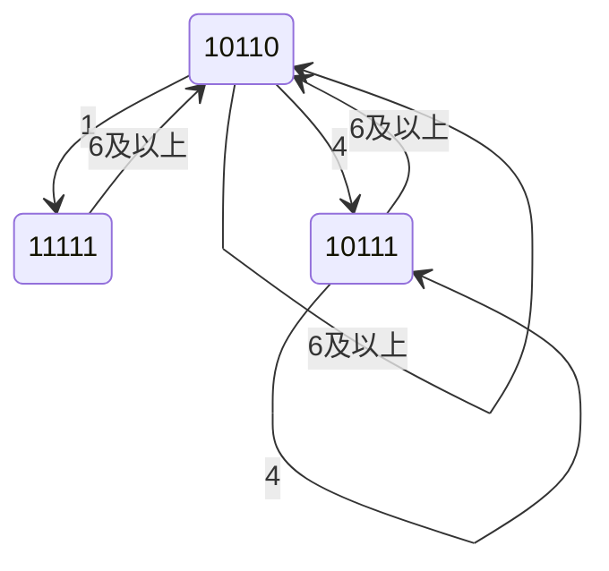

> 说明：本答案按照课程 PPT、目录中的练习题库以及试卷给出的符号约定整理。数学表达式统一使用 LaTeX。  
> 变形补码使用双符号位；整数的符号位和数值位之间用逗号分隔。

---

# 一、分析计算题（40 分）

## 1. 变形补码加减法

已知：

$$
X=-47,\qquad Y=+53
$$

数值位为 6 位，因此真值表示范围为：

$$
-64\leq x\leq63
$$

### （1）求 $X$、$Y$、$-Y$ 的变形补码

首先写出绝对值的 6 位二进制形式：

$$
47=(101111)_2
$$

$$
53=(110101)_2
$$

正数的变形补码使用双符号位 `00`：

$$
[Y]_{\text{补}}=00,110101
$$

求 $-47$ 的补码：

```text
+47：00,101111
取反：11,010000
加 1：11,010001
```

所以：

$$
[X]_{\text{补}}=11,010001
$$

同理，求 $-Y=-53$ 的补码：

```text
+53：00,110101
取反：11,001010
加 1：11,001011
```

所以：

$$
[-Y]_{\text{补}}=11,001011
$$

答案：

$$
\boxed{[X]_{\text{补}}=11,010001}
$$

$$
\boxed{[Y]_{\text{补}}=00,110101}
$$

$$
\boxed{[-Y]_{\text{补}}=11,001011}
$$

### （2）用变形补码计算 $X+Y$

$$
\begin{aligned}
[X]_{\text{补}}+[Y]_{\text{补}}
&=11,010001+00,110101\\
&=00,000110
\end{aligned}
$$

双符号位为 `00`，没有溢出，结果为正数：

$$
X+Y=(000110)_2=6
$$

答案：

$$
\boxed{X+Y=00,000110=(+6)_{10}}
$$

### （3）用变形补码计算 $X-Y$

减法转换为补码加法：

$$
X-Y=X+(-Y)
$$

$$
\begin{aligned}
[X]_{\text{补}}+[-Y]_{\text{补}}
&=11,010001+11,001011\\
&=10,011100
\end{aligned}
$$

双符号位为 `10`，表示发生负溢出，也叫下溢。

从真值验证：

$$
-47-53=-100
$$

$-100$ 超出了 6 位数值位可表示的范围 $[-64,63]$。

答案：

$$
\boxed{[X-Y]_{\text{补}}=10,011100}
$$

$$
\boxed{X-Y\text{ 发生下溢（负溢）}}
$$

---

## 2. 浮点数加法

已知：

$$
X=+17.5,\qquad Y=-9
$$

要求：

- 阶码 5 位，其中含双符号位；
- 尾数 8 位，其中含双符号位；
- 阶码和尾数均采用补码；
- 尾数数值位保持 6 位；
- 舍入采用截去法。

### 第一步：将两个数规格化

$$
17.5=(10001.1)_2
$$

所以：

$$
X=+0.100011\times2^{101}
$$

即：

$$
X=+0.100011\times2^5
$$

同理：

$$
9=(1001)_2
$$

所以：

$$
Y=-0.100100\times2^{100}
$$

即：

$$
Y=-0.100100\times2^4
$$

### 第二步：写出浮点补码

$X$ 的阶码为 $+5$：

$$
[E_X]_{\text{补}}=00101
$$

$X$ 的尾数为正：

$$
[M_X]_{\text{补}}=00.100011
$$

所以：

$$
[X]_{\text{浮}}=00101,\ 00.100011
$$

$Y$ 的阶码为 $+4$：

$$
[E_Y]_{\text{补}}=00100
$$

$Y=-0.100100$，其尾数补码为：

$$
[M_Y]_{\text{补}}=11.011100
$$

所以：

$$
[Y]_{\text{浮}}=00100,\ 11.011100
$$

### 第三步：对阶

$$
\Delta E=E_X-E_Y=5-4=1
$$

$Y$ 的阶码较小，因此将 $Y$ 的尾数算术右移一位，阶码加 1：

$$
11.011100\longrightarrow11.101110(0)
$$

对阶后：

$$
[Y]_{\text{浮}}=00101,\ 11.101110(0)
$$

括号中的 `0` 是移出的保护位。

### 第四步：尾数相加

$$
\begin{aligned}
00.100011\\
+\ 11.101110(0)\\
\hline
00.010001(0)
\end{aligned}
$$

因此：

$$
[X+Y]_{\text{浮}}=00101,\ 00.010001(0)
$$

### 第五步：规格化

尾数 `00.010001` 不是规格化正数，需要左移一位，同时阶码减 1：

$$
00.010001(0)\longrightarrow00.100010
$$

$$
00101\longrightarrow00100
$$

所以：

$$
[X+Y]_{\text{浮}}=00100,\ 00.100010
$$

### 第六步：舍入和溢出判断

采用截去法，直接舍去超出 6 位数值位的部分：

$$
[X+Y]_{\text{浮}}=00100,\ 00.100010
$$

阶码没有溢出。

还原真值：

$$
X+Y=+0.100010\times2^4
$$

$$
=+(1000.10)_2
$$

$$
=8.5
$$

最终答案：

$$
\boxed{[X+Y]_{\text{浮}}=00100,\ 00.100010}
$$

$$
\boxed{X+Y=(1000.1)_2=8.5}
$$

---

## 3. 顺序存储器与交叉存储器带宽

已知：

$$
T=400ns,\qquad \tau=50ns
$$

每字 64 位，连续读取 16 个字。

### 第一步：计算信息总量

$$
q=16\times64=1024bit
$$

### 第二步：顺序存储器

顺序存储器每读一个字都需要一个完整存储周期：

$$
t_{\text{顺}}=nT
$$

$$
t_{\text{顺}}=16\times400=6400ns
$$

带宽：

$$
W_{\text{顺}}=\frac{q}{t_{\text{顺}}}
$$

$$
W_{\text{顺}}
=\frac{1024bit}{6400ns}
=160Mbit/s
$$

### 第三步：交叉存储器

交叉存储器读出第一个字需要一个存储周期，后续各字按照总线传送周期连续输出：

$$
t_{\text{交}}=T+(n-1)\tau
$$

$$
t_{\text{交}}
=400+15\times50
=1150ns
$$

带宽：

$$
W_{\text{交}}
=\frac{1024bit}{1150ns}
\approx890.4Mbit/s
$$

答案：

| 存储器组织方式 | 读取时间 | 带宽 |
|---|---:|---:|
| 顺序存储器 | $6400ns$ | $160Mbit/s$ |
| 交叉存储器 | $1150ns$ | $890.4Mbit/s$ |

---

## 4. Cache 地址划分与命中率

已知：

- 计算机字长为 32 位，即每字 $4B$；
- 主存容量为 $4MB$；
- Cache 数据存储体容量为 $8KB$；
- 块长为 16 个字；
- 采用直接相联映射；
- 主存按字节编址。

### （1）主存地址划分

主存容量：

$$
4MB=2^{22}B
$$

所以主存地址长度为 22 位。

每块包含 16 个字：

$$
16\times4B=64B=2^6B
$$

因此块内偏移字段为 6 位，也可以进一步拆分为：

```text
块内字偏移：4 位
字内字节偏移：2 位
```

Cache 行数：

$$
\frac{8KB}{64B}
=\frac{2^{13}}{2^6}
=2^7
=128
$$

所以行索引字段为 7 位。

标记字段：

$$
22-7-6=9
$$

主存地址划分为：

```text
┌─────────┬───────────┬──────────────┐
│ Tag 9位 │ 行索引 7位 │ 块内偏移 6位 │
└─────────┴───────────┴──────────────┘
```

若把块内偏移继续拆开：

```text
┌─────────┬───────────┬────────────┬──────────────┐
│ Tag 9位 │ 行索引 7位 │ 字偏移 4位 │ 字节偏移 2位 │
└─────────┴───────────┴────────────┴──────────────┘
```

### （2）Cache 命中率

CPU 每轮访问 0～199 号单元，共 200 个字。

每块有 16 个字，所以涉及的主存块数为：

$$
\left\lceil\frac{200}{16}\right\rceil=13
$$

Cache 有 128 行，且这 13 个连续块映射到不同 Cache 行，不会发生冲突替换。

第一轮：

- 每个块第一次访问不命中，共 13 次不命中；
- 其余访问命中。

第一轮命中次数：

$$
200-13=187
$$

之后重复 4 轮，所需数据块都仍在 Cache 中：

$$
4\times200=800
$$

总访问次数：

$$
5\times200=1000
$$

总命中次数：

$$
187+800=987
$$

命中率：

$$
h=\frac{987}{1000}=0.987=98.7\%
$$

答案：

$$
\boxed{h=98.7\%}
$$

### （3）平均访问时间

按照课程题库采用的平均访问时间公式：

$$
t_a=ht_c+(1-h)t_m
$$

代入：

$$
t_a
=0.987\times10
+0.013\times50
$$

$$
t_a=9.87+0.65=10.52ns
$$

答案：

$$
\boxed{t_a=10.52ns}
$$

> 补充：若某教材把“不命中”定义为先访问 Cache，再访问主存，则会写成  
> $t_a=t_c+(1-h)t_m=10.65ns$。本课程此前题库采用前一种加权公式，因此本卷建议答 $10.52ns$。

---

# 二、分析设计题（30 分）

## 1. 扩展操作码设计

机器字长为 16 位，各类指令格式为：

```text
二地址：OP 4位  + A1 6位 + A2 6位
一地址：OP 10位 + A 6位
零地址：OP 16位
```

已知：

- 二地址指令 14 条；
- 一地址指令 125 条。

### （1）零地址指令最多有多少条

4 位操作码共有：

$$
2^4=16
$$

种编码。

二地址指令使用 14 种，还剩：

$$
16-14=2
$$

个 4 位前缀可扩展为一地址指令。

每个前缀再扩展 6 位，可以表示：

$$
2^6=64
$$

条一地址指令。

所以一地址指令区域最多有：

$$
2\times64=128
$$

个 10 位操作码。

已使用 125 个，还剩：

$$
128-125=3
$$

个 10 位前缀可继续扩展为零地址指令。

每个前缀还能扩展 6 位：

$$
N_0=3\times2^6=192
$$

答案：

$$
\boxed{零地址指令最多有192条}
$$

### （2）整个指令系统最多有多少条指令

$$
N=14+125+192=331
$$

答案：

$$
\boxed{整个指令系统最多有331条指令}
$$

### （3）若一地址指令要求设计 247 条，二地址指令最多有多少条

每保留一个 4 位扩展前缀，最多可形成 64 条一地址指令。

247 条一地址指令至少需要：

$$
\left\lceil\frac{247}{64}\right\rceil=4
$$

个扩展前缀。

因此二地址指令最多有：

$$
2^4-4=16-4=12
$$

答案：

$$
\boxed{二地址指令最多有12条}
$$

---

## 2. 单总线 CPU 中的 `lw` 指令

已知：

```text
lw rt, imm(rs)
```

功能为：

$$
R[rt]\leftarrow M[R[rs]+\operatorname{SignExt}(imm)]
$$

题目表格中取指周期已经给出，需要补充计算周期和执行周期。

### 计算周期

#### T5

操作：

$$
R[rs]\rightarrow X
$$

控制信号：

```text
Rout，Xin
```

因为 `Rs/Rt=0` 时选择 `rs`，而表格只列高电平信号，所以不用列出 `Rs/Rt`。

#### T6

操作：

$$
\operatorname{SignExt}(IR(I))+X\rightarrow Z
$$

控制信号：

```text
IR(I)out，ADD
```

### 执行周期

#### T7

操作：

$$
Z\rightarrow AR
$$

控制信号：

```text
Zout，ARin
```

#### T8

题目已经给出：

$$
M[AR]\rightarrow DR
$$

控制信号：

```text
Read，DREin
```

#### T9

操作：

$$
DR\rightarrow R[rt]
$$

控制信号：

```text
DRout，Rin
```

由于 `RegDst=0` 时选择 `rt`，而题目只要求列高电平信号，因此不列 `RegDst`。

### 表格填空答案

| 空号 | 答案 |
|---|---|
| ① | $R[rs]\rightarrow X$ |
| ② | `IR(I)out，ADD` |
| ③ | $Z\rightarrow AR$ |
| ④ | $DR\rightarrow R[rt]$ |
| ⑤ | `DRout，Rin` |

完整流程：

```text
计算周期：
T5  R[rs] → X
T6  SignExt(imm) + X → Z

执行周期：
T7  Z → AR
T8  M[AR] → DR
T9  DR → R[rt]
```

---

## 3. 微指令格式分析

微指令字长为 32 位，各字段如下：

| 字段 | 位号 | 位数 | 编码方式 |
|---|---|---:|---|
| W 组 | 31～27 | 5 | 编码表示 |
| X 组 | 26～24 | 3 | 编码表示 |
| Y 组 | 23～20 | 4 | 编码表示 |
| Z 组 | 19～12 | 8 | 直接表示 |
| 判别测试字段 | 11～7 | 5 | 题设可改为编码表示 |
| 下址字段 | 6～0 | 7 | 直接给出后继微地址 |

### （1）控制存储器的最大容量

下址字段为 7 位，最多可寻址：

$$
2^7=128
$$

个微地址单元。

每条微指令为 32 位，所以控制存储器最大容量为：

$$
128\times32=4096bit
$$

也可以写成：

$$
4096bit=512B
$$

答案：

$$
\boxed{4096bit}
$$

### （2）判别测试条件最多有多少个

判别测试字段为 5 位，采用编码表示时共有：

$$
2^5=32
$$

种编码。

编码字段通常需要保留一种编码表示“不进行判别测试”，所以最多可表示：

$$
2^5-1=31
$$

个判别测试条件。

答案：

$$
\boxed{31个}
$$

### （3）最多可以设计多少条微指令

微指令条数由下址字段的寻址范围决定：

$$
2^7=128
$$

答案：

$$
\boxed{128条}
$$

### （4）一条微指令中最多同时出现多少个有效微命令

W、X、Y 三个字段采用编码表示，每个字段同一时刻最多发出一个微命令：

$$
1+1+1=3
$$

Z 组采用直接表示，8 位可以同时发出 8 个微命令。

因此：

$$
3+8=11
$$

答案：

$$
\boxed{11个}
$$

### （5）该格式最多可表示多少种微命令

编码表示字段需要各保留一种“不发命令”的编码。

W 组：

$$
2^5-1=31
$$

X 组：

$$
2^3-1=7
$$

Y 组：

$$
2^4-1=15
$$

Z 组直接表示：

$$
8
$$

总数：

$$
31+7+15+8=61
$$

答案：

$$
\boxed{61种微命令}
$$

---

# 三、综合应用题（30 分）

## 1. 非线性流水线调度

根据预约表：

```text
时间： 1  2  3  4  5  6
S1：   √     √        √
S2：      √     √
S3：               √
```

### （1）禁止表和初始冲突向量

对 $S_1$：

$$
3-1=2
$$

$$
6-3=3
$$

$$
6-1=5
$$

所以 $S_1$ 产生禁止延迟：

$$
\{2,3,5\}
$$

对 $S_2$：

$$
4-2=2
$$

产生禁止延迟：

$$
\{2\}
$$

$S_3$ 只使用一次，不产生禁止延迟。

合并后：

$$
\boxed{F=\{2,3,5\}}
$$

令冲突向量按照：

$$
C=(c_5c_4c_3c_2c_1)
$$

排列，其中 $c_i=1$ 表示延迟 $i$ 禁止。

因此：

$$
\boxed{C_0=(10110)}
$$

### （2）最小启动循环和最小平均间隔

从初始状态 `10110` 出发：

- 延迟 1 允许；
- 延迟 4 允许；
- 延迟不小于 6 时也允许。

选择延迟 1：

$$
C_1=(10110>>1)\lor10110
$$

$$
C_1=01011\lor10110=11111
$$

状态 `11111` 的延迟 1～5 都被禁止，只能选择不小于 6 的延迟。

选择延迟 6 后回到初始状态：

```text
10110 --1--> 11111 --6--> 10110
```

所以最小启动循环为：

$$
\boxed{(1,6)}
$$

最小平均启动间隔：

$$
\bar d_{\min}
=\frac{1+6}{2}
=3.5
$$

答案：

$$
\boxed{\bar d_{\min}=3.5\text{ 个时钟周期}}
$$

### （3）状态转换图

可达状态包括：

```text
A = 10110
B = 11111
C = 10111
```

状态转移关系：

```text
A --1--> B
A --4--> C
A --6及以上--> A

B --6及以上--> A

C --4--> C
C --6及以上--> A
```

状态图：



其中平均间隔最小的闭合回路为：

$$
A\xrightarrow{1}B\xrightarrow{6}A
$$

平均间隔为 $3.5$。

---

## 2. 串行计算机和 SIMD 单向环计算点积

计算：

$$
S=A_1B_1+A_2B_2+\cdots+A_{64}B_{64}
$$

已知：

- 一次乘法需要 4 个单位时间；
- 一次加法需要 2 个单位时间；
- 相邻 PE 传送一次数据需要 1 个单位时间。

### （1）串行计算机

64 项点积需要：

- 64 次乘法；
- 63 次加法。

由于加法器和乘法器同一时刻只能使用其中一个，所以：

$$
T_{\text{串}}
=64\times4+63\times2
$$

$$
T_{\text{串}}
=256+126
=382
$$

答案：

$$
\boxed{T_{\text{串}}=382\text{ 个单位时间}}
$$

### （2）16 个 PE 的 SIMD 单向环

共有 64 项，平均分配给 16 个 PE：

$$
\frac{64}{16}=4
$$

每个 PE 先完成本地 4 项点积。

#### 本地乘法

每个 PE 执行 4 次乘法：

$$
4\times4=16
$$

个单位时间。

#### 本地累加

4 个乘积相加需要 3 次加法：

$$
3\times2=6
$$

个单位时间。

本地计算总时间：

$$
16+6=22
$$

#### 16 个部分和归约

因为：

$$
16=2^4
$$

需要 4 级加法归约：

$$
4\times2=8
$$

个单位时间。

在单向环上，关键路径的数据传送距离依次为：

$$
1,\ 2,\ 4,\ 8
$$

因此数据传送时间为：

$$
1+2+4+8=15
$$

个单位时间。

总时间：

$$
T_{\text{SIMD}}
=22+8+15
=45
$$

答案：

$$
\boxed{T_{\text{SIMD}}=45\text{ 个单位时间}}
$$

---

## 3. BSP 与理想 PRAM 计算点积

在 8 个处理器上计算：

$$
S=\sum_{i=1}^{200}A_iB_i
$$

已知：

$$
N=8,\quad m=200
$$

$$
t_{\text{multi}}=80ns,\quad
t_{\text{add}}=40ns
$$

$$
h=1,\quad g=200ns,\quad l=400ns
$$

### 串行执行时间

按课程公式，串行基准时间取：

$$
T_1=m(t_{\text{multi}}+t_{\text{add}})
$$

$$
T_1=200(80+40)=24000ns
$$

### （1）BSP 计算机

BSP 时间公式：

$$
T_{\text{BSP}}
=
\frac{m}{N}
(t_{\text{multi}}+t_{\text{add}})
+
\log_2N
(gh+l+t_{\text{add}})
$$

局部计算时间：

$$
\frac{200}{8}(80+40)
=25\times120
=3000ns
$$

归约、通信和同步时间：

$$
\log_28(200\times1+400+40)
$$

$$
=3\times640
=1920ns
$$

所以：

$$
T_{\text{BSP}}
=3000+1920
=4920ns
$$

加速比：

$$
S_p
=\frac{T_1}{T_{\text{BSP}}}
=\frac{24000}{4920}
\approx4.88
$$

答案：

$$
\boxed{T_{\text{BSP}}=4920ns}
$$

$$
\boxed{S_{p,\text{BSP}}\approx4.88}
$$

### （2）理想 PRAM 计算机

PRAM 时间公式：

$$
T_{\text{PRAM}}
=
\frac{m}{N}
(t_{\text{multi}}+t_{\text{add}})
+
\log_2N\cdot t_{\text{add}}
$$

代入：

$$
T_{\text{PRAM}}
=3000+3\times40
$$

$$
T_{\text{PRAM}}
=3120ns
$$

加速比：

$$
S_p
=\frac{T_1}{T_{\text{PRAM}}}
=\frac{24000}{3120}
\approx7.69
$$

答案：

$$
\boxed{T_{\text{PRAM}}=3120ns}
$$

$$
\boxed{S_{p,\text{PRAM}}\approx7.69}
$$

---

# 四、答案速查

## 第一大题

| 题号 | 答案 |
|---|---|
| 1（1） | $[X]_{\text{补}}=11,010001$；$[Y]_{\text{补}}=00,110101$；$[-Y]_{\text{补}}=11,001011$ |
| 1（2） | $00,000110$，真值 $+6$，无溢出 |
| 1（3） | $10,011100$，下溢（负溢） |
| 2 | $[X+Y]_{\text{浮}}=00100,\ 00.100010$，真值 $(1000.1)_2=8.5$ |
| 3 | 顺序：$160Mbit/s$；交叉：$890.4Mbit/s$ |
| 4（1） | Tag 9 位，行索引 7 位，块内偏移 6 位 |
| 4（2） | $98.7\%$ |
| 4（3） | $10.52ns$ |

## 第二大题

| 题号 | 答案 |
|---|---|
| 1（1） | 192 条 |
| 1（2） | 331 条 |
| 1（3） | 12 条 |
| 2 | ① $R[rs]\to X$；② `IR(I)out、ADD`；③ $Z\to AR$；④ $DR\to R[rt]$；⑤ `DRout、Rin` |
| 3（1） | $4096bit$ |
| 3（2） | 31 个 |
| 3（3） | 128 条 |
| 3（4） | 11 个 |
| 3（5） | 61 种 |

## 第三大题

| 题号 | 答案 |
|---|---|
| 1（1） | $F=\{2,3,5\}$，$C_0=10110$ |
| 1（2） | 最小循环 $(1,6)$，最小平均间隔 $3.5$ 个时钟周期 |
| 2（1） | 382 个单位时间 |
| 2（2） | 45 个单位时间 |
| 3（1） | $T_{\text{BSP}}=4920ns$，$S_p\approx4.88$ |
| 3（2） | $T_{\text{PRAM}}=3120ns$，$S_p\approx7.69$ |
