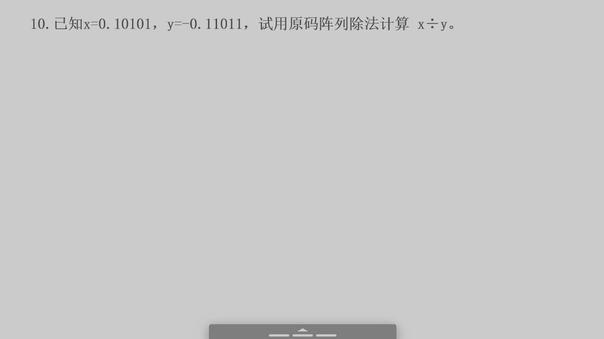
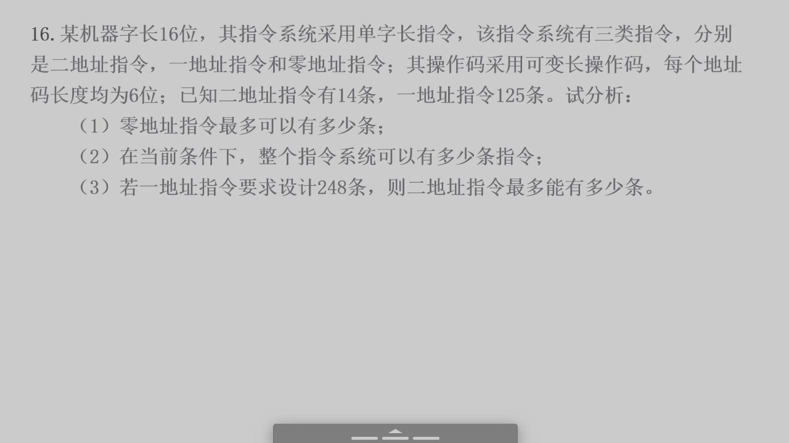
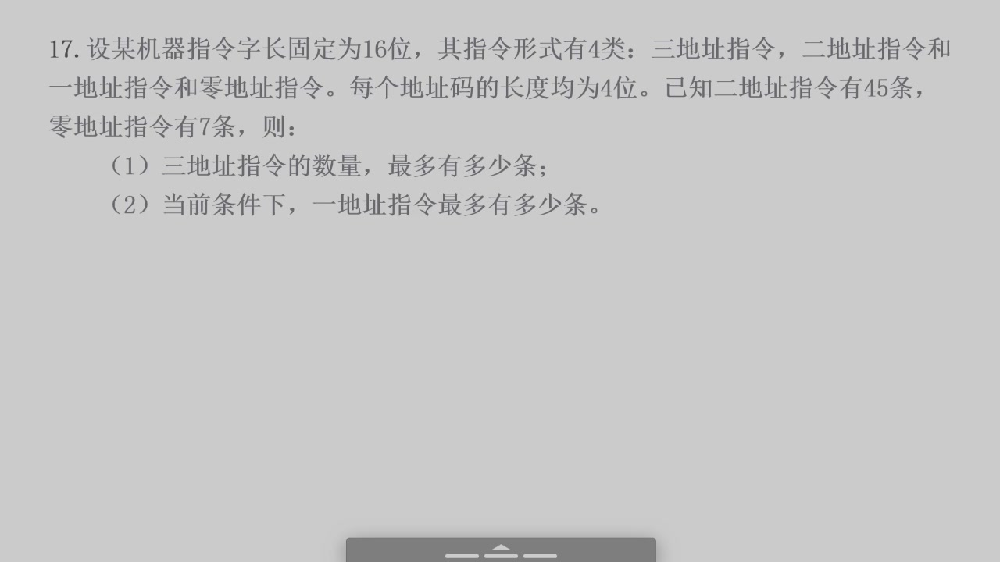
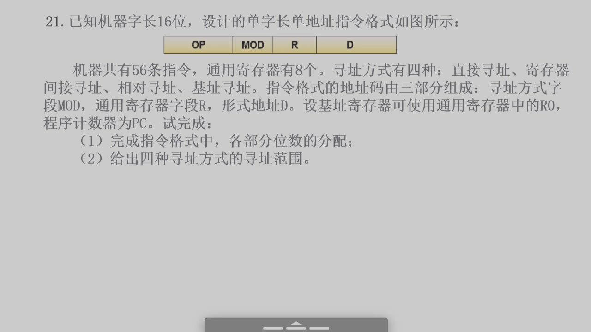
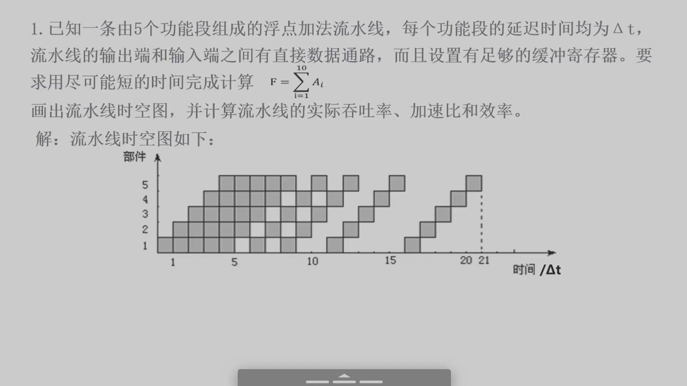
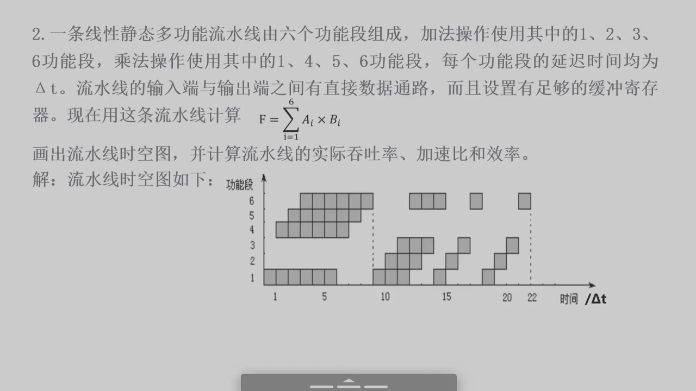
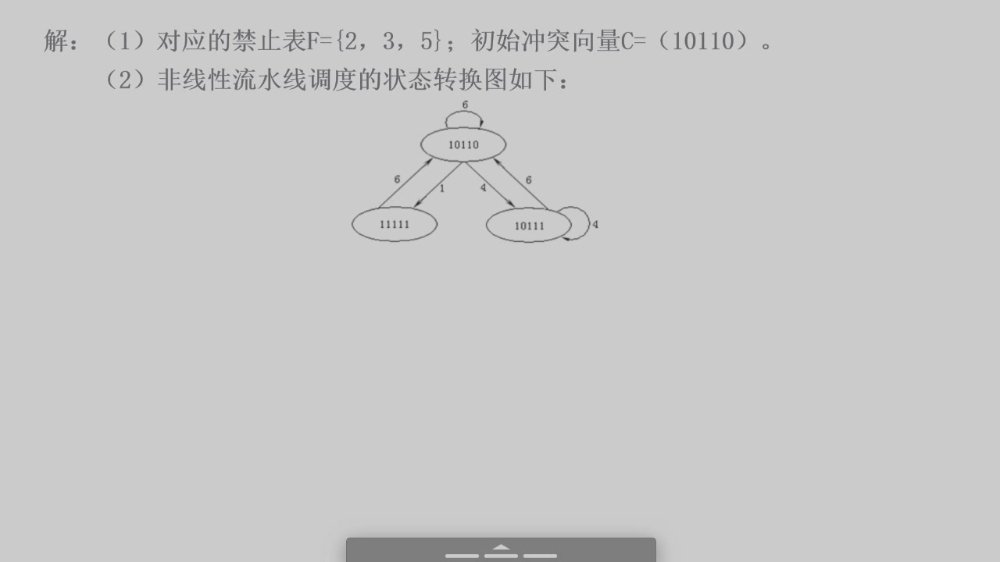
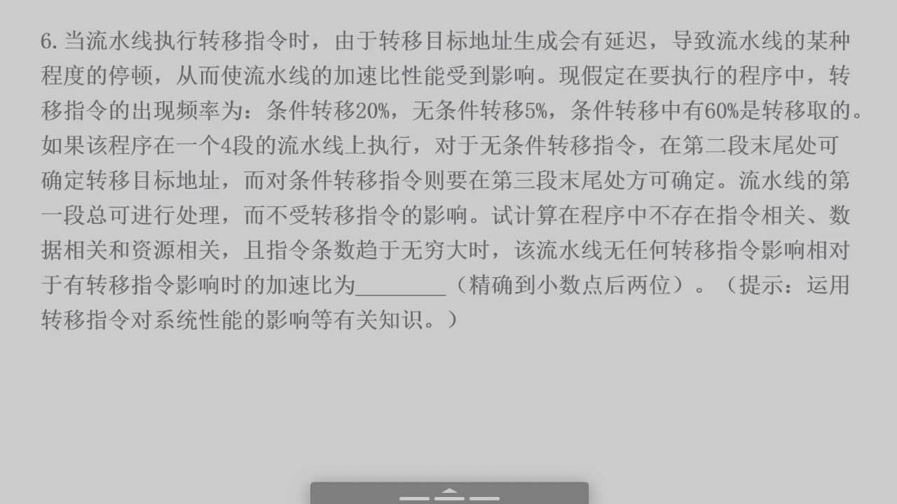
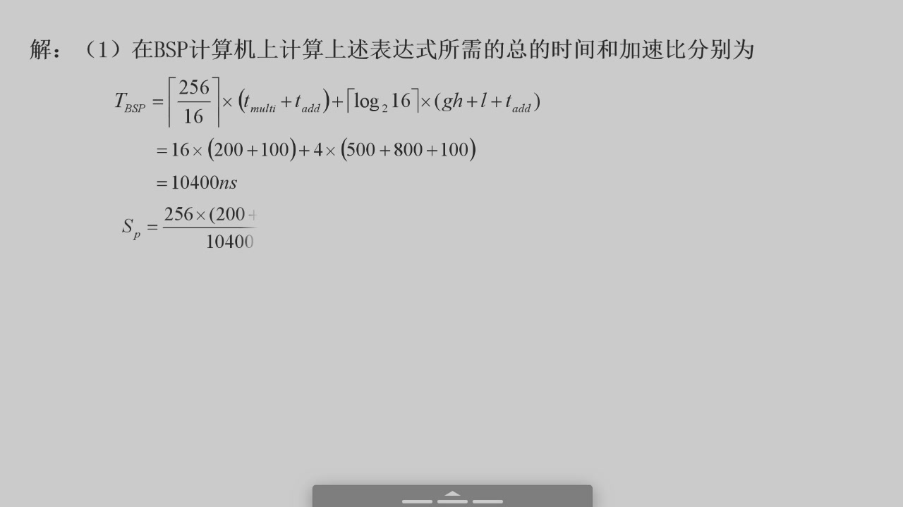

这个文件重新按 PPT 图片逐题校对。每题先对照题面截图，再写文字题面；能用文字表达的公式和答案都写出来，依赖电路图、表格、状态图的题保留图片并说明“见图”。

校对原则：

- 题号、题面和答案必须来自同一组 PPT 页面。
- 如果答案页有遮挡，只写能从图片和题库资料共同确认的部分。
- 不把“同类题”的答案硬套到当前题。

## 2026-06-09 习题课

### 1、变形补码计算定点小数 $X+Y$

题面页：`2026-06-09` 第 9 页  
答案页：第 10、11 页


文字题面：

已知定点小数 $X$ 和 $Y$，数值位为 5 位，试使用变形补码方式计算 $X+Y$。其中：

$$
X=-0.10001,\qquad Y=-0.11110
$$

文字答案：

$$
[X]_补=11.01111,\qquad [Y]_补=11.00010
$$

$$
[X+Y]_补=[X]_补+[Y]_补=11.01111+11.00010=10.10001
$$

双符号位为 `10`，表示负溢出，因此：

$$
X+Y\text{ 下溢，也叫负溢}
$$

### 2、变形补码计算定点小数 $X-Y$

题面页：`2026-06-09` 第 12 页  
答案页：第 13、14 页


文字题面：

已知定点小数 $X$ 和 $Y$，数值位为 5 位，试使用变形补码方式计算 $X-Y$。其中：

$$
X=-0.11111,\qquad Y=-0.11001
$$

文字答案：

$$
[X]_补=11.00001,\qquad [-Y]_补=00.11001
$$

$$
[X-Y]_补=[X]_补+[-Y]_补=11.00001+00.11001=11.11010
$$

双符号位为 `11`，无溢出。结果为：

$$
X-Y=-0.00110
$$

### 3、变形补码计算定点小数 $X+Y$ 和 $X-Y$

题面页：`2026-06-09` 第 15、18、19 页  
答案页：第 20、21 页


文字题面：

已知定点小数：

$$
X=+\frac{33}{64},\qquad Y=-\frac{61}{64}
$$

试使用变形补码方式分别计算，要求对运算结果进行溢出检测，若溢出，指明上溢或下溢，数值位 6 位：

1. 求 $X$、$Y$、$-Y$ 的变形补码；
2. 计算 $X+Y$；
3. 计算 $X-Y$。

文字答案：

$$
X=+0.100001,\qquad Y=-0.111101
$$

所以：

$$
[X]_补=00.100001
$$

$$
[Y]_补=11.000011
$$

$$
[-Y]_补=00.111101
$$

计算 $X+Y$：

$$
[X+Y]_补=00.100001+11.000011=11.100100
$$

双符号位为 `11`，无溢出：

$$
X+Y=-0.011100
$$

计算 $X-Y$：

$$
[X-Y]_补=00.100001+00.111101=01.011110
$$

双符号位为 `01`，表示正溢出，也叫上溢。

### 4、变形补码计算定点整数 $X+Y$

题面页：`2026-06-09` 第 22、26、27 页  
答案页：第 28 页


文字题面：

已知定点整数：

$$
X=-17,\qquad Y=-30
$$

设数值位为 5 位，试使用变形补码方式计算 $X+Y$。

文字答案：

因为：

$$
17=10001_2,\qquad 30=11110_2
$$

所以：

$$
[X]_补=11,01111,\qquad [Y]_补=11,00010
$$

相加：

$$
[X+Y]_补=11,01111+11,00010=10,10001
$$

双符号位为 `10`，表示负溢出：

$$
X+Y\text{ 下溢，也叫负溢}
$$

### 5、变形补码移位后计算 $X/2+Y/2$

题面页：`2026-06-09` 第 29 页  
答案页：第 30、31、32 页


文字题面：

已知定点整数：

$$
X=-17,\qquad Y=-30
$$

设计计算过程中，数值位为 5 位。试使用变形补码方式计算：

$$
X/2+Y/2
$$

提示：$X/2$、$Y/2$ 先求补码，再移位，移位后数值位只保留 5 位。

文字答案：

先有：

$$
[X]_补=11,01111,\qquad [Y]_补=11,00010
$$

算术右移一位，移位后数值位保留 5 位：

$$
[X/2]_补=11,10111,\qquad [Y/2]_补=11,10001
$$

相加：

$$
[X/2+Y/2]_补=11,10111+11,10001=11,01000
$$

双符号位为 `11`，无溢出，结果为：

$$
X/2+Y/2=-11000_2=-24
$$

### 6、带求补器的原码阵列乘法

题面页：`2026-06-09` 第 33 页  
答案页：第 34 页


文字题面：

已知：

$$
x=-13,\qquad y=+5
$$

用带求补器的原码阵列乘法器计算 $x\times y$。设 $x$ 和 $y$ 的机器码表示中符号位占 1 位，数值位占 4 位。

文字答案：

$$
[x]_原=11101,\qquad [y]_原=00101
$$

乘积符号位：

$$
x_f\oplus y_f=1\oplus 0=1
$$

数值部分：

$$
|x|=1101,\qquad |y|=0101
$$

$$
1101_2\times 0101_2=01000001_2
$$

加上符号位：

$$
[x\times y]_原=101000001
$$

所以：

$$
x\times y=-01000001_2=-65
$$

### 7、直接补码阵列乘法计算小数乘法

题面页/答案页：`2026-06-09` 第 35 页


文字题面：

已知：

$$
x=0.10011,\qquad y=-0.01011
$$

用直接补码阵列乘法器计算 $x\times y$。

文字答案：

由图中答案：

$$
[x]_补=0.10011,\qquad [y]_补=1.10101
$$

直接补码阵列乘法得到：

$$
[x\times y]_补=1.1100101111
$$

所以：

$$
x\times y=-0.0011010001
$$

### 8、直接补码阵列乘法计算整数乘法

题面页：`2026-06-09` 第 38 页  
答案页：第 39、43 页


文字题面：

已知：

$$
x=-11011,\qquad y=-10111
$$

试用直接补码阵列乘法计算 $x\times y$。

文字答案：

由题库同型题和答案页可核对：

$$
[x]_补=1,00101,\qquad [y]_补=1,01001
$$

直接补码阵列结果：

$$
[x\times y]_补=0,1001101101
$$

所以：

$$
x\times y=+1001101101_2
$$

十进制校验：

$$
(-27)\times(-23)=621
$$

而：

$$
1001101101_2=621
$$

### 9、原码阵列除法

题面页：`2026-06-09` 第 44 页  
答案页：第 45 页



文字题面：

已知：

$$
x=0.10101,\qquad y=-0.11011
$$

试用原码阵列除法计算 $x\div y$。

文字答案：

由答案页可读出：

$$
[x]_原=0.10101,\qquad [y]_原=1.11011
$$

商的符号位：

$$
x_f\oplus y_f=0\oplus 1=1
$$

答案页给出的商为：

$$
q=011000
$$

余数数值部分为：

$$
r=111101
$$

所以：

$$
[x\div y]_原=1.11000
$$

即：

$$
x\div y=-0.11000
$$

余数按答案页写为：

$$
0.0000111101
$$

这题的竖式推导较长，考试若要求过程，建议按 PPT 图中的“加 $[-y']_补$、判断商位、再加 $[y']_补$ 或 $[-y']_补$”逐行写。

### 10、DRAM 芯片组成主存

题面页：`2026-06-09` 第 47 页  
答案页：第 48、49 页


文字题面：

某 32 位计算机系统采用半导体存储器，其地址码是 32 位。若使用 $4M\times 8$ 位的 DRAM 芯片组成 64MB 主存，并采用内存条的形式，问：

1. 若每个内存条为 $4M\times 32$ 位，共需要多少内存条？
2. 每个内存条内共有多少片 DRAM 芯片？
3. 主存需要多少片 DRAM 芯片？

文字答案：

一个 DRAM 芯片容量：

$$
4M\times 8bit=4MB
$$

一个内存条为：

$$
4M\times 32bit=16MB
$$

组成 64MB 主存需要内存条：

$$
\frac{64MB}{16MB}=4\text{条}
$$

每个内存条的数据位宽为 32 位，每片 DRAM 为 8 位，需要：

$$
\frac{32}{8}=4\text{片}
$$

主存总 DRAM 片数：

$$
4\times 4=16\text{片}
$$

### 11、顺序存储器和交叉存储器带宽

题面页：`2026-06-09` 第 50 页  
答案页：第 51、52 页


文字题面：

设主存储器容量为 256M 字，字长为 64 位，模块数 $m=8$，分别用顺序方式和交叉方式进行组织。主存储器的存储周期 $T=400ns$，数据总线宽度为 64 位，总线传送周期 $\tau=50ns$。若按地址顺序连续读取 16 个字，问顺序存储器和交叉存储器的带宽各是多少？

文字答案：

信息总量：

$$
q=16\times 64=1024b
$$

顺序方式读 16 个字：

$$
t_{顺}=16T=16\times 400=6400ns
$$

交叉方式读 16 个字：

$$
t_{交}=T+(16-1)\tau=400+15\times 50=1150ns
$$

带宽：

$$
W_{顺}=\frac{1024b}{6400ns}=160Mb/s
$$

$$
W_{交}=\frac{1024b}{1150ns}\approx 890.4Mb/s
$$

### 12、Cache/主存系统效率和平均访问时间

题面页：`2026-06-09` 第 53 页  
答案页：第 54、55、56 页


文字题面：

CPU 执行一段程序时，Cache 完成存取 2400 次，主存完成存取 100 次。已知 Cache 存取周期为 50ns，主存存取周期为 250ns，求 Cache/主存系统的效率和平均访问时间。

文字答案：

命中率：

$$
h=\frac{2400}{2400+100}=0.96
$$

平均访问时间：

$$
t_a=h t_c+(1-h)t_m
$$

$$
t_a=0.96\times 50+(1-0.96)\times 250=58ns
$$

效率：

$$
e=\frac{t_c}{t_a}=\frac{50}{58}\approx 0.862
$$

即：

$$
e\approx 86.2\%
$$

### 13、Cache 地址划分：全相联与直接相联

题面页：`2026-06-09` 第 57 页  
答案页：第 58、59 页


文字题面：

某计算机字长 32 位，Cache 由 256 个存储块构成，主存包含 16K 个存储块，每块由 64 个字组成，访问地址为字节地址。

1. 若采用全相联映射方式，给出主存地址的划分情况，并标出各部分位数；
2. 若采用直接相联映射方式，给出主存地址的划分情况，并标出各部分位数。

文字答案：

每字 32 位，即 4B。每块 64 个字：

$$
64\times 4B=256B=2^8B
$$

块内地址 8 位。

主存包含 16K 个存储块：

$$
16K=2^{14}
$$

主存块号 14 位。

全相联映射：

```text
主存地址 = 主存块号 14位 | 块内地址 8位
```

直接相联映射时，Cache 有 256 个块：

$$
256=2^8
$$

Cache 块号 8 位。

标记位：

$$
14-8=6
$$

所以直接相联地址划分为：

```text
主存地址 = 标记 6位 | Cache块号 8位 | 块内地址 8位
```

### 14、4 路组相联 Cache 地址划分与命中率

题面页：`2026-06-09` 第 60、61、64 页  
答案页：第 62、63、65、66、67 页


文字题面：

计算机字长 32 位，主存容量为 4MB，Cache 容量为 8KB，每块包含 16 个字，每字为 32 位，映射方式采用 4 路组相联。设 Cache 初始为空，CPU 依次从主存第 $0,1,2,\ldots,99$ 号单元读出 100 个字，每次读一个字，并重复读 10 次。替换算法采用 LRU。求：

1. 若按字编址，列出主存地址划分，并标出各部分位数；
2. 求 Cache 命中率；
3. 若 Cache 比主存快 10 倍，分析采用 Cache 后存储访问速度提高了多少，即 $t_m/t_a$。

文字答案：

按字编址时，主存容量：

$$
4MB=2^{22}B
$$

每字 4B，所以主存按字编址共有：

$$
\frac{2^{22}}{2^2}=2^{20}\text{字}
$$

主存字地址 20 位。

块长 16 字：

$$
16=2^4
$$

块内字地址 4 位。

Cache 容量 8KB，即：

$$
\frac{8KB}{4B}=2^{11}\text{字}
$$

Cache 块数：

$$
\frac{2^{11}}{2^4}=2^7=128\text{块}
$$

4 路组相联，组数：

$$
\frac{128}{4}=32=2^5
$$

组号 5 位。

标记位：

$$
20-5-4=11
$$

主存地址划分：

```text
标记 11位 | 组号 5位 | 块内字地址 4位
```

顺序读 100 个字，块长 16 字，第一次涉及：

$$
\left\lceil\frac{100}{16}\right\rceil=7\text{块}
$$

第一次访问命中：

$$
100-7=93
$$

后 9 次重复访问全部命中：

$$
9\times 100=900
$$

总访问 1000 次，命中率：

$$
h=\frac{93+900}{1000}=0.993
$$

若主存访问时间为 $t_m$，Cache 访问时间为：

$$
t_c=\frac{t_m}{10}
$$

平均访问时间：

$$
t_a=h t_c+(1-h)t_m
$$

$$
t_a=0.993\times\frac{t_m}{10}+0.007t_m=0.1063t_m
$$

速度提高倍数：

$$
\frac{t_m}{t_a}\approx\frac{1}{0.1063}\approx 9.41
$$

## 2026-06-11 习题课

### 15、直接相联 Cache 的行号和 Tag

题面页：`2026-06-11` 第 1 页  
答案页：第 2、5、6 页


文字题面：

Cache 容量为 16K 块，每块是一个 32 位字，主存容量是 Cache 容量的 256 倍，按字节编址。程序访问以下主存地址：

```text
000008H
010004H
01FFFCH
```

在直接相联映射方式下，求 Cache 的相应标志，即载入 Cache 哪一行，对应 tag 是多少，要求用十六进制表示。

文字答案：

每块是一个 32 位字，即 4B，所以块内偏移为：

$$
\log_2 4=2\text{位}
$$

Cache 有 16K 块：

$$
16K=2^{14}
$$

所以行索引为 14 位。

主存容量是 Cache 的 256 倍，所以 tag 为：

$$
\log_2 256=8\text{位}
$$

主存地址划分：

```text
tag 8位 | 行索引 14位 | 块内偏移 2位
```

逐个地址计算：

$$
000008H >> 2 = 000002H
$$

所以行号为 `0002H`，tag 为 `00H`。

$$
010004H >> 2 = 004001H
$$

行号为：

$$
004001H\bmod 4000H=0001H
$$

tag 为 `01H`。

$$
01FFFCH >> 2 = 007FFFH
$$

行号为：

$$
007FFFH\bmod 4000H=3FFFH
$$

tag 为 `01H`。

答案表：

| 主存地址 | Cache 行 | Tag |
|---|---:|---:|
| `000008H` | `0002H` | `00H` |
| `010004H` | `0001H` | `01H` |
| `01FFFCH` | `3FFFH` | `01H` |

### 16、存储器设计：ROM/RAM 地址范围与连接图

题面页：`2026-06-11` 第 7 页  
答案页：该题后续页含课堂操作截图，当前 PPT 截图没有完整给出芯片规格和最终连接图。


文字题面：

CPU 地址总线为 16 位，数据总线为 8 位，读/写控制信号为 $\overline{R/W}$，访存允许信号为 $\overline{MREQ}$。SRAM 芯片有 $\overline{WE}$ 和 $\overline{CS}$ 控制端。现需设计 56KB 存储器，其中 ROM 容量 16KB，首地址为 `0000H`；RAM 容量 40KB，首地址为 `6000H`；片间译码采用 3-8 译码器。要求根据给出的 ROM、RAM 芯片规格，画出存储器与 CPU 之间的连接图。

可确定答案：

ROM 容量 16KB：

$$
16KB=4000H
$$

ROM 地址范围：

```text
0000H ~ 3FFFH
```

RAM 容量 40KB：

$$
40KB=A000H
$$

RAM 首地址为 `6000H`，所以末地址为：

$$
6000H+A000H-1=FFFFH
$$

RAM 地址范围：

```text
6000H ~ FFFFH
```

连接图部分需要看芯片规格图和译码器输入/输出选择。由于当前 PPT 页没有完整展示后续连接图，本题连接图以原图和课堂资料为准，不在这里硬补。

### 17、扩展操作码：二地址、一地址、零地址指令条数

题面页：`2026-06-11` 第 38、39 页  
答案页：第 40、41 页



文字题面：

某机器字长 16 位，指令系统采用单字长指令。指令系统有三类指令：二地址指令、一地址指令和零地址指令。操作码采用可变长操作码，每个地址码长度均为 6 位。已知二地址指令有 14 条，一地址指令有 125 条，求：

1. 零地址指令最多可以有多少条？
2. 当前条件下，整个指令系统可以有多少条指令？
3. 若一地址指令要求设计 248 条，则二地址指令最多能有多少条？

文字答案：

二地址指令格式：

```text
OP 4位 | A1 6位 | A2 6位
```

4 位 OP 共有 16 种编码。二地址指令用了 14 条，还剩：

$$
16-14=2
$$

这 2 个编码可扩展为一地址指令。一地址编码空间为：

$$
2\times 2^6=128
$$

已用 125 条，还剩：

$$
128-125=3
$$

这 3 个一地址扩展码可继续扩展为零地址指令：

$$
3\times 2^6=192
$$

所以零地址指令最多 192 条。

整个指令系统最多：

$$
14+125+192=331
$$

若一地址指令要求 248 条，需要的二地址扩展码数为：

$$
\left\lceil \frac{248}{2^6}\right\rceil=4
$$

二地址指令最多：

$$
16-4=12
$$

### 18、扩展操作码：三地址、二地址、一地址、零地址

题面页：`2026-06-11` 第 42、43 页  
答案页：第 44 页



文字题面：

设某机器指令字长固定为 16 位，指令形式有 4 类：三地址指令、二地址指令、一地址指令和零地址指令。每个地址码长度均为 4 位。已知二地址指令有 45 条，零地址指令有 7 条，求：

1. 三地址指令最多有多少条？
2. 当前条件下，一地址指令最多有多少条？

文字答案：

四种格式的操作码长度依次为：

```text
三地址：4位
二地址：8位
一地址：12位
零地址：16位
```

二地址指令有 45 条。每个三地址 OP 扩展为二地址后，可提供：

$$
2^4=16
$$

条二地址指令。因此二地址指令需要占用的三地址扩展标志数为：

$$
\left\lceil \frac{45}{16}\right\rceil=3
$$

三地址 OP 总数为 16，所以三地址指令最多：

$$
16-3=13
$$

二地址扩展空间剩余：

$$
3\times 16-45=3
$$

这 3 个二地址剩余编码可扩展成一地址指令。零地址指令有 7 条，只需占用 1 个一地址扩展码，所以一地址最多：

$$
3\times 16-1=47
$$

答案：

```text
三地址指令最多 13 条
一地址指令最多 47 条
```

### 19、寻址方式下操作数 S 的值

题面页：`2026-06-11` 第 45 页  
答案页：第 46、47 页


文字题面：

存储器中相应地址及内容如图所示。已知：

$$
R=4000H,\quad PC=7000H,\quad RX=2500H,\quad RB=3500H
$$

$D$ 为形式地址。求下列寻址方式下，指令访问得到的操作数 $S$ 的值：

1. 寄存器寻址，$R$；
2. 寄存器间接寻址，$(R)$；
3. 直接寻址，$D=5000H$；
4. 基址寻址，$D=500H$；
5. 间接寻址，$D=1000H$。

文字答案：

由图中存储表：

| 地址 | 内容 |
|---|---|
| `1000H` | `3000H` |
| `2000H` | `4000H` |
| `3000H` | `A210H` |
| `3A00H` | `9000H` |
| `4000H` | `6600H` |
| `5000H` | `2021H` |
| `6000H` | `2102H` |
| `7000H` | `1177H` |
| `7100H` | `3502H` |

1. 寄存器寻址：

$$
S=R=4000H
$$

2. 寄存器间接寻址：

$$
EA=(R)=4000H
$$

$$
S=(4000H)=6600H
$$

3. 直接寻址：

$$
EA=D=5000H
$$

$$
S=(5000H)=2021H
$$

4. 基址寻址：

$$
EA=(RB)+D=3500H+0500H=3A00H
$$

$$
S=(3A00H)=9000H
$$

5. 间接寻址：

$$
EA=(D)=(1000H)=3000H
$$

$$
S=(3000H)=A210H
$$

答案：

```text
4000H，6600H，2021H，9000H，A210H
```

### 20、二地址 RS 型指令格式字段分配

题面页：`2026-06-11` 第 49 页  
答案页：第 50、51、52 页


文字题面：

机器字长 32 位，设计单字长二地址指令格式：

```text
OP | RD | MOD | RS | A
```

机器有 16 个通用寄存器，29 条指令，$A$ 为形式地址。目标操作数寻址方式固定为寄存器寻址，另一个操作数的寻址方式有立即、直接、寄存器直接、寄存器间接、相对等 5 种寻址方式。给出指令中各部分位数，并指出寻址范围最大的寻址方式及寻址范围。

文字答案：

29 条指令需要 OP 位数：

$$
\left\lceil\log_2 29\right\rceil=5
$$

16 个通用寄存器：

$$
\log_2 16=4
$$

所以 $RD$ 和 $RS$ 各 4 位。

5 种寻址方式：

$$
\left\lceil\log_2 5\right\rceil=3
$$

所以 $MOD$ 为 3 位。

形式地址 $A$ 位数：

$$
32-5-4-3-4=16
$$

字段分配：

```text
OP 5位 | RD 4位 | MOD 3位 | RS 4位 | A 16位
```

寻址范围最大的是相对寻址。若 $A$ 为 16 位补码位移，则位移范围为：

$$
-2^{15}\sim 2^{15}-1
$$

在 32 位地址空间中，常写最大寻址范围为：

$$
0\sim 2^{32}+2^{15}-2
$$

### 21、单地址指令格式字段分配与寻址范围

题面页：`2026-06-11` 第 53 页



文字题面：

机器字长 16 位，单字长单地址指令格式：

```text
OP | MOD | R | D
```

机器共有 56 条指令，通用寄存器有 8 个。寻址方式有四种：直接寻址、寄存器间接寻址、相对寻址、基址寻址。地址码由寻址方式字段 $MOD$、通用寄存器字段 $R$、形式地址 $D$ 组成。设基址寄存器可使用通用寄存器中的 $R0$，程序计数器为 $PC$。要求：

1. 完成各字段位数分配；
2. 给出四种寻址方式的寻址范围。

文字答案：

56 条指令：

$$
\left\lceil\log_2 56\right\rceil=6
$$

所以 $OP$ 为 6 位。

4 种寻址方式：

$$
\log_2 4=2
$$

$MOD$ 为 2 位。

8 个通用寄存器：

$$
\log_2 8=3
$$

$R$ 为 3 位。

$D$ 字段：

$$
16-6-2-3=5
$$

字段分配：

```text
OP 6位 | MOD 2位 | R 3位 | D 5位
```

四种寻址范围：

| MOD | 寻址方式 | 有效地址 | 寻址范围 |
|---|---|---|---|
| `00` | 直接寻址 | $EA=D$ | $0\sim 2^5-1=31$ |
| `01` | 寄存器间接寻址 | $EA=(R)$ | $0\sim 2^{16}-1=65535$ |
| `10` | 相对寻址 | $EA=PC+D$ | $0\sim 2^{16}+2^4-2=65550$ |
| `11` | 基址寻址 | $EA=R0+D$ | $0\sim 2^{16}+2^4-2=65550$ |

---

## 2026-06-16 习题课

### 22、单字长双操作数指令格式与机器码

题面页：`2026-06-16` 第 11、12 页  
答案页：`2026-06-16` 第 13、14 页


文字题面：

某计算机字长为 16 位，主存地址空间大小为 128KB，按字编址。采用单字长指令格式：

```text
15~12: OP
11~06: 源操作数，分为 Ms 和 Rs
05~00: 目的操作数，分为 Md 和 Rd
```

寻址方式定义如下：

| Ms/Md | 寻址方式 | 助记符 | 含义 |
|---|---|---|---|
| `000B` | 寄存器直接寻址 | $R_n$ | 操作数 $=(R_n)$ |
| `001B` | 寄存器间接寻址 | $(R_n)$ | 操作数 $=((R_n))$ |
| `010B` | 寄存器间接加自增寻址 | $(R_n)+$ | 操作数 $=((R_n))$，然后 $(R_n)+1\to R_n$ |
| `011B` | 相对寻址 | $D(R_n)$ | 转移目标地址 $=(PC)+(R_n)$ |

回答：

1. 该指令系统最多可有多少条指令？最多有多少个通用寄存器？
2. $MAR$ 和 $MDR$ 至少各需要多少位？
3. 转移指令的目标地址范围是多少？
4. 若 $OP=0010B$ 表示 `add`，$R4=100B$，$R5=101B$，$(R4)=1234H$，$(R5)=5678H$，$(1234H)=5678H$，$(5678H)=1234H$，求 `add (R4), (R5)+` 的机器码，并说明执行后哪些内容改变。

文字答案：

`OP` 字段为 4 位，所以最多指令数为：

$$
2^4=16
$$

寄存器编号字段为 3 位，所以最多通用寄存器数为：

$$
2^3=8
$$

主存容量为 128KB，按字编址；字长 16 位，即 1 个字为 2B，所以主存字数为：

$$
128KB / 2B = 64K = 2^{16}
$$

因此：

$$
MAR=16\text{ 位},\quad MDR=16\text{ 位}
$$

转移目标地址范围为：

$$
0000H\sim FFFFH
$$

对 `add (R4), (R5)+`：

```text
OP = 0010
Ms = 001   表示 (Rn)，源操作数为 (R4)
Rs = 100   表示 R4
Md = 010   表示 (Rn)+，目的操作数为 (R5)+
Rd = 101   表示 R5
```

机器码为：

$$
0010\ 001\ 100\ 010\ 101B=2315H
$$

执行过程：

```text
源操作数：(R4) = (1234H) = 5678H
目的地址：(R5) = 5678H
目的操作数：(5678H) = 1234H
```

相加后：

$$
5678H+1234H=68ACH
$$

因此：

```text
机器码：2315H
R5：由 5678H 变为 5679H
(5678H)：由 1234H 变为 68ACH
```

---

### 23、五段浮点加法流水线计算连加

题面页：`2026-06-16` 第 20 页  
答案页：`2026-06-16` 第 21、22 页




文字题面：

一条由 5 个功能段组成的浮点加法流水线，每段延迟均为 $\Delta t$。流水线输出端和输入端之间有直接数据通路，并有足够缓冲寄存器。要求用尽可能短的时间计算：

$$
F=\sum_{i=1}^{10}A_i
$$

画出流水线时空图，并计算实际吞吐率、加速比和效率。

文字答案：

连加 10 个数需要 9 次加法。由 PPT 时空图可见，最后一次加法在第 21 个 $\Delta t$ 结束。

实际吞吐率：

$$
TP=\frac{9}{21\Delta t}=\frac{3}{7\Delta t}
$$

若不采用流水线，9 次加法每次经过 5 段，总时间为：

$$
9\times 5\Delta t=45\Delta t
$$

加速比：

$$
S_p=\frac{45\Delta t}{21\Delta t}\approx 2.14
$$

效率：

$$
\eta=\frac{45\Delta t}{5\times 21\Delta t}\approx 42.9\%
$$

---

### 24、六段线性静态多功能流水线计算点积

题面页：`2026-06-16` 第 23 页  
答案页：`2026-06-16` 第 24、26 页




文字题面：

一条线性静态多功能流水线由 6 个功能段组成，加法使用第 1、2、3、6 段，乘法使用第 1、4、5、6 段，每段延迟均为 $\Delta t$。现计算：

$$
F=\sum_{i=1}^{6}A_iB_i
$$

要求画出时空图，并计算实际吞吐率、加速比和效率。

文字答案：

该表达式需要：

```text
6 次乘法
5 次加法
```

PPT 给出的时空图中，总共用时为 $22\Delta t$，产生 11 个运算结果。

实际吞吐率：

$$
TP=\frac{11}{22\Delta t}=\frac{1}{2\Delta t}
$$

非流水执行时间：

$$
6\times 4\Delta t+5\times 4\Delta t=44\Delta t
$$

加速比：

$$
S_p=\frac{44\Delta t}{22\Delta t}=2
$$

效率：

$$
\eta=\frac{44\Delta t}{6\times 22\Delta t}\approx 33.3\%
$$

---

### 25、动态双功能流水线计算 8 元素向量点积

题面页：`2026-06-16` 第 28 页  
答案页：`2026-06-16` 第 29 页


文字题面：

向量 $A$ 和 $B$ 各有 8 个元素，要求在动态双功能流水线上计算：

$$
A\cdot B=\sum_{i=1}^{8}a_ib_i
$$

流水线中，$A\to B\to C\to F$ 构成乘法流水线，$A\to D\to E\to F$ 构成加法流水线。每个功能段时间均为 $\Delta t$，流水线结果可直接反馈，反馈延迟和功能切换时间忽略。求实际吞吐率和效率。

文字答案：

该题共有：

```text
8 次乘法
7 次加法
共 15 个流水线任务
```

PPT 配套题库给出的完成时间为 $23\Delta t$。

实际吞吐率：

$$
TP=\frac{15}{23\Delta t}
$$

非流水执行时间：

$$
8\times 4\Delta t+7\times 4\Delta t=60\Delta t
$$

加速比：

$$
S_p=\frac{60\Delta t}{23\Delta t}\approx 2.61
$$

效率：

$$
\eta=\frac{60\Delta t}{6\times 23\Delta t}\approx 43.5\%
$$

---

### 26、三段非线性流水线的禁止表与状态图

题面页：`2026-06-16` 第 30 页  
答案页：`2026-06-16` 第 31 至 35 页




文字题面：

一条具有三个功能段的非线性流水线，其预约表如图所示。要求：

1. 写出禁止表和初始冲突向量；
2. 画出状态转换图；
3. 求最小启动循环和最小平均间隔时间；
4. 画出各功能段之间的连接图；
5. 若采用插入非计算延迟单元的预留算法，且时钟周期 $\tau=20ns$，求最大吞吐率。

文字答案：

同一功能段中任意两个预约时间之差组成禁止表：

$$
F=\{2,3,5\}
$$

最大禁止延迟为 5，所以初始冲突向量按 $C_5C_4C_3C_2C_1$ 写为：

$$
C=(10110)
$$

PPT 给出的状态转换图见上图。由状态图可得最小启动循环为：

$$
(1,6)
$$

最小平均间隔时间：

$$
\frac{1+6}{2}=3.5\text{ 个时钟周期}
$$

采用预留算法插入非计算延迟后，最大吞吐率为：

$$
TP_{\max}=\frac{1}{3\tau}
=\frac{1}{3\times20ns}
\approx1.67\times10^7\text{ 任务/s}
$$

---

### 27、五段非线性流水线预约表填空

题面页：`2026-06-16` 第 36 页  
答案页：`2026-06-16` 第 37 页


文字答案：

由预约表可得：

$$
F=\{1,3,4,8\}
$$

初始冲突向量：

$$
C=(10001101)
$$

最小平均延迟：

$$
3.5\text{ 个时钟周期}
$$

最大吞吐率：

$$
TP_{\max}=\frac{1}{3.5\text{ 时钟周期}}
$$

最佳调度方案：

$$
(2,5)
$$

若按该调度方案输入 6 个任务，实际吞吐率为：

$$
TP=\frac{6}{25\text{ 时钟周期}}
$$

---

### 28、转移指令对流水线加速比的影响

题面页：`2026-06-16` 第 38、39 页  
答案页：`2026-06-16` 第 40 页



文字题面：

程序在 4 段流水线上执行。转移指令出现频率为：

```text
条件转移：20%
无条件转移：5%
条件转移中，60% 为转移取
```

无条件转移在第 2 段末尾确定目标地址，条件转移在第 3 段末尾确定目标地址。第一段总可处理，不受转移影响。求没有转移指令影响时相对于有转移指令影响时的加速比。

文字答案：

按 PPT 给出的影响模型：

$$
S_p=
\lim_{n\to\infty}
\frac{k\tau+(n-1)\tau+p_1q_1b_1n\tau+p_2q_2b_2n\tau}
{k\tau+(n-1)\tau}
$$

其中：

```text
k = 4
p1 = 0.2，条件转移频率
q1 = 0.6，条件转移取的概率
b1 = 2，条件转移造成 2 拍影响
p2 = 0.05，无条件转移频率
q2 = 1
b2 = 1，无条件转移造成 1 拍影响
```

所以：

$$
S_p\approx 1+0.2\times0.6\times2+0.05\times1\times1=1.29
$$

---

### 29、单级互连网络函数

题面页：`2026-06-16` 第 41 页


文字题面：

32 个处理器编号为 $0,1,2,\cdots,31$，用单级互连网络互连。求第 11 号处理器在下列互连函数下分别与哪个处理器相连：

```text
Cube3
PM2+3
PM2-4
Shuffle
Butterfly
Shuffle(Shuffle)
Shuffle(Cube0(PM2-1))
```

文字答案：

第 11 号处理器二进制编号：

$$
11=01011B
$$

结果如下：

| 函数 | 结果 |
|---|---:|
| $Cube_3$ | 3 |
| $PM2_{+3}$ | 19 |
| $PM2_{-4}$ | 27 |
| Shuffle | 22 |
| Butterfly | 26 |
| Shuffle(Shuffle) | 13 |
| Shuffle(Cube0(PM2-1)) | 16 |

---

### 30、混洗交换网络与完全混洗

题面页：`2026-06-16` 第 42 至 46 页


文字答案：

在 8 个处理器的混洗交换网络中，使第 0 号处理器与第 5 号处理器相连需要：

```text
2 次混洗
2 次交换
```

256 个 PE 表示需要 8 位编号。完全混洗执行 10 次，相当于循环左移：

$$
10\bmod 8=2
$$

原 PE 编号：

$$
197=11000101B
$$

循环左移 2 位：

$$
11000101B\to00010111B=23
$$

所以数据被送往：

$$
PE_{23}
$$

---

### 31、SISD 与 8PE 环形 SIMD 计算 32 项点积

题面页：`2026-06-16` 第 45、47 页


文字题面：

在含 1 个 PE 的 SISD 机和含 8 个 PE、连接成线性环的 SIMD 机上计算：

$$
S=\sum_{i=1}^{32}A_iB_i
$$

加法每次 2 个单位时间，乘法每次 4 个单位时间，相邻 PE 间移数 1 个单位时间。

文字答案：

SISD 串行计算需要 32 次乘法、31 次加法：

$$
T_{SISD}=32\times4+31\times2=190
$$

SIMD 计算：

$$
T_{SIMD}=4\times4+3\times2+3\times2+2^3-1=32
$$

加速比：

$$
S_p=\frac{190}{32}\approx5.94
$$

---

### 32、64 项点积在串行机与 16PE SIMD 上的最短时间

题面页：`2026-06-16` 第 48 至 51 页


文字题面：

计算：

$$
S=A_1B_1+A_2B_2+\cdots+A_{64}B_{64}
$$

加法 2 个单位时间，乘法 4 个单位时间。比较：

1. 一台串行计算机，只有一个加法器和一个乘法器，同一时刻只能使用其中一个；
2. 一台有 16 个 PE 的 SIMD 计算机，16 个 PE 连成单向环，每次相邻传数 1 个单位时间。

文字答案：

串行机：

$$
T=64\times4+63\times2=382
$$

16PE SIMD：

$$
T=4\times4+3\times2+4\times2+(2^4-1)\times1=45
$$

---

## 2026-06-18 习题课

### 33、BSP 与理想 PRAM 计算 256 项点积

题面页：`2026-06-18` 第 28 页  
答案页：`2026-06-18` 第 29、30 页




文字题面：

在 16 个处理器的 BSP 计算机和理想 PRAM 计算机上计算：

$$
S=\sum_{i=1}^{256}(A_iB_i)
$$

每次乘法 200ns，每次加法 100ns。BSP 参数为：

$$
h=1,\quad g=500ns,\quad l=800ns
$$

忽略并行性开销。求 $T_{BSP}$、$T_{PRAM}$ 以及加速比。

文字答案：

每个处理器先处理：

$$
\frac{256}{16}=16
$$

局部乘加时间：

$$
16\times(200+100)
$$

规约需要：

$$
\log_2 16=4
$$

BSP 中每一级规约包含通信和加法：

$$
gh+l+t_{add}=500+800+100=1400ns
$$

所以：

$$
T_{BSP}=16\times(200+100)+4\times(500+800+100)=10400ns
$$

按 PPT 的串行基准：

$$
T_{serial}=256\times(200+100)=76800ns
$$

加速比：

$$
S_{p,BSP}=\frac{76800}{10400}\approx7.38
$$

理想 PRAM 忽略通信开销，只保留规约加法：

$$
T_{PRAM}=16\times(200+100)+4\times100=5200ns
$$

加速比：

$$
S_{p,PRAM}=\frac{76800}{5200}\approx14.77
$$

---

### 34、CPU 结构中寄存器名称识别

题面页：`2026-06-18` 第 66 页


文字题面：

图中 $AC$ 为累加器，状态寄存器保存指令执行过程中的状态。$a,b,c,d$ 为四个寄存器，箭头表示数据传送方向。根据 CPU 功能和结构标明四个寄存器名称，可选：

```text
AR、DR、IR、PC
```

文字答案：

```text
a = DR
b = IR
c = AR
d = PC
```

理由：

```text
DR：与主存双向传送数据，也可送入运算通路
AR：向主存提供地址
IR：向操作控制器提供指令信息
PC：可自增 +1，并向地址通路提供下一条指令地址
```

---

### 35、LDA addr 指令的数据通路

题面页：`2026-06-18` 第 67 页


文字题面：

使用上一题 CPU 模型，简述 `LDA addr` 的数据通路。`addr` 为主存地址，指令功能是把主存 `addr` 单元的内容送入 $AC$。

文字答案：

取指阶段：

```text
PC -> AR -> 主存M -> DR -> IR
PC + 1 -> PC
```

执行阶段：

```text
IR(addr) -> AR -> 主存M -> DR -> AC
```

含义是：先从 $PC$ 指向的地址取出指令，送入 $IR$；再把指令中的地址字段送入 $AR$，访问主存，把数据经 $DR$ 送入累加器 $AC$。

---

### 36、subi 微程序控制字编码

题面页：`2026-06-18` 第 69 至 75 页


文字题面：

已知指令：

```text
subi rt, rs, imm
```

功能为：

$$
R[rt]\leftarrow R[rs]-SignExt(imm)
$$

按微程序控制器格式完成 `subi` 的 3 条微指令，分别放在控存 29、30、31 单元。

文字答案：

执行周期的 3 个节拍：

| 控存单元 | 微操作 | 控制信号含义 |
|---:|---|---|
| 29 | $R[rs]\to X$ | $R_{out}=1,\ X_{in}=1$ |
| 30 | $X-IR(I)\to Z$ | $IR(I)_{out}=1,\ SUB=1$ |
| 31 | $Z\to R[rt]$ | $Z_{out}=1,\ R_{in}=1$ |

按下址字段法，PPT/题库给出的 3 条微指令编码为：

```text
29单元：0202001EH
30单元：0100021FH
31单元：04010000H
```

按计数器法，PPT/题库给出的 3 条微指令编码为：

```text
29单元：0202000H
30单元：0100020H
31单元：0401001H
```

---

### 37、微程序入口地址逻辑

题面页：`2026-06-18` 第 78 至 86 页


文字题面：

已知指令译码信号为 `lw`、`sw`、`beq`、`add`、`addi`，微程序入口地址用 $\mu A_4\sim\mu A_0$ 表示。根据状态转换图和真值表，用数字逻辑方法写出入口地址表达式。

文字答案：

由真值表：

```text
lw   -> S4  -> 00100
sw   -> S9  -> 01001
beq  -> S14 -> 01110
add  -> S19 -> 10011
addi -> S22 -> 10110
```

所以：

$$
\mu A_4=add+addi
$$

$$
\mu A_3=sw+beq
$$

$$
\mu A_2=lw+beq+addi
$$

$$
\mu A_1=beq+add+addi
$$

$$
\mu A_0=sw+add
$$

注意：如果题目使用的是 `slt` 而不是 `add`，则把上式中的 `add` 替换为 `slt`，即：

```text
μA4 = slt + addi
μA3 = sw + beq
μA2 = lw + beq + addi
μA1 = beq + slt + addi
μA0 = sw + slt
```

---

### 38、微指令字段位数与控存容量

题面页：`2026-06-18` 第 76、77 页


文字答案：

第 14 题：微指令字长 32 位，测试字段 5 个条件，微操作信号 70 个，分成 5 个互斥类，数量分别为 7、8、8、16、31。

编码表示法中，每个互斥组需要：

$$
\lceil \log_2 7\rceil=3,\quad
\lceil \log_2 8\rceil=3,\quad
\lceil \log_2 8\rceil=3,\quad
\lceil \log_2 16\rceil=4,\quad
\lceil \log_2 31\rceil=5
$$

如果按 PPT 配套题库的口径，每组还要能表示“不发微命令”，对应答案为：

```text
操作控制字段：21位
判别测试字段：5位
下址字段：6位
控存容量：32 × 2^6 = 2048位
直接表示法微指令字长：70 + 5 + 6 = 81位
```

第 15 题：微指令 32 位，下址字段为 6 位，所以：

```text
控制存储器最大容量：32 × 2^6 = 2048位
最多微指令条数：2^6 = 64条
一条微指令中最多同时出现微命令数：12个
最多表示微命令种类：62种
```
