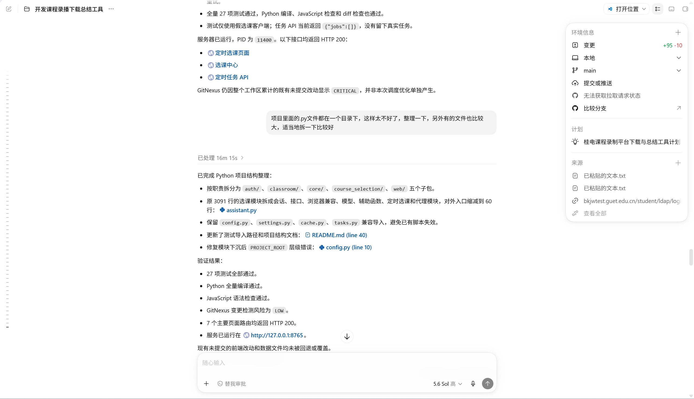
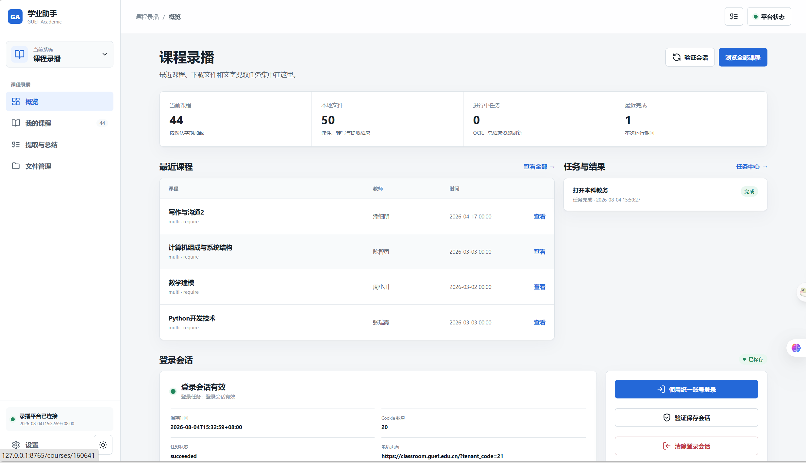
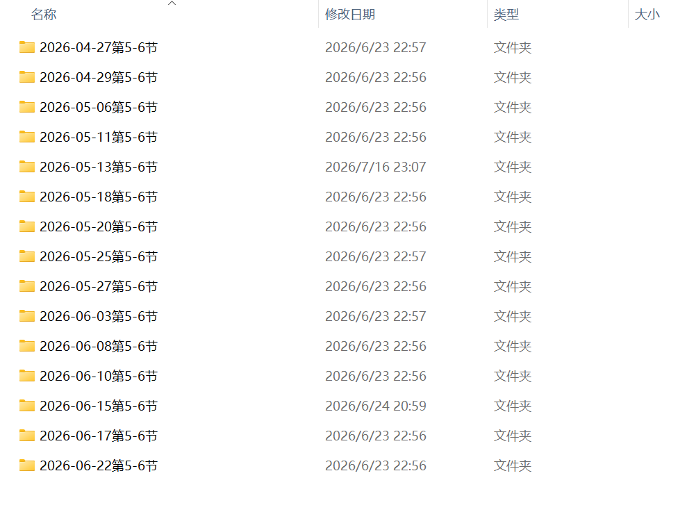
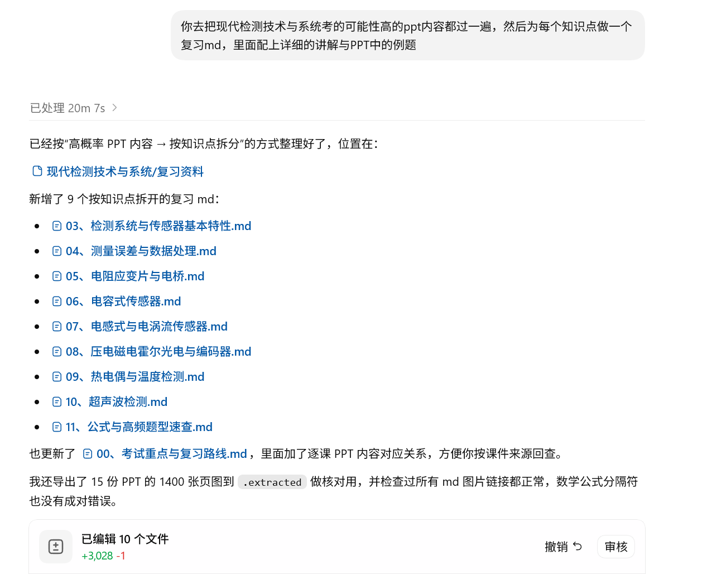
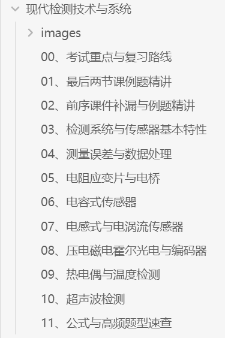

> 一个更加符合如今互联网语境的标题应该是：用 Codex 学习 《现代检测技术与系统》 的超强工作流！奥特曼看到后如见原子弹爆炸般震惊瘫坐

## 抽象

总所周知，一般来说，随着经济社会的持续发展，通过期末考试已经成为越来越多大学生所面对的难题。而期末突击就是一种常见的通过考试的方法，如今 AI 工具十分方便，使用 AI 工具辅助期末突击便成为了一种新的选择。本文以介绍期末突击学习《现代检测技术与系统》为例，展示了一种新的人机交互学习工作流。

《现代检测技术与系统》是一门与电学强相关的学习传感器原理与应用的科目，涉及到多种传感器在实际情况下的应用及数据处理。由于各个考试时间挨得很近，我只有两天的时间进行学习，在此之前是完全没有学的。但在 Codex 使用 GPT-5.5 辅助学习之后，我在期末考试中取得了58分的考试成绩，这完全足够通过课程了。

以下是学习的大致流程：

- 通过教材或者自制的智慧校园 PPT 下载器获得第一手学习资料
- 将学习资料提供给大模型
- 让大模型根据一手学习资料制作合适快速背诵的版本
- 让大模型提供配套练习题与答案进行练习
- 自主学习

流程中最为困难的实际上是第一步，获取第一手资源一般完全依赖老师是否分享对应 PPT 文件，但本文所使用的方法绕过了这一限制。

**关键词**：GPT；Codex；学习；爬虫；Python；Vibe Coding

# 1 绪论

## 1.1 小标题

我不想写了，省略两千字，总之就是现代大学生需要一种更快的提高学习效率（通过考试）的方法

# 2 基于 Python 开发的智慧课堂课件下载系统的设计与实现

## 2.1 功能需求分析

正如前文所述，当老师不提供 PPT 文件时，该工作流的后续工作都将无以为继，因此获取 PPT 便极为重要。众所周知，GUET 有一个相当方便的课程直播/录播系统，名为智慧课堂，但这个系统无法下载课程的录播与 PPT，这时我们便需要一个软件来获取这些上下文

## 2.2 开发技术选择

因为我不知道选什么，就让 AI 用 Python 写了，大概是`FastAPI + Jinja2/HTMX + SQLite`

## 2.3 开发流程

把需求丢给 AI 后，不断测试迭代就好了

界面长这样

# 3 基于 Codex 的复习资料整理与生成

这样写好累……后面随便写了

“你去把现代检测技术与系统考的可能性高的 ppt 内容都过一遍，然后为每个知识点做一个复习 md，里面配上详细的讲解与 PPT 中的例题”

于是就生成了好多个文档，具体内容可以在[这里](https://notes.yiyuemeow.com/ai%E9%80%9F%E6%88%90/%E7%8E%B0%E4%BB%A3%E6%A3%80%E6%B5%8B%E6%8A%80%E6%9C%AF%E4%B8%8E%E7%B3%BB%E7%BB%9F/00%E8%80%83%E8%AF%95%E9%87%8D%E7%82%B9%E4%B8%8E%E5%A4%8D%E4%B9%A0%E8%B7%AF%E7%BA%BF)看到

通过这套流程，即获取考试范围、总结学习资料、AI 总结，我们可以获得公式化的复习方案，对这套复习方案越熟悉，复习的效率就越高

如果可以通过更优雅的方式获取复习资料，例如老师提供的复习题，那更能事半功倍

# 4 基于复习资料的人工学习与复习

自此，就可以通过此前获得的大量资料速成学习了，选择一个合适你的 markdown 阅读器，就可以开始愉快地复习（预习）了

这是我喜欢用的[黑曜石](https://obsidian.md/zh/)，如果有喜欢的阅读器也可以用

通过紧张刺激的学习与紧张刺激的考试，我成功考到了 58 分的卷面分数！该说不说老师给分还是很大方的，于是加上平时分也就理所当然的及格了哈哈哈

# 5 总结

懒得总结，去看抽象

课本里面对考试没用的东西太多了，用 AI 来整理是更好的主意

# 致谢

感谢~~张雪峰老师~~，~~388 分~~，Codex 的天天重置，GPT 的强大能力，没有他们的支持，我应该不会写出这一篇东西

# 参考文献

没有参考文献，我要学术不端了