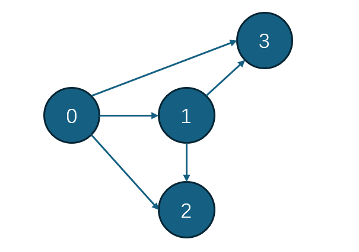

这玩意折磨了我一个小时……不过是另一种邻接表罢了

### 上代码！（来自[OI Wiki](https://oi-wiki.org/graph/save/#%E9%93%BE%E5%BC%8F%E5%89%8D%E5%90%91%E6%98%9F)
```C++
// head[u] 和 cnt 的初始值都为 -1 
void add(int u, int v) { nxt[++cnt] = head[u]; // 当前边的后继 
    head[u] = cnt; // 起点 u 的第一条边 
    to[cnt] = v; // 当前边的终点 
} // 遍历 u 的出边 
for (int i = head[u]; ~i; i = nxt[i]) { // ~i 表示 i != -1 
    int v = to[i]; 
}
```

据说这是个存有向图的代码
### 但是是啥意思呢

在这里每条边都要有个编号，所以cnt其实就是每一条边的编号

`head[u]`中存储的是第u个节点的第一条边

`to[u]`代表第u条边指向第几个点

`nxt[u]`代表第u条边的下一条边是哪条

显然每条边只能指向一个点，这条边的起点则是对应`head`里面的某个点

在查找时遇到-1就该停止了

所以链式前向星就是**每个点存第一条边**，**每条边存指向的点**和**下一条**指向同一个点的**边**的地址的数据结构

这就是为啥他们说链式前向星
>本质上是用链表实现的邻接表


### 来点图片


在数组里则是这么存

|      | 0   | 1   | 2   | 3   | 4   | 5   |
| ---- | --- | --- | --- | --- | --- | --- |
| head | 5   | 3   | 4   | -1  | -1  | -1  |
| next | -1  | -1  | 0   | 1   | -1  | 2   |
| to   | 1   | 2   | 2   | 3   | 3   | 3   |
